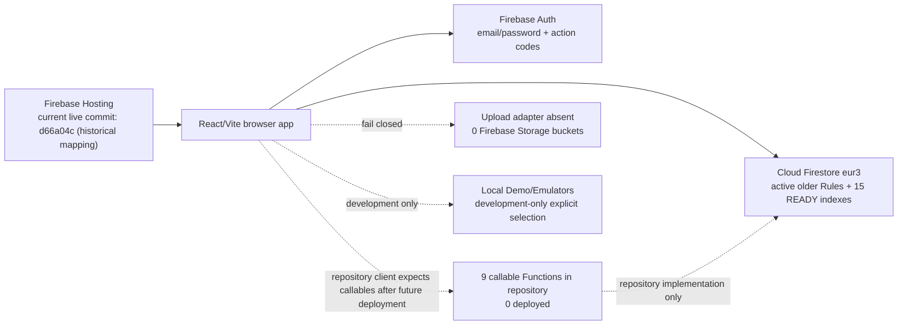
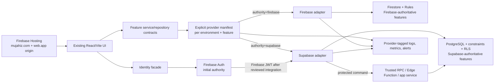
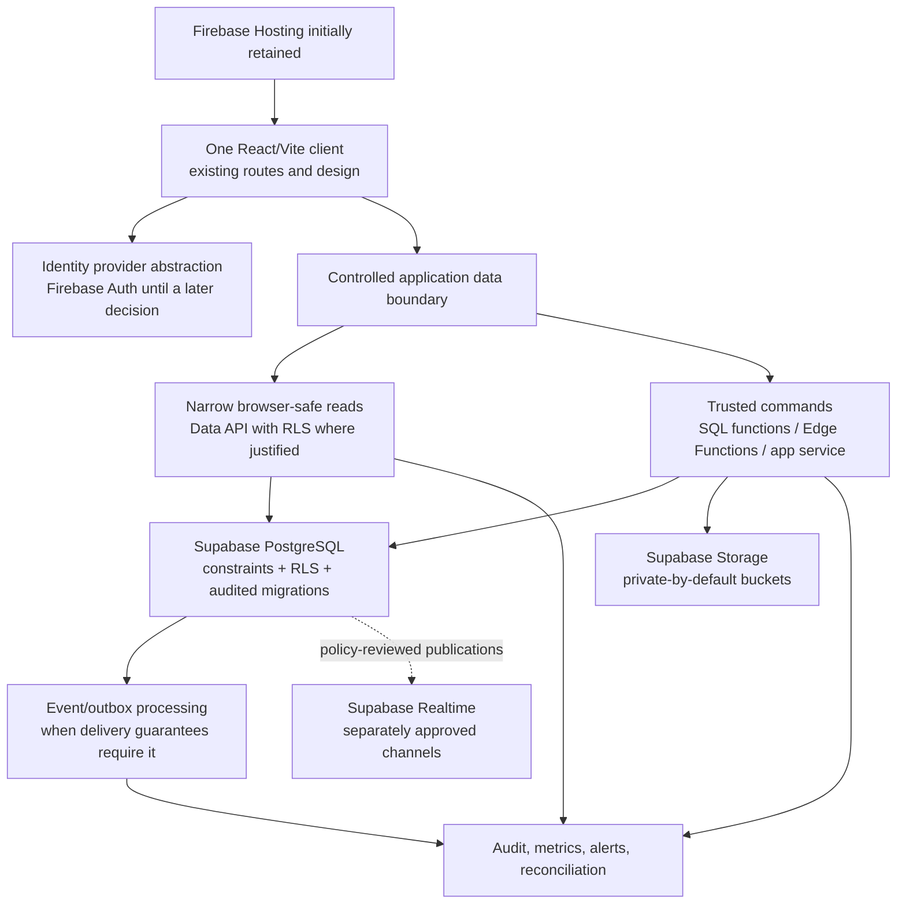

# Target hybrid architecture

## Evidence notation

`[Verified current fact]`, `[Latest known historical fact]`, `[Assumption]`, `[Unknown]`, and `[Future plan]` have the meanings defined in `00_CURRENT_STATE_AND_INVENTORY.md`.

## Architecture decision

- **[Future plan]** Keep one React/Vite frontend and the current visual identity. Introduce backend-provider boundaries beneath the existing service modules; do not build a second interface.
- **[Future plan]** Keep Firebase Hosting serving `mujahiz.com` and the existing Firebase origins during the initial backend migration. No DNS or Hosting migration belongs to the initial phases.
- **[Future plan]** Keep Firebase Auth as the initial identity provider unless a separately reviewed TEST/UAT phase proves that Supabase Auth migration is safer and worthwhile.
- **[Future plan]** Introduce Supabase PostgreSQL and RLS gradually. Introduce Supabase Storage, Realtime, and Edge Functions only after their own schema, policy, privacy, cost, and rollback reviews.
- **[Future plan]** Every feature has exactly one authoritative write backend at a time. No Production dual writes and no automatic Firebase fallback after a Supabase failure.
- **[Future plan]** Use Firebase legacy IDs as stable mapping values even when PostgreSQL uses UUID/bigint primary keys.

## Current-state architecture

- **[Verified current fact]** Most Firestore access already flows through `src/services/*`, but Firebase Auth is also imported directly by the Auth context and four page-level flows.
- **[Verified current fact]** Live Firebase has no deployed Functions or Storage bucket; current GitHub source nevertheless contains callable-backed protected workflows.
- **[Verified current fact]** Production runtime selection fails closed to a configuration-error screen; Demo mode requires an explicit development flag.

## Transitional hybrid architecture

- **[Future plan]** The provider manifest must be explicit and immutable for a deployed build/config revision. A request must never try Provider A and silently retry Provider B.
- **[Future plan]** Read-only shadow comparison may be used in TEST or a controlled rehearsal, but it must not expose private data, change responses, or become a hidden fallback.
- **[Future plan]** Move feature aggregates, not isolated tables. Example: quotation response, immutable revision, deterministic event, and notification must change authority together.
- **[Future plan]** Keep provider identifiers in telemetry so an operator can distinguish Firebase failures, Supabase failures, policy denials, and validation errors.

## Target architecture

- **[Future plan]** “Target” does not force Supabase Auth. The identity abstraction permits Firebase Auth to remain authoritative or a later approved migration to Supabase Auth.
- **[Future plan]** Browser-direct CRUD is appropriate only for simple records whose constraints and RLS fully express the current authorization and consistency contract.
- **[Future plan]** Ownership decisions, Supplier approval/deduplication, RFQ publication/quotation revision, role/access administration, idempotency, and audit/event creation require trusted transactional commands.

## Trust boundaries

| Boundary | Rule |
|---|---|
| Browser | **[Future plan]** Treat all identifiers, roles, status values, ownership links, prices, revision numbers, event IDs, and file metadata as untrusted input. |
| Identity token | **[Future plan]** Validate issuer, audience, expiry, signature, and the Postgres role claim. Never map Buyer/Admin/Owner directly onto Postgres system roles. |
| Application authorization | **[Future plan]** Use a database profile/ownership lookup for current role, account status, access, and Supplier linkage. JWT claims may be a cache hint only where revocation semantics are explicit. |
| RLS | **[Future plan]** Enable RLS on every exposed table and grant least privilege. Keep internal/event/idempotency/fingerprint tables outside the exposed API schema or grant them no browser access. |
| Trusted command | **[Future plan]** Re-read current state inside one database transaction, validate transitions, allocate deterministic/idempotent artifacts, and write audit/event records before commit. |
| Service credentials | **[Future plan]** Service-role keys, database credentials, Firebase Admin credentials, and migration credentials are backend/CI secrets only and must never enter Vite, browser logs, docs, Git, or PR text. |
| Storage | **[Future plan]** Bucket policy and database ownership must agree; signed URLs are capabilities with short expiry, not durable ownership records. |

Official Supabase guidance used for this plan: [Firebase third-party authentication](https://supabase.com/docs/guides/auth/third-party/firebase-auth), [Row Level Security](https://supabase.com/docs/guides/database/postgres/row-level-security), and [securing the Data API](https://supabase.com/docs/guides/api/securing-your-api).

## Authentication token-flow options

### Initial Firebase-third-party flow

1. **[Future plan]** The browser authenticates with Firebase Auth using the existing session, verification, and recovery behavior.
2. **[Future plan]** A future Supabase client obtains a current Firebase ID token through an asynchronous access-token callback.
3. **[Future plan]** Supabase verifies the registered Firebase issuer/audience before the request reaches PostgreSQL.
4. **[Future plan]** The Firebase token must carry Postgres `role: authenticated`; application roles remain in `application_users` and are not trusted as Postgres roles.
5. **[Future plan]** RLS maps `auth.jwt()->>'sub'` to `application_users.firebase_uid`. Do not assume a Firebase UID is a PostgreSQL UUID.
6. **[Future plan]** RLS/trusted functions then validate current role/status/access and Supplier ownership from relational data.

- **[Verified current fact]** No repository code currently assigns the Firebase custom claim `role: authenticated`; current authorization reads Firestore application-role data. Source: repository search and `functions/src/callableAuth.ts`.
- **[Future plan]** Adding the claim for existing/future users is a separate Firebase Auth/Functions mutation and requires TEST proof, rollback, token-refresh handling, and explicit approval. It is not part of this baseline.
- **[Future plan]** Never set Firebase JWT `role` to `owner`, `admin`, `buyer`, or `supplier`; Supabase interprets that claim as a Postgres role selector.

### Later Supabase Auth flow

- **[Future plan]** If Option B is approved, the identity facade obtains a Supabase session and RLS maps the Supabase `sub` to the same application user through an identity-link table.
- **[Future plan]** Existing Firebase sessions remain valid only for the explicitly defined coexistence window; session invalidation, password migration/reset, verification, recovery, and rollback must be rehearsed.
- **[Future plan]** No account may be automatically merged by email alone. A trusted migration/linking process must preserve Firebase UID, Supplier ownership, and audit evidence.

## Backend-provider selection rules

| Rule | Required behavior |
|---|---|
| One authority | **[Future plan]** A feature manifest records exactly one of `firebase` or `supabase` for reads and writes. |
| No implicit probing | **[Future plan]** Do not choose a provider based on record existence, exception type, latency, or a failed request. |
| No Production dual write | **[Future plan]** A user command commits to one authoritative backend. Migration copies run as separately controlled data operations, not application side effects. |
| Coupled aggregate | **[Future plan]** Parent, child, event, revision, notification, idempotency, and audit rows that form one invariant move in one phase. |
| Configuration | **[Future plan]** Missing/invalid provider configuration fails closed before protected UI/data operations. |
| Versioning | **[Future plan]** Provider manifest, schema version, deployment commit, and migration checkpoint are recorded together. |
| Rollback | **[Future plan]** Rollback changes the manifest only after the old backend is confirmed complete through the cutover checkpoint and no incompatible writes occurred. |

## Failure behavior

- **[Future plan]** Supabase-authoritative reads that fail return a provider-specific unavailable/denied error; they do not read Firebase “temporarily.”
- **[Future plan]** Supabase-authoritative commands use an idempotency key. Ambiguous network failure is reconciled against the same Supabase command record, not replayed against Firebase.
- **[Future plan]** RLS denial is a security result, not a signal to use a service-role path or another backend.
- **[Future plan]** Realtime failure degrades to explicit refresh or bounded polling only if the feature design approves it; it must not change data authority.
- **[Future plan]** Notification delivery failure is detected through an outbox/event state and retried idempotently; it must not roll back or duplicate the business transition unless that is the defined transaction contract.
- **[Future plan]** Storage upload failure leaves no durable file row marked ready and no rewritten Firestore URL.

## Rollback boundaries

| Boundary | Rollback condition |
|---|---|
| Before any Production copy | **[Future plan]** Revert code/config only; Firebase remains authoritative. |
| Rehearsal environment | **[Future plan]** Drop/recreate only the explicitly disposable rehearsal environment under separate approval; never touch Production Firebase. |
| After copy, before write cutover | **[Future plan]** Discard/repeat the copy from a new checkpoint; Firebase remains authoritative. |
| After read cutover, before write cutover | **[Future plan]** Return reads to Firebase only if no Supabase-only writes occurred and parity checks pass. |
| After write cutover | **[Future plan]** Rollback requires a defined reverse-delta or a freeze-and-reconcile procedure. A config flip alone is unsafe. |
| Identity | **[Future plan]** Keep Firebase Auth until Supabase Auth rollback has been proven with TEST accounts. Never delete Firebase users as part of rollback. |
| Storage | **[Future plan]** Keep Firebase objects/URLs until Supabase copies, hashes, access policies, and URL resolution are verified through the retention window. |

## Why Production dual writes are prohibited

- **[Verified current fact]** Current features create multiple deterministic artifacts in one Firestore batch/transaction; independent Firebase and PostgreSQL commits cannot be atomic across both systems.
- **[Future plan]** Retries, partial outages, race conditions, Rules/RLS differences, timestamp ordering, and independently generated IDs would create divergent ownership, quotation revisions, notifications, or audit histories.
- **[Future plan]** A migration worker may copy from an authoritative source to a target with checkpoints and verification, but the user-facing command path must never pretend two independent commits are one transaction.
