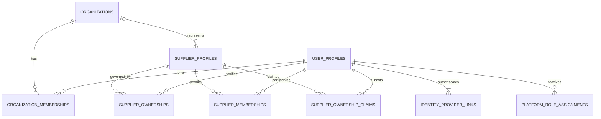
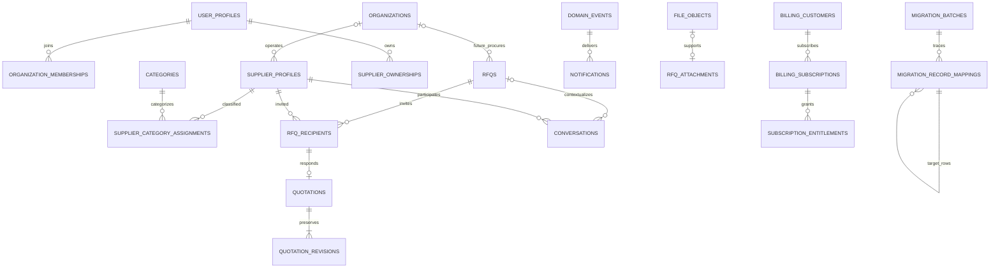

# Authoritative PostgreSQL schema design

Status: **Owner-approved logical design; twenty-five local SQL slices implemented; privileged-access and security-eligibility structural slices implemented as inert foundations**
Design base: `1a4e5a59a37b2f1eb05d5cf8fa555d8f7dfe84d6`
Evidence date: 3 August 2026
Primary task profile: Documentation

## A. Scope and status

This document is the authoritative logical design for a future Mujahiz IQ PostgreSQL schema. It is documentation only.

- At the design base, no Mujahiz application SQL existed. Current `main` at `85a68c44e01d8d3bf86bdbf4d71f8092abfb4f3a` contains 25 tracked local migrations, 25 pgTAP files, and 24 physical tables. PRs #113/#114 added the empty, fully revoked `public.access_grants` and non-exposed `internal.security_eligibility_assessments` foundations; PR #116 added the bounded local current-principal resolver, PR #118 added the bounded local target-Supplier conflict resolver, and PR #120 added the Reviewer Private-Read Substrate; no Claim mutation RLS policy was added.
- The twenty-five local slices implement 22 of 37 Core Phase 1 concepts; 15 remain unimplemented. No verified hosted environment contains these local tables.
- Owner-approved document 41 selected exactly one empty, fully revoked, local-only `public.supplier_ownership_claims` table as the Claim-specific slice after REL. Merged PR #99 implemented that structural foundation as the fifteenth tracked local migration without RLS, policy, grant, row, trusted command, Auth bridge runtime, hosted authority, or Production behavior.
- Owner-approved document 38 resolves RFQ-003 for future normalized commercial semantics only. No RFQ/quotation PostgreSQL table or amount-bearing SQL slice has been selected or implemented.
- Owner-approved document 55 selects Access Option A (`public.access_grants`, purpose exactly `platform_administration`) and Security Option A (`internal.security_eligibility_assessments`) as two separate local-only structural slices. PRs #113/#114 implemented both as empty, fully revoked foundations. Implemented locally: `claim_security.current_privileged_actor_v1()`, private `claim_security.privileged_actor_for_profile_v1(uuid)`, `claim_security.target_supplier_conflict_v1(uuid, uuid, uuid)`, Reviewer Private-Read Substrate, Owner assignment queue, Reviewer candidate projection, assigned-reviewer queue/detail, and three Claim SELECT policies. Still absent: real access/security authority population, access/security administration runtime, bootstrap, `supplier_claim.assign_reviewer`, approve/reject/expire, real Firebase gateway, and hosted/Production authority.
- The local slices contain no seed, trigger, browser/application grant beyond the dedicated Claimant read path, and no Claim mutation policy. PR #101 adds the identity context; PR #102 adds exactly one Claim FORCE-RLS self-select policy and one minimized `SECURITY INVOKER` claimant projection, with no trusted command, row, or hosted authority.
- No hosted Supabase project was linked, authenticated, queried, or independently verified.
- The local Supabase runtime was not started for the documentation-only design; the separate SQL slice was later verified in the disposable local runtime.
- Firebase Production remains operational, authoritative, and unchanged.
- Claim Supplier Profile exists on GitHub `main` but is not deployed, enabled, or populated in Firebase Production.
- Future procurement decisions, awards, multi-user Supplier memberships, file uploads, saved searches, and Stripe billing are designs, not implemented product behavior.

The design translates the repository behavior at the exact base above. It does not claim that current GitHub code, Rules, indexes, or callable Functions are deployed. Current bounded Firestore counts are time-bound and must be refreshed before any migration or consequential Production decision.

### Evidence reviewed

The design was derived from the migration documents `00_CURRENT_STATE_AND_INVENTORY.md` through `08_LOCAL_CLI_FOUNDATION.md`, plus the current implementation and focused tests, including:

- `src/services/workspace.ts`, `firestore.ts`, `registration.ts`, `supplierExcelImport.ts`, `supplierOwnership.ts`, `supplierWorkspace.ts`, `portalDashboard.ts`, `adminUsers.ts`, and `uploadService.ts`;
- `src/types/domain.ts` and `src/types/workspace.ts`;
- `src/utils/rfqLifecycle.ts`, Supplier normalization/import/search utilities, and the Supplier directory query/filter path;
- `functions/src/adminUsers.ts`, `callableAuth.ts`, `supplierDuplicate.ts`, `supplierOwnership.ts`, `supplierSubmissionApproval.ts`, and their normalization cores;
- `firestore.rbac.rules` and `firestore.indexes.json`; and
- focused RFQ, revision, conversation, ownership, duplicate, import, trial/access, notification, permission, read-budget, and Functions/Firestore Emulator tests; and
- documents 45_CLAIM_RUNTIME_IDENTITY_CONTEXT_FOUNDATION_EVIDENCE.md, 47_CLAIM_RLS_SELF_READ_FOUNDATION_EVIDENCE.md, and Owner-approved 46_CLAIM_V1_TRUSTED_COMMAND_ATOMICITY_AND_LOCKING_CONTRACT.md.

### Evidence labels

- **Current:** proved by repository evidence at the design base or the bounded 3 August 2026 inventory.
- **Recommended:** the preferred schema decision, still requiring review before implementation.
- **Open:** an explicit approval or evidence gap blocks the final implementation choice.
- **Future:** intentionally supported by the model but not current behavior.

## B. Design decisions

| Topic | Recommended decision | Reason and boundary |
|---|---|---|
| Primary keys | Use database-generated UUID primary keys for new relational identities. | Business relationships use UUID FKs, never email or mutable display values. Deterministic legacy keys remain unique alternate keys, not primary keys. |
| UUID generation | Use database-generated UUIDv4 through `pg_catalog.gen_random_uuid()` for the first local slice; retain UUIDv7 as a later option only when an approved environment exposes a stable reviewed mechanism. | Local PostgreSQL `17.6` exposes no UUIDv7 function and does expose the standard UUIDv4 mechanism. Hosted compatibility remains unverified. Clients never choose authoritative IDs. |
| Firebase identity | Store each Firebase UID as `identity_provider_links.provider_subject` with provider `firebase`, and preserve `users/{uid}` as `user_profiles.legacy_firestore_id`. | The Firebase subject is bounded text, not a PostgreSQL UUID. The provider link is the initial RLS identity bridge and can coexist with a later Supabase Auth subject. |
| Firestore document IDs | Require `legacy_firestore_id` on a row that directly represents a migrated Firestore root document or authoritative legacy event; keep it nullable for new PostgreSQL-created rows and normalized child rows. Preserve each source collection/document/version in a disposition record, then map targets through exactly one deterministic child key or ordinal, non-forking active slot uniqueness, reverse target uniqueness, and reviewed merge groups. | This supports idempotent replay, zero-to-many normalized children without target forks, exceptional reviewed many-source merges, bidirectional reconciliation, rollback comparison, and deterministic event verification without inventing legacy IDs for derived children. |
| Timestamps | Use timezone-aware timestamps for all instants; preserve source `created_at` and `updated_at` separately from migration timestamps. | New trusted writes use database/server time. Ordering uses a stable tie-breaker such as UUID or preserved legacy ID, never physical row order. |
| Dates and durations | Use dates only for calendar concepts; use timestamps for deadlines and validity windows. | RFQ closing, access expiry, claim expiry, message creation, and billing periods are instants. Delivery days and granted days are positive integers. |
| Money | Use exact `numeric(20,4)` canonical quantity and monetary values, exactly four fractional digits in canonical serialization, half-even rounding at the approved arithmetic boundary, and one IQD/USD currency per quotation revision. | Floating point is prohibited. Owner-approved RFQ-003 Option B fixes new quotation unit/subtotal/total, tax, freight, comparison, and legacy-quarantine semantics; implementation remains separately gated. |
| Status fields | Use bounded text with check constraints for stable workflow states; use reference tables only for administrator-extensible vocabularies. | PostgreSQL enums are not recommended for frequently evolving workflows. A native enum is acceptable only after an ADR proves the value set is truly closed. |
| JSONB | Restrict JSONB to immutable source snapshots, external webhook payloads, migration evidence, schema-versioned settings, and bounded audit/event metadata. | Searchable relationships, authorization fields, money, status, recipients, participants, categories, contacts, and line items remain relational. |
| Soft deletion | Do not add `deleted_at` everywhere. Use state transitions for users, organizations, Suppliers, RFQs, quotations, claims, subscriptions, and files; hard delete only disposable/pre-publication or user-owned preference rows. | Procurement, ownership, financial, event, audit, and migration history is never cascade-deleted in normal operation. |
| Audit columns | Mutable business tables use `created_at`, `created_by_user_id`, `updated_at`, and `updated_by_user_id` where the actor is meaningful. | Append-only ledgers use only creation/actor fields. Migration provenance is separate from business authorship. |
| Trusted-server fields | Roles, account status, verification mirrors, ownership, `can_receive_rfqs`, canonical fingerprints, review decisions, revision numbers, current revision pointers, awards, entitlement state, file readiness/scan state, events, notifications, audits, and migration fields are trusted-only. | Browser input is never authoritative for identity, authorization, sequence, money totals, eligibility, deduplication, or history. |
| Immutable data | Quotation revisions/items, temporal ownership history and its domain events, RFQ publication records, access grants, billing events, domain events, audit logs, and migration mappings are append-only. | Corrections use compensating rows or a new revision/event, not in-place historical edits. |
| Reference numbers | Store a separate immutable human-readable reference allocated by a trusted transaction; do not expose UUID order as a business sequence. | Reference uniqueness is scoped by type and, where needed, organization plus year. Gaps are acceptable. |
| Email and identifiers | Store original display value plus a versioned normalized value. Enforce case-insensitive uniqueness only within the correct provider or invitation scope. | Email is PII and a delivery/login attribute, not a permanent relationship. No account merge is based on email alone. |
| Arabic and English | Store UTF-8 text. Use explicit `*_ar` and `*_en` columns for core bilingual names/snapshots; use translation tables for extensible content and taxonomy. | One language never silently overwrites or backfills the other. Search normalization retains the original text and normalization version. |
| Search normalization | Keep original values plus a versioned normalizer and rebuildable audience-safe projection; do not treat current `searchKeywords` arrays as authoritative. | Owner-approved SEARCH-001 Option A starts with relational filters plus bilingual PostgreSQL FTS. `pg_trgm` is absent initially and requires all four approved evidence gates; an external service is rejected for Phase 1. No search implementation is authorized. |
| Category hierarchy | Use one `categories` adjacency hierarchy with stable codes and required Arabic/English columns in the initial bounded taxonomy; Supplier assignments point to an approved node and record whether it is primary. | Current category/subcategory strings require a reviewed mapping and exception queue before FKs can be enforced. `category_translations` is merged into `categories`; a separate locale table may return only after evidence shows more locales or independent translation lifecycle are required. |
| File metadata and custody | Before FILE-001, use only the controlled external/legacy-reference strategy in typed attachment rows or bounded Claim evidence, with no file-object column/FK or Storage assumption. After approval and implementation, use immutable provider-neutral `file_objects`; typed domain relations hold custody/authorization and persist reviewed provider/object, safe name, MIME, size, SHA-256, classification, upload/scan, retention, and creator provenance. | The uploader or creating user is provenance, not continuing authorization. Private files never use permanent public URLs. Future finalization attaches a ready object to one authorized typed parent or quarantines it; an audited migration may replace validated external references with stable file IDs while retaining provenance. |
| Duplicate detection | Preserve two distinct controls: versioned protected exact fingerprints with active uniqueness, and a trusted rebuildable fuzzy-candidate projection over normalized name variants plus governorate/category/supporting evidence. | Exact contact-derived values use protected keyed digests and atomic pending-to-approved promotion. Fuzzy scoring is bounded and versioned, feeds a review queue, and never automatically merges or deletes a Supplier. Legacy SHA-256 remains migration evidence only. |
| Idempotency | Hash the client key, bind it to actor, operation scope, normalized payload hash, result reference, and expiry, then consume it in the same transaction as the command. | Raw keys are not stored. Replays with a different payload fail. Deterministic legacy IDs remain migration evidence. |
| Denormalization | Permit Supplier rating summaries, conversation last-message pointer, notification bilingual snapshots, and immutable migration/audit payloads only when a trusted write maintains them. | Current quotation items are read from the immutable items of `quotations.current_revision_id`; `quotation_items` is removed from the first implementation. Any later performance projection must be derived, rebuildable, and justified by query evidence. |

### Recomputed rather than authoritative

The following current fields should not be canonical stored state: Supplier `completionScore`, user `qualityRatio`, badges, directory `searchKeywords`, review aggregates, dashboard counts, effective access status where grants/entitlements determine it, RFQ expiry labels, and quotation comparison totals that can be calculated from line items. A performance projection may cache a value only after query evidence, with a trusted refresh rule and reconciliation test.

### RLS design boundary

This document records sensitivity and expected access dimensions but does not design or implement policies. Final grants, exposed schemas, JWT mapping, helper functions, and RLS require a separate **Extra High security PR** and independent allow/deny review.

Expected dimensions are: unauthenticated public, authenticated user, organization member, Buyer organization, Supplier profile member, verified Supplier owner, RFQ creator, RFQ recipient, conversation participant, Admin, Owner, and trusted server only. Platform `owner`/`admin` application roles must never be confused with Supabase/PostgreSQL technical roles.

Base Supplier tables are **not public**. Current directory access remains restricted to the audiences already approved by application policy. RLS is row-level and cannot by itself hide private columns from a row a caller may select. If a separately approved audience needs directory data, expose only an audience-specific security-invoker view or RPC projection. No anonymous or public projection may contain private contacts, ownership/member identity, duplicate fingerprints or candidate evidence, source/migration metadata, internal status, review notes, or quality/security signals. Anonymous Supplier-directory exposure is a future product/security approval, not current behavior and not authorized by this design.

### Internal schema boundary

Use the non-exposed internal schema for `audit_logs`, approved `security_eligibility_assessments`, `idempotency_keys`, `domain_events`, deferred `security_events`, `import_errors`, `migration_batches`, `migration_record_mappings`, and `migration_validation_results`, plus protected Supplier fingerprint/candidate machinery. These relations are unavailable to browser clients and API schema exposure; narrowly scoped trusted commands or security-invoker projections are the only boundary. This is a schema recommendation, not a grant, policy, RLS, or implementation.

## C. Domain model

The approved model contains **80 logical tables**. “Future” tables are designed for compatibility but are not proposed for the first SQL migration.

| Domain | Proposed tables | Count |
|---|---|---:|
| Identity and access | `user_profiles`, `identity_provider_links`, `platform_role_assignments`, `organizations`, `organization_memberships`, `account_invitations`, `access_credits`, `access_grants`, `contribution_logs` | 9 |
| Supplier directory and ownership | `supplier_profiles`, `supplier_locations`, `supplier_contacts`, `supplier_category_assignments`, `supplier_capabilities`, `supplier_payment_options`, `supplier_products`, `supplier_documents`, `supplier_ownerships`, `supplier_memberships`, `supplier_ownership_claims`, `supplier_ownership_claim_evidence`, `supplier_ownership_events`, `supplier_claim_rate_limits`, `supplier_submissions`, `supplier_import_batches`, `supplier_duplicate_fingerprints`, `supplier_feedback`, `supplier_reviews`, `supplier_review_tags`, `supplier_favorites` | 21 |
| RFQ and procurement | `rfqs`, `rfq_items`, `rfq_attachments`, `rfq_recipients`, `rfq_publish_events`, `rfq_status_history`, `quotations`, `quotation_items`, `quotation_revisions`, `quotation_revision_items`, `quotation_revision_attachments`, `quotation_events`, `quotation_decisions`, `quotation_comparison_notes`, `award_decisions`, `decision_approvals` | 16 |
| Messaging and notifications | `conversations`, `conversation_participants`, `messages`, `message_receipts`, `message_attachments`, `notifications`, `notification_preferences` | 7 |
| Content, search, and configuration | `categories`, `category_translations`, `administrative_areas`, `registration_sectors`, `content_pages`, `content_page_translations`, `material_terms`, `material_term_aliases`, `term_suggestions`, `term_suggestion_examples`, `platform_settings` | 11 |
| Files and storage metadata | `file_objects`, `upload_sessions`, `file_access_events` | 3 |
| Audit, security, and reliability | `audit_logs`, `security_eligibility_assessments`, `idempotency_keys`, `domain_events`, `security_events`, `import_errors`, `migration_batches`, `migration_record_mappings`, `migration_validation_results` | 9 |
| Future billing | `subscription_entitlements`, `billing_customers`, `billing_subscriptions`, `billing_events` | 4 |

The 80 entries above are the authoritative logical catalog. The phase manifest below, not the catalog size, controls implementation. Core Phase 1 contains 37 concepts; the remaining concepts are near-term extensions, compatibility seams, deferred work, or explicit removals/merges.

### Complete 80-table phase manifest

Each proposed table appears exactly once in this manifest. "Core Phase 1" is the recommended first SQL implementation. "Core Later" is a near-term extension after its named gates. "Future-Compatible" and "Deferred" mean **do not create yet**. "Remove/Merge" means the named table must not be created; its replacement is stated inline. The detailed catalog remains the authoritative logical description and does not override this disposition.

| Disposition | Count | Tables and disposition notes |
|---|---:|---|
| Core Phase 1 | 37 | `user_profiles`, `identity_provider_links`, `platform_role_assignments`, `access_credits`, `access_grants`, `contribution_logs`, `supplier_profiles`, `supplier_locations`, `supplier_contacts`, `supplier_category_assignments`, `supplier_capabilities`, `supplier_payment_options`, `supplier_ownerships`, `supplier_submissions`, `supplier_import_batches`, `supplier_duplicate_fingerprints`, `rfqs`, `rfq_items`, `rfq_attachments`, `rfq_recipients`, `rfq_publish_events`, `quotations`, `quotation_revisions`, `quotation_revision_items`, `quotation_revision_attachments`, `quotation_events`, `notifications`, `categories`, `administrative_areas`, `audit_logs`, `security_eligibility_assessments`, `idempotency_keys`, `domain_events`, `import_errors`, `migration_batches`, `migration_record_mappings`, `migration_validation_results`. |
| Core Later | 10 | `supplier_products`, `supplier_ownership_claims`, `quotation_decisions`, `quotation_comparison_notes`, `conversations`, `conversation_participants`, `messages`, `material_terms`, `material_term_aliases`, `term_suggestions`. |
| Future-Compatible - **do not create yet** | 13 | `organizations`, `organization_memberships`, `account_invitations`, `supplier_documents`, `supplier_memberships`, `award_decisions`, `message_receipts`, `message_attachments`, `file_objects`, `subscription_entitlements`, `billing_customers`, `billing_subscriptions`, `billing_events`. |
| Deferred - **do not create yet** | 13 | `supplier_claim_rate_limits`, `supplier_feedback`, `supplier_reviews`, `supplier_favorites`, `decision_approvals`, `notification_preferences`, `registration_sectors`, `content_pages`, `content_page_translations`, `platform_settings`, `upload_sessions`, `file_access_events`, `security_events`. |
| Remove/Merge - **do not create** | 7 | `supplier_ownership_claim_evidence` -> merge bounded immutable evidence descriptors into the Claim and defer file evidence to a typed future file relation; `supplier_ownership_events` -> use temporal ownership rows plus canonical domain-event and audit ledgers; `supplier_review_tags` -> merge bounded moderated tags into the deferred review design until a governed vocabulary justifies a relation; `rfq_status_history` -> use RFQ state timestamps and publish/domain-event ledgers without inventing history; `quotation_items` -> query items belonging to the current immutable revision; `category_translations` -> use required paired Arabic/English fields on the category row; `term_suggestion_examples` -> retain a bounded minimized evidence sample on the suggestion row until separate retention/query evidence exists. |

Reconciliation: **37 + 10 + 13 + 13 + 7 = 80**. The new Core Phase 1 concept is `internal.security_eligibility_assessments`: it is distinct current authority and neither replaces deferred `security_events` nor decomposes another concept. `supplier_ownership_claims` remains cataloged as Core Later because Production has zero Claim rows and the GitHub-only Claim feature is undeployed; merged PR #99 supplies only its empty local structural foundation. Any later phase movement still requires repository evidence, an updated count reconciliation, and dependency review; implementation of one table never implies that all 80 belong in one migration.

### Recommended initial migration slice

This is a design target only, not authority to execute a migration:

- Transform four Firebase application identities into `user_profiles` and provider links while preserving legacy `accountType`, role, Buyer/Supplier context, and free-text organization/sector as restricted migration evidence; fabricate no organization.
- Transform 480 Suppliers and ordered normalized child rows with deterministic zero-to-many mappings. Create ownership only when `users.supplierProfileId` and `suppliers.accountOwnerId` agree in both directions; quarantine mismatches. Supplier profiles remain valid without organization rows.
- Preserve 540 Supplier submissions, the one Supplier import batch, access credits, the two legacy product-access grant records as restricted source evidence pending a separate product-access contract, and contribution ledgers. Do not map legacy product/trial grants into the approved administration-only `public.access_grants` contract.
- Preserve protected exact fingerprint evidence and the inputs needed to rebuild/version fuzzy duplicate candidates; perform no automatic merge or delete.
- Preserve the two controlled TEST RFQs, their recipients, responses, immutable revisions/items, and events after price/currency approval; preserve their TEST classification.
- Import the six notification rows as already-materialized inbox history with fan-out suppressed, and preserve 623 audit rows with minimized mappings. Historical RFQ/quotation events are not replayed.
- Create one source disposition plus zero-to-many deterministic target mappings and validation results for every source record.
- Leave Claims, messaging, files, organizations, organization memberships, and billing uncreated initially. The authoritative Claim design is retained for a later phase; no empty Claim table is required by the first slice.

No counts above authorize a Production read or write; bounded facts must be refreshed under a separately approved migration runbook.
### Second local SQL-slice implementation status

The implementation branch adds only public.user_profiles and internal.identity_provider_links through migration 20260804000200_provider_neutral_identity_foundation.sql. It applies the approved provider-neutral UUID/profile and provider-subject contracts, bounded lifecycle checks, partial active-link uniqueness, migration-batch provenance, ON DELETE RESTRICT relationships, and zero direct API-role table privileges. No RLS, policy, Auth bridge, Auth user, runtime command, data migration, or deferred identity/access table is included. This is local implementation evidence only; ID-001 remained Open when that slice merged and is now Resolved by approved document 33. MIG-002 and RES-001 remain Open, and Firebase Auth remains authoritative during the hybrid phase.

The third local SQL slice adds only `public.supplier_profiles` through migration `20260804000300_supplier_profile_foundation.sql`. It applies the approved organization- and Auth-independent Supplier root contract: UUIDv4 identity, bounded legacy alternate ID, distinct original/display/Arabic/English names, bounded business/lifecycle/provenance fields, nullable `ON DELETE RESTRICT` trusted actor references, and zero direct API-role table privileges. It creates no Supplier ownership, location, contact, category, capability, payment, submission, import, duplicate, eligibility, organization, Auth, RLS, policy, view, RPC, trigger, function, browser/API, data-migration, hosted, or Production behavior. This remains local implementation evidence only; it predates SUP-003 approval.

The fourth SQL slice merged by PR #59 adds only `public.categories` through migration `20260805000100_categories_foundation.sql`. It establishes the empty local Supplier-offering taxonomy contract with declarative bounded-depth/type/leaf/archive and replacement-target checks, bilingual normalized-sibling uniqueness, and zero API-role access. Canonical-code update immutability, active-parent immutability, lifecycle transition history, and normalized-value derivation remain deferred to a later authorized trusted mutation path because this slice adds no trigger or function.

The fifth SQL slice merged by PR #62 adds only `public.administrative_areas` through migration `20260805000200_administrative_areas_foundation.sql`. It establishes the empty governorate-only administrative-area foundation required by SUP-004: UUIDv4 identity, canonical code, bilingual names, lifecycle and normalized-name bounds, and zero API-role access. It creates no reference rows, Supplier locations, mapping artifacts, RLS, Auth bridge, hosted operation, Firebase interaction, or Production data behavior. Merged `main` now contains 9 implemented / 27 deferred Core Phase 1 concepts across 11 physical local SQL tables.

### Sixth local SQL-slice selection status

The documentation decision in `25_SIXTH_SQL_SLICE_SUPPLIER_LOCATIONS_SELECTION.md` selected exactly one empty `public.supplier_locations` table. PR #68 later implemented that exact local-only, synthetic-data-only boundary without rows, mapping execution, contacts, RLS, policies, API privileges, application integration, hosted operations, Firebase access, or Production behavior. The verified state at the sixth-slice implementation point was 10 implemented / 26 deferred Core Phase 1 concepts across 12 physical tables.

### Seventh local SQL-slice selection status

`26_SEVENTH_SQL_SLICE_SELECTION.md` records the historical hard stop at `public.supplier_category_assignments`, and `27_SUPPLIER_CATEGORY_ASSIGNMENT_PRODUCT_AND_DATA_CONTRACT.md` records the approved Option B contract. Merged PR #73 implemented exactly the selected empty, revoked, local-only `public.supplier_category_assignments` table plus focused synthetic pgTAP as the seventh slice. It added no alias infrastructure, rows, mapping execution, RLS, data operation, hosted behavior, Firebase access, or Production behavior. The historical post-PR-73 local state was 13 physical tables, 11 implemented Core Phase 1 concepts, and 25 deferred concepts; PR #75 later moved that state to 14 / 12 / 24, PR #78 moved it to 15 / 13 / 23, and PR #80 moved the verified current state to 16 / 14 / 22.

### Supplier capability approval and payment-option deferral

On 7 August 2026, the Product/Data Owner approved the capability contract in `28_SUPPLIER_CAPABILITIES_AND_PAYMENT_OPTIONS_PRODUCT_AND_DATA_CONTRACT.md`: indicative capability semantics, `imports_outside_iraq` routing, unresolved/excluded `import_only`, controlled/custom shapes, optional category scope, provenance/review/lifecycle/normalization, semantic duplicate prevention, restricted evidence, and future public labels-only projection. The same decision selects one future empty, revoked, local-only `public.supplier_capabilities` table as the eighth SQL slice. `public.supplier_payment_options` and its detailed commercial semantics remain deferred. No SQL, pgTAP, row, gate change, RLS, data operation, hosted behavior, Firebase access, or Production/TEST behavior is authorized.

### Eighth local SQL-slice implementation and payment contract approval

Merged PR #75 implemented exactly the approved empty, revoked, local-only `public.supplier_capabilities` table plus focused synthetic pgTAP as the eighth slice. It added no vocabulary rows, mapping execution, payment table, RLS, policy, API privilege, application integration, hosted operation, Firebase access, or Production/TEST data behavior. The verified post-PR75 local state was 14 physical tables, 12 implemented Core Phase 1 concepts, and 24 deferred concepts.

On 8 August 2026, the Product/Data Owner approved the payment-options-only contract in `29_SUPPLIER_PAYMENT_OPTIONS_PRODUCT_AND_DATA_CONTRACT.md`: one typed table with separate method, settlement-currency, credit, and advance shapes; exact no-credit/credit-duration/two-event start semantics; internal-only notes/provenance/review evidence; semantic duplicate prevention; lossless ambiguous-value routing; no client projection; and no invented freshness or reviewer authority. The owner selected exactly one future empty, revoked, local-only `public.supplier_payment_options` table as the proposed ninth slice, later implemented by merged PR #78. The approval created no decision ID, resolved no Open gate, and authorized no data work.

The earlier capability-section deferral remains the historical PR #74 decision. Document 29 is its approved successor contract and proposed-slice selection for payment options only.

### Ninth through seventeenth local SQL-slice implementation status

PR #109 implements the nineteenth local-only Claim submit hotfix slice, PR #110 implements the twentieth local-only Claim withdraw slice, PR #113 implements the twenty-first access-grants foundation, and PR #114 implements the twenty-second security-eligibility foundation, and PR #116 implements the twenty-third bounded local resolver slice and PR #118 implements the twenty-fourth bounded local conflict-resolver slice and PR #120 implements the twenty-fifth Reviewer Private-Read Substrate slice. Current `main` contains 25 migrations, 25 pgTAP files, 24 physical tables, and 22 implemented concepts; the approved 80-concept catalog now has 37 Core Phase 1 concepts, of which 15 remain unimplemented; PR #113 exact evidence was 50/50 focused assertions and 1,399/1,399 full assertions; PR #114 exact evidence was 59/59 focused assertions and 1,458/1,458 full assertions. Claim RLS now has exactly three SELECT policies and no mutation RLS policy exists; exactly four Claim business commands remain unimplemented: `supplier_claim.assign_reviewer`, `supplier_claim.approve`, `supplier_claim.reject`, and `supplier_claim.expire`.

The Product/Data/Security/Privacy Owner-approved endpoint contract remains authoritative for contacts. SUP-005 is Resolved; non-synthetic rows, trusted commands, mapping, RLS/projections, Auth, hosted work, Firebase, and Production/TEST work remain unauthorized.

### REL-001 Option D decision status

On 8 August 2026, the owner approved Option D in `31_REL_001_IDEMPOTENCY_AND_DOMAIN_EVENTS_FOUNDATION_CONTRACT.md`. REL-001 remains historically Resolved for the planning decision that selected no reliability SQL slice at that time. Product/Security/Data/Privacy Owner-approved document 39 later resolved MSG-003 Option C and satisfied the recorded producer/consumer revisit condition. Merged PR #95 then implemented both `internal.idempotency_keys` and `internal.domain_events` together as the empty, fully revoked, local-only fourteenth structural SQL slice with focused synthetic pgTAP. Audit, notification, idempotency, and event concepts remain separate; no real rows, processing, trusted commands, materializer, hosted work, or runtime is implemented.

### SUP-001 ownership and Claim decision status

The Product/Data/Security Owner approved document 32 on 8 August 2026. SUP-001 is Resolved for temporal primary ownership, multiple Suppliers per user, future delegates/memberships, Claim lifecycle/evidence, separate transfer/revocation, same-Supplier privacy, Firebase reconciliation, and the design-only `supplier_ownership.decide_claim` contract. Merged PR #85 implements the selected empty, fully revoked, local-only `public.supplier_ownerships` foundation only; real rows and runtime remain unauthorized.

On 9 August 2026, the Owner approved document 41 Option A: exactly one empty, fully revoked, local-only `public.supplier_ownership_claims` table as the Claim-specific structural slice after REL. Claim v1 has one durable write-once assigned reviewer, no reassignment, and no Owner override; bounded versioned private evidence remains on the Claim; and the rejected/deferred companion tables remain uncreated. PR #96 records this selection only; merged PR #99 implements the empty table foundation, merged PR #101 implements only identity context, and merged PR #102 implements only Claim FORCE RLS, one claimant self-select policy, and one minimized `SECURITY INVOKER` projection. None implements Claim rows, Claim mutation commands, reviewer/Admin/Owner access, complete Auth bridge runtime, notification runtime, hosted authority, or Production behavior.

The Product/Security/Data/Operations Owner approved document 46. PR #103 implemented local `supplier_claim.submit`. PR #108 is the merged review that identified M-1 replay binding, M-2 same-pair race classification, and M-3 reservation/fence defects; PR #109 corrects all three locally. PR #110 implements local `supplier_claim.withdraw` with the corrected completed-binding and two-phase reservation/fence behavior. `supplier_claim.assign_reviewer`, `supplier_claim.approve`, `supplier_claim.reject`, and `supplier_claim.expire` remain unimplemented. This does not imply gateway, hosted Supabase, Firebase signed-token, Production, or deployment readiness. PR #104 gateway/HMAC/pool readiness remains documentation/design only; PR #120 implements Reviewer Private-Read Substrate, while `supplier_claim.assign_reviewer` remains unimplemented.

### Approved ID-001 hybrid authority contract

On 8 August 2026, the Product/Security/Data Owner approved document 33: Firebase Auth is the sole hybrid authentication/email-verification/disablement authority; `public.user_profiles` is the stable provider-neutral domain principal; `internal.identity_provider_links` is the non-domain provider mapping/mirror; and temporal `public.platform_role_assignments` plus separate access/security eligibility form the relational privileged-actor boundary. ID-001 is Resolved, the 11 unrelated Open gates remain unchanged, and the empty, fully revoked, local-only `public.platform_role_assignments` foundation is selected as the next identity/access structural SQL candidate. No SQL or Auth/runtime work is authorized here.

The Product/Security/Data Owner approved document 34 on 8 August 2026: exactly `owner|admin`; no platform `reviewer`; temporal/cardinality/provenance and fail-closed identity boundaries; and future protected bootstrap of at least two usable Owners. Merged PR #87 later implemented exactly its selected empty, fully revoked, local-only `public.platform_role_assignments` foundation; no real rows or runtime are authorized.

The Product/Security/Data Owner approved document 35 on 8 August 2026. AUD-001 is Resolved for the append-only, minimized, trusted-command-only audit boundary. Merged PR #91 later implemented exactly the selected empty, fully revoked, local-only `internal.audit_logs` foundation; no real audit rows, retention job, access path, or runtime is authorized.

### Approved privileged access and security eligibility successor contract

On 10 August 2026, the Product/Security/Data Owner approved [document 55](55_PRIVILEGED_ACTOR_ACCESS_AND_SECURITY_ELIGIBILITY_READINESS.md) as the complete successor implementation prerequisite under ID-001, ID-003, AUD-001, and SEC-001. Access Option A and Security Option A are approved. Access Option B is deferred/not selected, Access Option C rejected, Security Option B deferred, and Security Options C/D rejected.

The approved access contract uses `public.access_grants` only for `platform_administration`, binds every grant to its exact platform-role assignment, preserves `active|revoked|expired|superseded` immutable history, gives usable Owners a non-expiring horizon, and caps Admin grants at exactly 180 calendar days with no auto-renewal. Every new or renewed Admin grant requires two distinct currently usable Owners, one authorizer and one reviewer, and the subject cannot self-approve.

The approved security contract uses the separate, non-exposed `internal.security_eligibility_assessments` relation with `clear|deny|unknown`, initial conditions `complete_clear|explicit_deny|security_hold|identity_quarantine|reconciliation_required`, lifecycle `active|resolved|expired|superseded`, immutable history, and exactly one effective current assessment per subject/scope/current policy/coverage boundary. Only current complete `clear` permits. Trusted systems may restrict only and never self-clear; a human clear/release requires two distinct currently usable Owners neither of whom is the subject. Authoritative security loss makes even a final usable Owner unusable and triggers separately governed emergency recovery, while ordinary discretionary closures cannot intentionally leave zero usable Owners and final-usable-Owner-affecting authority changes retain distinct usable-Owner review.

The future bootstrap must atomically establish at least two Owner roles, matching administration access, explicit complete-clear security assessments, AUD-001 `privilege_security_authority` evidence, and external governance/manifest evidence. No access/security domain event is approved without a named consumer. PRs #113/#114 completed the two inert structural slices and PR #116 implemented the bounded local relational resolver. The Reviewer private-read substrate, assignment command, administration/bootstrap runtime, later approve/reject slices, later expiry slice, real Firebase gateway, hosted proof, migration, and release work follow separately. Approval creates no table and changes none of the seven Open gates.

### Approved SEARCH-001 Option A architecture

On 9 August 2026, the Product/Technical/Data Owner approved document 37 Option A: relational filters plus bilingual PostgreSQL FTS first, no initial `pg_trgm`, and no external Phase 1 service. SEARCH-001 is Resolved for architecture only. Audience-safe field boundaries, original-preserving versioned normalization, same-script-first reviewed bilingual aliases, bounded AI intent only, deterministic ranking, query-bound keyset pagination, the four-gate trigram boundary, separate protected Admin exact lookup, payment/credit exclusion, and conditional Claim activation remain mandatory. No search SQL, extension, index, projection, RPC, RLS, frontend, AI, hosted, data, or runtime implementation is authorized.

### Approved RFQ-003 Option B commercial semantics

On 9 August 2026, the Product/Finance Owner approved document 38 Option B. RFQ-003 is Resolved for strictly positive net `unit_price`, published quantity/unit equality, trusted derived line/quotation subtotals and total, IQD/USD single-currency revisions, exact scale-4 half-even canonicalization, mandatory quotation-level tax/freight modes, no structured discount, complete same-currency informational comparison, immutable canonical revisions, and normalized-revision-only future award/value references.

Ambiguous legacy `price` remains quarantined source evidence and produces no authoritative amount-bearing target graph unless a separately approved, auditable record-specific provenance class proves all required semantics. This approval selects no RFQ/quotation table or SQL slice and authorizes no SQL, command, RLS, frontend, award, FX, migration/data transformation, hosted, Firebase, Production/TEST, runtime, or deployment work.

### Identity and access conclusions

- Firebase Auth remains the sole hybrid authentication and email-verification authority under the approved ID-001 contract. One `user_profiles` row may have multiple provider links over time, but each provider/subject pair maps to exactly one user and a provider-link ID is never a domain FK.
- A person may later belong to multiple organizations. Organization linkage is nullable and deferred until ORG-001 and ORG-002 are approved. Current users migrate without fabricated organizations; free-text `organization`, `sector`, legacy role, and `accountType` are retained as restricted migration evidence rather than treated as a legal entity or membership.
- Platform Owner/Admin are trusted platform-role assignments and need no organization membership. Buyer/Supplier remain preserved account/business context and are not platform roles, organization roles, or PostgreSQL roles.
- Absent an explicitly reviewed exception, a user has at most one effective active platform role across all role codes. A partial uniqueness constraint or equivalent trusted enforcement applies per user for active intervals; Owner and Admin are mutually incompatible. Legacy `owner` and `admin` map to those assignments, `buyer`/`supplier` map to account context, `suspended` maps to account status, and contributor/viewer values remain migration evidence pending their approved non-privileged mapping.
- A **usable platform Owner** exists only when all of these conditions hold at the same policy version: a current validated Firebase identity plus current Firebase Admin evidence that the account exists, is verified, and is not disabled; an exact active Firebase provider link; an active `user_profiles` row with compatible `buyer` platform context; an active, in-time Owner platform-role assignment; a current valid trusted platform-administration access grant; and every other repository-backed trusted-admin eligibility condition, including absence of an identity conflict, security quarantine, or explicit deny. Database fields are only trusted mirrors. Document 33 records this approved ID-001 contract; it is not implemented here.
- Every direct command or background expiry/correction/reconciliation job that can make a usable Owner ineligible must acquire the common Owner-eligibility serialization guard, lock and re-read the complete candidate Owner set and its profile, account-context, Firebase-link/mirror, role, access, and trusted-admin eligibility rows, apply the proposed transition in the transaction, and re-evaluate the full predicate. It fails closed and rolls back if fewer than one usable Owner would remain. This includes provider unlink/disable, Firebase verification loss or mirror correction, profile suspension, account-status/context change, role demotion/removal, access revocation/correction/expiry, identity disablement, and any future repository-backed eligibility change.
- **Owner-approved under document 55:** `public.access_grants` initially and only represents `platform_administration` and binds to the exact role assignment. Owner access is non-expiring while that role remains usable. Admin access is finite at no more than exactly 180 calendar days from `valid_from`, never auto-renews, and every new or renewed Admin grant requires two distinct currently usable Owners as authorizer and reviewer, with no self-approval. Product trial/subscription/billing entitlement remains outside this contract. `public.access_grants` is implemented locally as an empty, fully revoked structural foundation; it is not runtime authority.
- **Owner-approved security eligibility:** only one current, supported, coverage-complete `internal.security_eligibility_assessments` row with result `clear` and condition `complete_clear` may satisfy the `platform_administration` predicate. Every missing, stale, contradictory, duplicate, unsupported, deny, hold, quarantine, or reconciliation state fails closed. Systems may restrict only; human clear/release requires two distinct currently usable Owners neither of whom is the subject. Genuine authoritative security loss overrides final-Owner availability and enters governed emergency recovery; ordinary discretionary authority changes may not intentionally leave zero usable Owners.
- Registration remains two-stage. Stage 1 accepts a trusted Firebase identity assertion even when email is unverified, idempotently creates/reconciles the application profile and Firebase link, preserves current `accountType`/account context, and grants no verified-only benefit. Stage 2 refreshes verification/disablement from Firebase Auth, and the first verified transition performs idempotent trial/access-ledger work; repeated refreshes cannot duplicate benefits. Verification loss/correction recomputes role, account-context, access, and Supplier eligibility and invokes final-Owner protection when applicable. Browser verification claims are never authoritative.
- A separate `buyer_profiles` table is not justified by current fields. Buyer-specific organization data belongs to organizations/memberships; a later verified buyer qualification aggregate can add a table without splitting identities.
- Current `role=suspended` becomes account suspension state, not a role. Legacy contributor/viewer values are preserved during migration and resolved by the role ADR.
- Platform-administration authority is computed from the approved role-backed `public.access_grants` contract. Product/trial/subscription entitlement remains a separate future contract; current user access fields and legacy grant rows are restricted migration comparison evidence, not authority and not rows for the administration-only relation.

### Supplier directory and ownership conclusions

- `supplier_profiles` is a listed business profile, not an Auth account. “Listed”, “claimed”, “verified owner”, “RFQ-ready”, and “paying” are independent states.
- `supplier_ownerships` records one temporal verified primary human controller per Supplier, separate from operational membership. One user may own/manage multiple Suppliers; no owner-only active uniqueness is recommended. `supplier_memberships` remains a Future-Compatible delegate/admin model and is not required to migrate current Supplier profiles.
- Ordinary Claim approval applies only to an unowned Supplier. Transfer closes the old ownership and creates the successor; revocation leaves the Supplier unowned unless the same transaction transfers it. Both recompute eligibility/access, preserve history, and write separately approved audit/events/notices without making an organization prerequisite.
- `can_receive_rfqs` is a trusted, versioned projection. It is true only when the Supplier is listed/approved and not blocked; an active canonical owner or approved RFQ-capable membership exists; the authorizing user, account context, provider link, and required verification are active; and any approved access entitlement rule passes. It is recomputed transactionally after changes to profile/listing, ownership/membership, account/provider/verification, access, or policy version; otherwise it is invalidated to false with reason codes and a recomputation timestamp. It is explainable, reconciled, and never browser-editable.
- Exact duplicate enforcement and fuzzy review are separate. Active exact kind/digest values are unique and trusted-only; approval atomically promotes pending submission fingerprints while closing/superseding conflicting pending rows. A bounded rebuildable fuzzy-candidate projection uses versioned normalized Arabic/English/name variants, Dice or an approved equivalent score, governorate/category overlap, and supporting evidence. Candidate lookup is capped, scoring/version inputs are recorded in the submission/review queue, and no score causes automatic merge or deletion.
- Locations, contacts, categories, capabilities, payment options, and fingerprints become relational rows. Deferred review tags remain a bounded controlled field on `supplier_reviews` until a governed taxonomy is justified; no `supplier_review_tags` join is created. Source snapshots remain only where approval/audit fidelity requires them.
- Supplier submission approval, canonical duplicate mutation, ownership decisions, transfers, suspensions, and import finalization are trusted commands.

### RFQ and procurement conclusions

- Current states are `draft`, `published`, `receiving`, `closed`, and `cancelled`. `awarded` is Future and may be either an RFQ state or a derived state from an active award; this is **Open**.
- Publication freezes the recipient set into `rfq_recipients` with eligibility and ownership snapshots. A later ownership change does not rewrite the historical invite.
- There is at most one canonical quotation per `rfq_recipient`. The recipient is the sole authorization/party anchor; RFQ and Supplier are derived through it and are not independently writable duplicates. Supplier eligibility and recipient authorization are rechecked before quotation creation.
- `quotation_revisions` and `quotation_revision_items` are authoritative immutable snapshots. A quotation is inserted with a temporarily nullable current-revision pointer, its first revision/items are inserted, and the pointer is set in the same trusted transaction before commit. A composite same-parent relationship guarantees that the pointer names a revision of that quotation; revision number is unique per quotation. `quotation_items` is removed/merged, and current items are queried from the current revision.
- Material-change detection compares normalized commercial content with the current revision. Identical resubmission returns the existing result and creates no revision, event, audit, or notification.
- Owner-approved RFQ-003 Option B requires first-release offered quantity/unit to equal the published item; strictly positive net `unit_price`; trusted `line_subtotal`, `quotation_subtotal`, and `quotation_total`; IQD/USD only with one revision currency; and exact `numeric(20,4)` canonical values, four-digit serialization, and half-even rounding without binary floats.
- Tax mode is `not_applicable|included_in_prices|added_separately`; freight mode is `included_in_prices|added_separately|buyer_arranged`. Only separately added quotation-level amounts enter total. Included components are not double-counted; tax engines/rates/jurisdictions/types/line allocation, freight allocation/Incoterm automation, structured discounts, partial/alternate units, zero-price lines, FX, and cross-currency ranking are excluded.
- Automatic price comparison requires the same RFQ and quantity/unit contract, complete valid normalized data, valid tax/freight treatment, and the same currency. Any lowest same-currency normalized total indicator is informational only and cannot select or recommend an award.
- Ambiguous legacy commercial units create no authoritative amount-bearing rows without separately approved record-specific provenance and bounded review. A future award/value record may reference only an immutable normalized revision and trusted amount, never raw legacy `price`.
- Buyer-only decisions, notes, approvals, award evidence, value/savings measures, and competitor quotations are never visible to Supplier competitors.
- Multi-stage decision approval is Future and remains disabled until organization roles and thresholds are approved.

### Messaging and notifications conclusions

- A conversation links a transitional Buyer user or later Buyer organization, a Supplier profile, and optionally an RFQ. Participant authorization is temporal: `valid_from` is inclusive and `valid_until` is exclusive, and a user may read only messages created inside that participant interval. Normal revocation preserves only that interval's historical read access under retention policy and forbids later messages; security quarantine may additionally suspend historical access through a trusted exception.
- Ownership transfer closes the old owner's participant interval. A new Supplier owner never inherits prior private messages automatically; explicit approved participation begins a new interval and exposes only later messages. RFQ close/cancel closes RFQ conversation write epochs while preserving interval-bounded reads.
- This interval predicate is feasible for a later RLS design through a security-invoker helper over indexed participant/conversation/message keys, but the separate RLS PR must prove positive and negative cases.
- Message body and sender identity are immutable. Edit/delete/tombstone behavior is **Open**; the recommended initial policy is no edits and no user deletion.
- Read receipts are normalized per message/participant and are self-write only.
- Under owner-approved document 39 Option C, `domain_events` is the transactional outbox and durable minimal integration-event record, not an event-sourced reconstruction of business state. The trusted domain command writes the event but no notification row; exactly one materializer creates Claim notifications. Immutable event identity/payload is retained while processing state moves through pending, processing, processed, retryable-failed, or dead-letter with bounded attempts and safe error classification.
- `notifications` is a separate self-only delivery/read projection. Claim v1 uses provider-neutral recipients, controlled target kind/UUID, nullable `read_at`, template/type/version provenance, and an immutable bounded Arabic/English snapshot rendered one language at a time. It enforces `(domain_event_id, recipient_user_profile_id, channel)` uniqueness for live rows; historical import is already materialized and fan-out-suppressed.
- Notification preferences are Future; security, ownership, award, and required transactional notices may not be suppressible.

### Content, files, audit, and billing conclusions

- Categories use a hierarchy with paired Arabic/English columns in the bounded first implementation. Material synonyms, brands, and standards become typed alias rows. Term suggestions retain only a bounded minimized evidence sample until a separate example relation is justified.
- Database-backed `feature_flags` are not recommended now; current deployment flags remain fail-closed build/runtime configuration. `saved_searches` are deferred until a product workflow exists.
- A generic polymorphic `file_links` table is not recommended because it weakens FK integrity. Before FILE-001 is approved, Core Phase 1 typed attachment relations contain only strictly validated controlled external HTTPS or preserved legacy references and contain no `file_objects` column or FK. A later approved file phase adds provider-neutral file custody to the typed relations.
- Audit logs do not replace ownership, revision, status, or billing histories. Audit/event/idempotency/migration tables are internal and never browser-writable.
- Billing is Future. A customer may belong to one organization or one user, never both; the billing ownership decision remains Open. Stripe webhook events are append-only and idempotent.

## D. Table specification

All candidate indexes below are conceptual, not SQL. `legacy_firestore_id` is nullable for new records and unique within the relevant source collection when populated. “Trusted” means no unrestricted browser write path.

### D1. Identity and access

| Table | Domain and purpose / primary key | Required columns | Optional columns | Foreign keys | Unique and check constraints | Candidate indexes | Immutable and trusted-only fields | Sensitivity and deletion | Firestore source, transformation, open question |
|---|---|---|---|---|---|---|---|---|---|
| `user_profiles` | Identity; application person/profile. PK `id` UUID. | `legacy_firestore_id` when migrated, `full_name`, `account_status`, current `account_context`, `preferred_locale`, `created_at`, `updated_at` | normalized/display email, phone, job title, preserved onboarding `account_type`, Buyer/Supplier context evidence, city, free-text legacy organization/sector evidence, verification mirror, suspension reason, security-quarantine/deny reference | actor columns to `user_profiles` | unique legacy ID when present; valid locale/status/context; no email relationship | status/context and created cursor; normalized email for controlled support search | account status/context, verification mirror, security eligibility, counters/projections, audit actors trusted; identity/creation immutable | Critical PII; self plus scoped staff; suspend/anonymize, never cascade-delete history | `users` documents. Preserve UID document ID and account/business context, move provider subject and privileged role, preserve ledgers; fabricate no organization and do not migrate badges/quality/dashboard counters as canonical. |
| `identity_provider_links` | Identity; provider subject mapping and trusted provider-state mirror. PK UUID. | `user_profile_id`, `provider_code`, `provider_subject`, `linked_at`, `link_status`, `identity_status`, `verification_status`, provider-state observed-at | email-at-link snapshot, verified-at, disabled-at, unlinked-at, state evidence/version, migration batch | user profile; migration batch | unique active provider/subject; one active primary link per provider/user; subject bounded; only an exact active, verified, non-disabled link can participate in authorization where verification is required; the mirror alone and inactive history cannot authorize | provider plus subject; user plus link/identity/verification status | provider subject, link/unlink/disable/verification actors, evidence, and timestamps trusted; link identity immutable; Firebase Auth is source of truth during hybrid phase | Critical identity data; self metadata and trusted server; retain through migration/rollback | Firebase UID from `users/{uid}` plus trusted Firebase Auth reconciliation. ID-001 controls coexistence duration; browser verification claims and email-only linking are prohibited. |
| `platform_role_assignments` | Identity; temporal platform `owner|admin` assignment. PK UUID. `reviewer` is a Claim work assignment, not a platform role. | `user_profile_id`, `role_code`, `valid_from`, `assignment_status`, assignment source/reason, assignment/review provenance, policy version, `created_at` | `valid_until`, terminal actor/source/reason/time, successor assignment, restricted legacy/bootstrap evidence reference | subject and human actor users; optional restrictive successor; no forward access-grant FK | one effective active role per user across all role codes; many users per role; non-overlapping intervals; `active|revoked|expired|superseded` coherence; full usable-Owner predicate protected | active user/role; user history; active Owners | assignment immutable; terminalization write-once; every eligibility-removing mutation uses the common Owner serialization guard | Privileged security data; fully revoked base; Owner-only trusted mutation after bootstrap; append/terminalize, never hard delete | `users.role` is reconciliation evidence only. Map exact reconciled `owner|admin`; never infer from account context, email/domain, provider link, ownership, membership, or reviewer assignment. Owner-approved document 34 governs; the empty table is selected as the next SQL slice. |
| `organizations` | Identity; future Buyer or Supplier legal/business entity. PK UUID. | `organization_type`, `display_name`, `legal_name`, `status`, `created_at` | legacy ID, names ar/en, registration reference, normalized legal fingerprint, parent ID, archived-at | optional parent organization; actors | unique reviewed fingerprint only after reconciliation; valid type/status | type/status/name; parent | canonical fingerprint, verification/status changes trusted | Mixed public/private business data; archive/state transition; no cascade into procurement | No current organization collection. Future-Compatible: do not create or seed approximately 480 Supplier organizations. Free-text Buyer organization remains evidence until ORG-001/ORG-002 approval. |
| `organization_memberships` | Identity; future temporal user membership and organization role. PK UUID. | `organization_id`, `user_profile_id`, `membership_role`, `status`, `valid_from`, `created_at` | valid-until, invited-by, approved-by, title | organization, user, actor users | one active membership per user/organization regardless of role; role changes close/recreate or version the row; valid interval | user/status; organization/role/status | role, status, approval/revocation trusted | Private tenant authorization; revoke/close, never erase used memberships | Future-Compatible and do not create yet. Current Buyer free text/account context does not prove a membership. ORG-002 governs role vocabulary/bootstrap. |
| `account_invitations` | Identity; one-time invitation to organization or Supplier membership. PK UUID. | invite scope, inviter, normalized invite email, token hash, intended role, status, expires-at, created-at | organization ID, Supplier profile ID, accepted user/time, revoked time | inviter/acceptor users; organization or Supplier | exactly one target scope; unique active token hash; expiry after creation | normalized email/status/expiry; target/status | token hash, intended role, target, acceptance trusted | PII/security; invitee and target admins; purge token material after retention, retain minimal acceptance audit | No Firestore source; Future multi-user workflow. Open: invitation expiry and support recovery. |
| `access_credits` | Product-access evidence; earned/applied credit ledger, outside the approved administration-access contract. PK UUID. | legacy ID, user, source code, approved Supplier count, days value, status, created-at | applied-at, contribution ID, preserved legacy benefit reference, previous/new expiry, created-by | user, contribution, actor; no FK to first-contract `public.access_grants` | non-negative counts, positive days when applied; deterministic source uniqueness | user/created cursor; status | source, values, application state trusted; corrections compensating only | Private financial-like product-access data; self/admin; immutable under normal operation | `accessCredits` 8 remain restricted migration evidence. A separate product/trial access contract must define any future target and relationship; they never create `platform_administration`. |
| `public.access_grants` | Access; immutable role-backed `platform_administration` authority only in the first approved contract. PK UUID. | user profile, exact platform-role assignment, purpose fixed to `platform_administration`, lifecycle, trusted valid-from, source, bounded reason, policy/evidence versions, accountable authorizer/reviewer provenance, record/correlation/trusted timestamps | valid-until as required by role policy, bounded evidence reference/digest, terminal provenance, restrictive successor | subject and exact role assignment; accountable human actors; optional restrictive successor | `active|revoked|expired|superseded`; one effective grant per role assignment; no subject overlap; subject/role agreement; no grant authoritative beyond its role; Owner valid-until absent while usable; Admin valid-until at most 180 calendar days; unsupported/partial/contradictory state denies | subject/purpose/effective interval; role assignment/current state; lifecycle/time | all authority, policy, provenance, lifecycle, and timestamps trusted-only; append-and-terminalize; never reopen or rewrite history | Fully revoked private authority history; no browser/API/generic `service_role` access; never hard-delete | Owner-approved document 55 Option A. Product/trial/subscription/billing access and arbitrary capability vocabulary are outside this contract. The table is implemented locally as an empty, fully revoked structural foundation; `claim_security.current_privileged_actor_v1()` reads it only inside the bounded local resolver and does not make it hosted or Production authority. |
| `contribution_logs` | Access; immutable contribution/reward ledger. PK UUID. | legacy ID, user, contribution type, points, counts-for-access, occurred-at | Supplier submission/profile/review IDs, reversal-of, metadata snapshot | user and related Supplier records; reversal row | unique legacy ID and deterministic source event; points bounded | user/occurred cursor; type | eligibility, points, source relation trusted; reversal by compensating row | Private self/admin; append-only | `contributionLogs` 528. Map existing relationships and distinguish Supplier contribution from review/duplicate/profile events. Open: final product term "contribution" versus "referral". |

### D2. Supplier directory and ownership

| Table | Domain and purpose / primary key | Required columns | Optional columns | Foreign keys | Unique and check constraints | Candidate indexes | Immutable and trusted-only fields | Sensitivity and deletion | Firestore source, transformation, open question |
|---|---|---|---|---|---|---|---|---|---|
| `supplier_profiles` | Supplier; canonical listed business profile independent of Auth or organization. PK UUID. | legacy ID when migrated, original/display name, business type, listing status, verification status, source type, confidence, created/updated actors/times | nullable future organization, names ar/en, descriptions, map/external links, credit note, experience fields, eligibility projection/reasons/version | optional organization; actors | unique legacy ID when present; status/value checks; no contact uniqueness here | listing status/display name cursor; verification; optional organization | approval, verification, normalized identity, eligibility projection trusted | Base row non-public; audience-specific projections only; archive/state transition | `suppliers` 480. Split nested values and preserve original/source text. `accountOwnerId` moves to ownership. Create no organization automatically; public/anonymous projection requires separate approval. |
| `supplier_locations` | Supplier; ordered physical-presence or service-coverage assertion. PK UUID. | Supplier, record class, conditionally valid record kind, position, mapping status, source origin/field, lifecycle status, created/updated times | conditional administrative area, bounded coverage code, city/market/address, allowlisted map link, source ordinal/original text, mapping rule/reason, reviewer/time, validity interval, provider-neutral actors | Supplier; conditional administrative area; nullable reviewer/actor user profiles; no contact or organization FK | unique active Supplier/class/kind/position; at most one active headquarters; unique active mapped coverage area and `all_iraq`; physical rows require an area only when mapped and are not unique by area; coverage target forms are exclusive; position non-negative | Supplier/class/status/kind/position; mapped area/class/status/Supplier; coverage code/class/status/Supplier | mapping/review/source/actor trusted; activated identity/order stable after historical use | Base row non-public; restricted evidence never enters public projections; archive without rewriting historical recipient snapshots; no normal hard delete after activation/mapping/use | Distinguish headquarters/branch/unspecified presence from service coverage. Preserve `governorate`/`governorates[]`/`branches[]`/`coverageAreas[]` and bounded originals. `all_iraq` is a coverage code with no area FK. `imports_outside_iraq` is capability evidence and produces no row. Branch phones remain for the later contact transformation; ambiguous values enter review. |
| `supplier_contacts` | Supplier; one reviewed phone, email, or website endpoint. A named person is a subject, not a channel. PK UUID. | Supplier, channel type, type-specific display/normalized endpoint, subject kind (`company|named_person|unspecified`), preference rank, source/mapping/review/lifecycle/privacy fields, created/updated times | phone kind/extension, same-Supplier physical location, named-person name/role, purpose, verification provenance, legal-basis/disclosure fields, validity dates, actors | Supplier; composite same-Supplier physical location; reviewer/verifier/actor users | mutually exclusive channel/subject shapes; unique active Supplier/scope/subject/channel/endpoint and scope/purpose rank; supporting location key plus composite FK rejects cross-Supplier/service-coverage links | Supplier/scope/channel/status/rank; protected normalized endpoint; restricted review queues | normalization, verification, privacy/disclosure, review, lifecycle and actors trusted; recording an actor grants no authority | Personal/potentially personal; base row revoked; no client projection approved; immediate suppression plus policy-driven archive/erasure rather than indefinite PII retention | `phones[]`, email, website, `branches[].phone`, and separately associated person fields. Current normalized values are discovery-only; ambiguous person/channel/location/purpose/consent creates no active row. Approved contract: document 30; SUP-005 is Resolved; merged PR #80 implemented the empty tenth-slice structure, while rows, mapping, trusted commands, RLS/projections, and data work remain unimplemented. |
| `supplier_category_assignments` | Supplier; reviewed temporal classification of one Supplier to one canonical Supplier-offering category. PK UUID. | Supplier, category, assignment role (`primary`/`secondary`), position, lifecycle status, source type/namespace, created/updated times | mapping/normalizer versions, bounded evidence reference, confidence evidence, reviewer/time, actor IDs, validity interval | Supplier, category, reviewer/actor user profiles | unique active Supplier/category regardless of role/source; at most one active primary; unique active Supplier position; valid lifecycle/time/provenance shape | Supplier/status/role/position; category/status/Supplier | role, lifecycle, review, provenance and actors trusted; activation/correction through a later trusted command | Base row non-public; effective projection requires active assignment plus active assignable category; close as superseded/archived and never normally hard-delete after use | Resolve `categories[]`/`subcategories[]` through versioned reviewed mapping. Never infer primary from array order. Broad-only, global `other`, ambiguous, unmapped, and rejected values create no row. `category_aliases` is not required for empty DDL but must exist before alias-based transformation. |
| `supplier_capabilities` | Supplier; reviewed indicative operational/service/documentary/experience assertion or bounded custom term. PK UUID. | Supplier, capability kind, mutually exclusive controlled code or custom original/display/normalized shape, position, lifecycle status, source namespace/type, created/updated times | category scope, language/script, mapping/normalizer versions, evidence reference, confidence, reviewer/time, valid dates, actors | Supplier; optional category; reviewer/actor user profiles | unique active controlled semantic key; unique active custom normalized semantic key; unique active Supplier position; controlled/custom shape and lifecycle checks | Supplier/status/kind/position; category/status/Supplier; controlled code; custom normalized value/version | activation, moderation, provenance, review and actors trusted | Base row non-public; field-minimized approved projection only; custom anonymous exposure separately approved; archive/supersede after use | `capabilityTags[]`, `coverageAreas.imports_outside_iraq`, and reviewed non-category free text. Payment/currency-like tags route to payment review; `official_invoice` is documentary capability; `import_only` remains pending rather than automatic equivalence. Contract: document 28. |
| `supplier_payment_options` | Supplier; reviewed indicative method, currency, credit, or advance-payment profile assertion. PK UUID. | Supplier, option type/code, position, lifecycle status, source namespace/type, created/updated times | ISO currency, credit days/start, advance percentage, reviewed note, mapping/normalizer versions, evidence reference, reviewer/time, valid dates, actors | Supplier; reviewer/actor user profiles | mutually exclusive type-specific shape; credit days 1-365; active semantic uniqueness; explicit no-credit cannot coexist with positive credit; unique active Supplier position | Supplier/type/status/position; method/currency/credit semantic lookup | activation, review, provenance and actors require a later trusted authority path; this table grants none | Base row non-public; no client projection approved; archive/supersede; no bank/instrument data | `paymentOptions[]`, `acceptsCredit`, `creditDays[]`, `creditStart`, and credit note. Methods/currencies are separate; `official_invoice` routes to capability; ambiguous start labels remain restricted review evidence. Contract: document 29. |
| `supplier_products` | Supplier; Catalog Lite product/service. PK UUID. | legacy ID when migrated, Supplier, created-by member, type, name ar/en, category, status, created/updated times | descriptions ar/en, SKU/reference, primary file, moderation fields | Supplier, membership/user, category, file | unique legacy ID; type/status checks; ownership agreement | Supplier/status/updated cursor; category/status | Supplier identity, moderation/status/media readiness trusted | Active products buyer-readable; drafts Supplier-only; archive, no hard delete after quotation use | `supplierProducts` 0. Preserve bilingual fields and `mediaStatus`; full variants/pricing/CPQ deferred. |
| `supplier_documents` | Supplier; document/certificate business metadata. PK UUID. | legacy ID when migrated, Supplier, owner membership/user, name, document type, verification status, created/updated times | description, certificate number, issuer, issue/expiry dates, current file object | Supplier, member/user, file, verifier | unique legacy ID; expiry after issue; ownership agreement | Supplier/type/status; expiry | verification and file link trusted; identity immutable | Private by default; Supplier member/reviewer; archive or retention state | `supplierDocuments` 0; metadata-only/upload-pending values map without inventing file objects. Open: document types and legal retention. |
| `supplier_ownerships` | Supplier; temporal verified primary human controller, separate from operational membership and legal organization identity. PK UUID. | Supplier, owner user, authority type initially `primary_controller`, status, valid-from, establishment source/actor/reason, created-at | valid-until, closure actor/reason, transfer successor; source-specific claim/submission/event FKs only after targets exist | Supplier and owner/actor users; later restrictive source/successor FKs | one active primary controller per Supplier; no owner-only uniqueness; non-overlapping valid intervals; active/terminal closure coherence | Supplier/status; owner/status; Supplier/history | relationship/establishment immutable; closure write-once trusted; historical row never reactivated | Critical authorization; fully revoked base; field-minimized owner/reviewer paths later; never hard delete | Create migrated ownership only on exact two-sided Firebase backlink agreement plus identity/Supplier reconciliation; quarantine every mismatch and fabricate no organization/membership. Approved contract: document 32; merged PR #85 implements the empty fully revoked foundation only. |
| `supplier_memberships` | Supplier; future operational access role independent of verified ownership. PK UUID. | Supplier, user, member role, status, valid-from, created-at | ownership, invitation, approved-by, valid-until, reason | Supplier, user, ownership, invitation, actor | one active membership per Supplier/user regardless of role; role changes version the membership; valid interval | user/status; Supplier/role/status | activation, role, revocation trusted | Critical authorization; member/admin; close/revoke, never erase used membership | Future-Compatible and do not create yet. Existing Supplier profiles and verified ownership do not require a membership row. |
Documents 32, 41, and 46 govern the local Claim design; PR #109 corrects the local submit protocol and PR #110 implements the local withdraw protocol. `supplier_claim.reserve_submit` and `supplier_claim.reserve_withdraw` are private trusted Phase-A implementation boundaries, not Claim business commands. Exactly two of six business mutations are implemented: `supplier_claim.submit` and `supplier_claim.withdraw`; `supplier_claim.assign_reviewer`, `supplier_claim.approve`, `supplier_claim.reject`, and `supplier_claim.expire` remain unimplemented.
| `supplier_ownership_claim_evidence` | Remove/Merge catalog concept; no physical table or PK. | Not applicable | Not applicable | Not applicable | Must not be created | None | Evidence integrity is enforced on the bounded immutable Claim payload | Inherits Claim restrictions | Merged into `supplier_ownership_claims`; a typed file relation may be designed only with FILE-001 approval. |
| `supplier_ownership_events` | Remove/Merge catalog concept; no physical table or PK. | Not applicable | Not applicable | Temporal ownership/Claim rows, `domain_events`, `audit_logs` | Must not be created; deterministic event identity remains unique in `domain_events` | Domain-event aggregate/sequence and causation indexes | Historical ownership rows and domain/audit facts remain immutable trusted-only | Critical history remains restricted | Merge into temporal ownership/Claim state plus domain and audit events; preserve any legacy event source disposition/mapping without inventing a target row. |
| `supplier_claim_rate_limits` | Supplier security; short-lived abuse-control bucket. PK UUID. | identity/user, scope, window start/end, request count, expires-at, updated-at | last request, blocked-until, hashed network/device signal if approved | user/identity | one active bucket per subject/scope/window; non-negative count | subject/scope/window; expiry | all fields trusted-only | Security metadata; hidden; retention TTL/hard delete after approved horizon | `supplierClaimSearchRateLimits` 0. Map per-UID fixed window only if present. Open: distributed limiter versus database row. |
| `supplier_submissions` | Supplier; proposed Supplier data and review lifecycle. PK UUID. | legacy ID, submitter, status, immutable Supplier payload snapshot, duplicate snapshot, source, counts-for-access, created-at | import batch/row, reviewer/times/notes, approved Supplier, idempotency key, completeness evidence, override reason | users, import batch, approved Supplier, idempotency | unique legacy ID; import batch/row and idempotency uniqueness; valid transitions | submitter/created cursor; status/created; import batch/row | review, counts, target, override trusted; submitted snapshot immutable per submission version | High restricted proposal/PII; submitter/reviewer; archive/retain after review | `supplierSubmissions` 540. Normalize approved target data; retain restricted immutable source snapshot and duplicate evidence. Open: corrected resubmission as version versus row update. |
| `supplier_import_batches` | Supplier; metadata-only import run. PK UUID. | legacy ID, importer, importer-role snapshot, safe filename, byte size, row counts, status, created/completed times | sheet name, normalizer/template version, idempotency key | user, idempotency | unique legacy/batch key; size at most 204800; rows at most 50; count reconciliation | importer/created cursor; status | completion counts and source metadata trusted after commit | Private importer/Admin; retain for audit, no raw workbook | `supplierImportBatches` 1. Preserve metadata only; raw workbook remains browser-local. Open: metadata retention. |
| `supplier_duplicate_fingerprints` | Supplier security; canonical exact guard plus source for fuzzy review projection. PK UUID. | fingerprint kind, protected digest, algorithm/key/normalizer version, state, source type, created-at | Supplier profile, submission, superseded-at/by, promotion transaction reference | Supplier or submission, actor | exactly one source; unique active kind/digest; digest/version checks; pending-to-approved promotion reserves all values atomically or changes nothing | exact kind/digest; Supplier; submission; state | every field trusted-only; supersede rather than rewrite | Internal/server-only sensitive index; never public; retain while source active plus review window | Recompute and compare legacy guards; one source may create several rows. A separate rebuildable fuzzy projection uses normalized names, Dice/equivalent score, area/category/supporting evidence, capped lookup and scoring version; queue candidates for human review only. |
| `supplier_feedback` | Supplier; correction/issue report and review. PK UUID. | legacy ID, Supplier, submitter, feedback type, message, status, created-at | suggested correction, name snapshot, reviewer/times/notes, resolution event | Supplier, users, event | unique legacy ID; bounded text/status transitions | submitter/created cursor; status/created; Supplier/status | review/resolution trusted; submitted content immutable | Private reporter/reviewer; retain/audit, optionally redact PII | `supplierFeedback` 0. Separate snapshot from live Supplier. Open: whether resolved feedback creates a Supplier change request. |
| `supplier_reviews` | Supplier; moderated multidimensional review. PK UUID. | legacy ID, Supplier, reviewer, status, overall and required rating dimensions, interaction type/year, comment, created-at | optional rating dimensions, related category, approved-at/by | Supplier, reviewer, category, approver | ratings in approved range; unique policy Open; valid moderation | Supplier/status/created; reviewer/created; status/created | moderation and approval trusted; submitted ratings/comment immutable | Approved projection buyer-visible; draft/rejected private; tombstone/moderate, no cascade | `reviews` 0. Move tag arrays; recompute Supplier aggregate. Open: one review per interaction/Supplier and public-comment policy. |
| `supplier_review_tags` | Remove/Merge catalog concept; no physical table or PK. | Not applicable | Not applicable | Deferred `supplier_reviews` | Must not be created | None initially | Moderation follows the review design | Same sensitivity/retention as the deferred review | Keep bounded normalized positive/concern tags within the deferred review design until an approved governed vocabulary/query need justifies a relation. |
| `supplier_favorites` | Supplier preference; user bookmark. PK UUID. | user, Supplier, created-at | none | user, Supplier | unique user/Supplier | user/created cursor | none beyond ownership; Supplier ID immutable | Self-only preference; hard delete allowed | `favorites` 0; ignore cached Supplier name/location/category snapshots and join current projection. |

### D3. RFQ and procurement

| Table | Domain and purpose / primary key | Required columns | Optional columns | Foreign keys | Unique and check constraints | Candidate indexes | Immutable and trusted-only fields | Sensitivity and deletion | Firestore source, transformation, open question |
|---|---|---|---|---|---|---|---|---|---|
| `rfqs` | Procurement; RFQ header and current lifecycle. PK UUID. | legacy ID when migrated, created-by Buyer user, reference number, title, description, status, closing-at, delivery-area evidence, created/updated times | nullable future Buyer organization, preferred-currency mode/code, payment/delivery terms, cancellation/closure actor/reason, current version | user, optional organization/category/area, actors | unique legacy ID/reference scope; legal transitions; closing after publish; published needs recipients; organization required only after ORG bootstrap approval | transitional Buyer user or future organization/status/created cursor; status/closing; reference | party/status transitions, reference, publication/closure actors trusted | Buyer party private; recipients see published scope; draft hard delete only, otherwise state transition | `rfqs` 2 controlled TEST. Preserve creator and Buyer account context without fabricating an organization; future organization linkage follows ORG-001/ORG-002. |
| `rfq_items` | Procurement; requested line items with stable order. PK UUID. | RFQ, line number, title/description, quantity exact `numeric(20,4)`, unit code, created-at | other unit, category, product reference, technical specifications snapshot | RFQ, category, product | unique RFQ/line number; positive quantity; type-specific unit rule | RFQ/line; category/RFQ | identity/order immutable after publication; edits through draft aggregate | Same as RFQ; cascade only for unpublished draft, retain after publication | Create line 1 from current title/description/quantity/unit. New quotation commands use the published quantity/unit exactly; header-versus-item text boundary remains a later design detail. |
| `rfq_attachments` | Procurement; ordered Phase-1 controlled external-reference relation, later eligible for provider-neutral file custody. PK UUID. | RFQ, attachment kind, position, allowlisted HTTPS or preserved legacy reference, source/provider/reference metadata, created-by/time | label; legacy size/MIME/hash when known | RFQ, user; no `file_objects` column or FK before FILE-001 | unique RFQ/position; max-count policy; strict URL/scheme/local-path rejection; later replacement uses exactly one approved file ID or external reference | RFQ/position | relation immutable after publication except trusted invalidation; validation/source metadata trusted | Buyer/eligible recipients; retention with RFQ; private files never use permanent public URLs | Current `referenceLinks[]` and upload placeholder. Preserve valid links/references; quarantine invalid schemes; create no file rows and assume no Storage. Open: permitted purposes/count/retention. |
| `rfq_recipients` | Procurement; immutable invitation and quotation authorization anchor for one Supplier. PK UUID. | RFQ, Supplier, selected-at/by, eligibility status/version/snapshot, invited owner/membership snapshot | notification domain event, viewed/responded times, revoked reason before publish only | RFQ, Supplier, user/membership, domain event | unique RFQ/Supplier; recipient eligible at publication | Supplier/status/RFQ; RFQ/Supplier; invited owner | selection, eligibility snapshot, publish-time identity trusted | Buyer sees all; Supplier sees own row only; never silently remove after publish | Explode `rfqs.recipientIds[]`; validate listed status, `can_receive_rfqs` inputs, and current canonical owner/eligibility before creation. Ownership changes do not rewrite the historical snapshot. |
| `rfq_publish_events` | Procurement; immutable publication fact and recipient-set digest. PK UUID. | legacy ID, RFQ, actor, published-at, recipient count/digest | source payload snapshot, domain event | RFQ, actor, domain event | one canonical first publish per RFQ; unique legacy/deterministic ID | RFQ/published; actor/time | every field immutable trusted | Buyer/Admin and authorized recipients through RFQ; never normal-delete | `rfqPublishEvents` 2 controlled TEST. Explode recipient IDs through recipients and retain ordered digest/snapshot for validation. |
| `rfq_status_history` | Remove/Merge catalog concept; no physical table or PK. | Not applicable | Not applicable | `rfqs`, `rfq_publish_events`, `domain_events` | Must not be created and migration must not synthesize unknown transitions | Existing RFQ timestamps/events only | Trusted domain events remain immutable | Procurement history remains party-private | Use current state/timestamps, publish events, and future command events; preserve a no-target disposition for absent legacy history. |
| `quotations` | Procurement; one canonical quotation per authorizing recipient. PK UUID. | legacy ID when migrated, `rfq_recipient_id`, status, first-submitted-at, created/updated times | temporarily nullable `current_revision_id`, submitted-by user/future membership, withdrawn-at/reason | recipient; composite same-parent current revision; user/membership | unique `rfq_recipient_id`; pointer is null only inside trusted creation transaction and otherwise references a revision of this quotation; valid status | recipient; status/updated | recipient identity, first submit, current pointer trusted | Buyer party sees its RFQ; Supplier sees only its recipient; no competitor access; never hard delete | `rfqResponses` 2 controlled TEST. RFQ/Supplier are derived from recipient and cannot contradict it; validate recipient/Supplier/user eligibility before create. |
| `quotation_items` | Remove/Merge catalog concept; no physical table or PK. | Not applicable | Not applicable | `quotations.current_revision_id` -> `quotation_revision_items` | Must not be created | Query current revision/items; consider a derived rebuildable projection only after evidence | No browser-writable current-item state exists | Same privacy as quotation revisions | Owner-approved document 38 places new authoritative money only in immutable revision items; ambiguous legacy `price` creates no target without separately approved record-specific provenance and transformation authorization. |
| `quotation_revisions` | Procurement; immutable commercial revision header. PK UUID. | legacy ID when migrated, quotation, revision number, change type, IQD/USD currency, response status, tax mode, freight mode, exact quotation subtotal/total, submitted-by, created-at, no-op hash, normalizer version | prior revision, validity date, delivery days/terms, payment terms, conditional quotation-level tax/freight amounts, explicitly supported informational included-tax disclosure, message, source snapshot | quotation, prior same-quotation revision, user/membership | unique quotation/revision number; unique quotation/revision UUID pair for composite current pointer; positive monotonic sequence; one currency; exact `numeric(20,4)` amount/mode consistency; server-recomputed subtotal/total | quotation/revision desc; created cursor | all commercial/history/hash fields immutable trusted-created | Same strict quotation privacy; never update/delete | `rfqResponseRevisions` 2 controlled TEST. Preserve V1/V2/source fingerprint separately; raw legacy commercial values remain quarantined unless approved record-specific provenance proves price, currency, quantity/unit, tax/freight, numeric, and revision semantics. |
| `quotation_revision_items` | Procurement; immutable line snapshot for a revision. PK UUID. | revision, RFQ item, line number, offered quantity, unit, exact unit price/line subtotal, compliance, created-at | description/alternate, lead time, notes | revision, RFQ item | unique revision/RFQ item/line; offered quantity/unit equal the published RFQ item in first release; `unit_price > 0`; exact `numeric(20,4)` values; line subtotal is server-recomputed half-even quantity times unit price; currency is inherited from the revision | revision/line; RFQ item | all fields immutable trusted-created | Same quotation privacy; never update/delete | New quotations use owner-approved document 38. A legacy line is created only after separately approved record-specific provenance and transformation; otherwise no authoritative amount-bearing row is produced. |
| `quotation_revision_attachments` | Procurement; immutable ordered Phase-1 controlled external-reference snapshot, later eligible for provider-neutral file custody. PK UUID. | revision, attachment kind, position, allowlisted HTTPS or preserved legacy reference, source/provider/reference metadata, created-at | label; legacy size/MIME/hash when known | revision; no `file_objects` column or FK before FILE-001 | unique revision/position; strict URL/scheme/local-path rejection; later replacement uses exactly one approved file ID or external reference | revision/position | immutable with revision; validation/source metadata trusted; future scan/readiness trusted | Buyer and submitting Supplier only; retain with revision; private files never use permanent public URLs | Current quotation `referenceLinks[]`; preserve ordered valid reference snapshot, quarantine invalid schemes, and invent no object or Storage capability. |
| `quotation_events` | Procurement; append-only submitted/updated/withdrawn/decision event. PK UUID. | legacy ID where present, event type, quotation, revision, actor, occurred-at | prior revision, RFQ, domain event, reason | quotation, revision, users, RFQ, domain event | unique legacy/deterministic ID; event revision matches quotation | quotation/occurred cursor; RFQ/type/time | all fields immutable trusted | Buyer and own Supplier through aggregate; never normal-delete | `rfqResponseEvents` 3 controlled TEST. Preserve response ID for first event and `response_vN` for updates. |
| `quotation_decisions` | Procurement; Buyer-only per-quotation shortlist/reject/clarify decision history. PK UUID. | quotation, Buyer organization, decision type, actor, occurred-at | reason, supersedes decision, domain event | quotation, organization, user, prior decision/event | valid decision; one current decision per quotation/type through active marker | RFQ/current decision; quotation/time | decision actor/type/reason trusted; historical row immutable | Buyer organization and authorized staff only; Supplier projection separate if later approved | No Firestore source; Future. Open: reversible states, Supplier disclosure, legal wording. |
| `quotation_comparison_notes` | Procurement; Buyer-private structured note or score. PK UUID. | RFQ, Buyer organization, author, note type, body/score, created-at | quotation, RFQ item, updated-at, archived-at | RFQ, organization, user, quotation/item | target belongs to RFQ; bounded body/score | RFQ/created cursor; quotation/type | organization/target immutable; author may edit only under approved policy | Buyer-only, never Supplier/competitor; archive/retention policy | No Firestore source; Future comparison workflow. Open: collaborative edit history and scoring rubric. |
| `award_decisions` | Procurement; RFQ-level award or no-award record and value measurement. PK UUID. | RFQ, Buyer organization, decision status, actor, decided-at, currency | winning immutable normalized quotation revision/Supplier, awarded amount, baseline amount, savings amount/method, rationale, effective/voided fields | RFQ, organization, quotation revision, Supplier, actors | at most one active award per RFQ; referenced revision belongs to the RFQ and is complete/normalized; exact money/currency; raw legacy `price` prohibited | organization/decided cursor; RFQ/status | every decision/value field trusted; corrections supersede/void | Buyer-only until approved Supplier notice; immutable history, no delete | No Firestore source; Future. Open: award state, value baseline, partial/multi-award, disclosure. RFQ-003 approves only the immutable normalized-revision/value seam, not award implementation. |
| `decision_approvals` | Procurement; Future multi-stage approval record. PK UUID. | award decision, stage number, approver membership/user, status, acted-at | comments, threshold snapshot, delegated-by | award, organization membership/user | unique award/stage/approver; valid ordered transitions | award/stage; approver/status | threshold, actor, status trusted; acted row immutable | Buyer organization only; never delete | No Firestore source; Future and disabled until organization role/threshold ADR. |

### D4. Messaging and notifications

| Table | Domain and purpose / primary key | Required columns | Optional columns | Foreign keys | Unique and check constraints | Candidate indexes | Immutable and trusted-only fields | Sensitivity and deletion | Firestore source, transformation, open question |
|---|---|---|---|---|---|---|---|---|---|
| `conversations` | Messaging; transitional Buyer-user or future Buyer-organization/Supplier context. PK UUID. | legacy ID when migrated, Buyer user, Supplier, status, created-by/time, updated-at | nullable future Buyer organization, RFQ, last message ID/time, archived-at/reason | user, optional organization, Supplier, RFQ, message | unique active canonical Buyer-party/Supplier/RFQ context; RFQ party and targeted Supplier agree | participant join drives access; Buyer party/updated cursor; Supplier/updated | party/context identity trusted; last-message pointer trusted projection | Critical private context; interval-authorized participants only; archive, never normal-delete | `conversations` 0. Core Later. Remove participant arrays/maps/body preview; do not require organization before ORG approval. |
| `conversation_participants` | Messaging; temporal participant authorization. PK UUID. | conversation, user, participant role, status, `valid_from` | Supplier/org membership evidence, `valid_until`, revoked-by/reason, display-label snapshot | conversation, user, optional memberships, actor | unique active conversation/user; valid non-overlapping interval; participant belongs to a party | user/status/conversation; conversation/valid interval | interval/role/revocation trusted; join identity immutable | Critical authorization; read only messages inside interval; close membership and retain authorized history | Explode `participantIds[]`; ownership transfer closes old interval, new owner starts later only if explicitly approved, and RFQ close/cancel closes write interval. |
| `messages` | Messaging; immutable private body. PK UUID. | legacy ID when migrated, conversation, sender participant/user, body, created-at | reply-to, client idempotency, tombstone/moderation metadata | conversation, participant/user, prior message, idempotency | sender interval contains creation time; bounded non-empty body; unique client key if used | conversation/created cursor and ID; sender/time | body/sender/time immutable; moderation/quarantine trusted | Highly sensitive; a reader's participant interval must contain message creation time; no edit/delete initially | `messages` 0. Preserve body/sender; no body duplication in conversation/notification. MSG-002 gates tombstone/export/legal policy. |
| `message_receipts` | Messaging; self-only delivered/read state. PK UUID. | message, participant/user, receipt type, occurred-at | device class, domain event | message, participant/user, event | unique message/user/type; receiver is participant | user/type/time; message/user | subject and prior receipt immutable; only caller's receipt command | Participant-private; retain with message or privacy policy | Explode `readBy[]`; sender's initial receipt is created atomically. Open: delivered versus seen and per-device need. |
| `message_attachments` | Messaging; Future-Compatible ordered immutable attachment relation. PK UUID. | message, position, attachment kind, created-at | allowlisted HTTPS or preserved legacy reference with source/provider/reference metadata, label/caption, legacy size/MIME/hash; approved file object only after FILE-001 | message; no `file_objects` column or FK before FILE-001, later file FK | exactly one approved representation; unique message/position; strict URL/scheme/local-path rejection; future file ready and conversation-authorized | message/position | validation/source metadata and future link/readiness trusted; immutable after send | Same message privacy; private files never use permanent public URLs; retention with message/future file policy | No current objects; `attachmentStatus=upload_pending_launch` creates no row. If created before file storage, only the controlled external-reference strategy is allowed; no Storage assumption. |
| `notifications` | Notification; self-only recipient/channel inbox projection and immutable delivery snapshot, distinct from domain events, audit, idempotency, domain history, and retry state. PK UUID. | recipient user profile, channel, notification type/class, template/version provenance, bounded title/body ar/en, controlled target kind/UUID, materialized-at; domain event required for live rows | nullable `read_at`; retention-policy/archive/visible-until fields only under approved class policy; bounded legacy source identity and fan-out suppression only for approved imports | recipient user profile, authoritative domain event for live rows; controlled target resolved by application | unique `(domain_event_id, recipient_user_profile_id, channel)` for live rows; unique bounded legacy source identity for imports; recipient/channel/content/target immutable; both languages required | recipient/channel/created cursor; recipient/unread/created cursor; event/recipient/channel | exactly one materializer owns live creation/routing/content/target; recipient may set only own `read_at`; no command/client insert or Firebase fallback after cutover | Self-only ordinary-user inbox; class-based trusted archive/purge later; protected Claim notices not browser-deletable; ownership/membership changes never transfer history | `notifications` 6. Document 39 Option C is approved. Import only as classified already-materialized history with replay suppressed; quarantine/exclude unsafe or ambiguous rows. No table, SQL, row, migration transform, or runtime is authorized yet. |
| `notification_preferences` | Notification; Future user/channel preference. PK UUID. | user, notification class, channel, enabled, updated-at | quiet hours, locale, digest mode | user | unique user/class/channel; valid channel/timezone | user/channel | mandatory class and enforcement trusted; user edits own optional preferences | Private self; hard delete/reset allowed | No Firestore source; Future. Security/ownership/billing transactional notices may be mandatory. |

### D5. Content, search, and configuration

| Table | Domain and purpose / primary key | Required columns | Optional columns | Foreign keys | Unique and check constraints | Candidate indexes | Immutable and trusted-only fields | Sensitivity and deletion | Firestore source, transformation, open question |
|---|---|---|---|---|---|---|---|---|---|
| `categories` | Taxonomy; hierarchical bilingual Supplier/material category. PK UUID. | stable code, category type, `label_ar`, `label_en`, status, sort order, created/updated times | parent category, legacy ID, description ar/en, valid dates | parent category; actors | unique code; no hierarchy cycle; non-negative order; both launch-language labels required | parent/status/order; type/status/code; normalized labels | code, parent, approval/status trusted | Base/internal taxonomy with separately approved read projection; archive, no delete after reference | `categories` 0 plus reviewed constants/settings taxonomy. SUP-003 governs mapping/depth; no silent language copying. |
| `category_translations` | Remove/Merge catalog concept; no physical table or PK. | Not applicable | Not applicable | `categories` | Must not be created | None | Bilingual category fields follow category moderation | Inherits category visibility | Merge Arabic/English label/description into `categories` for the bounded launch languages; reconsider only with multi-locale lifecycle evidence. |
| `administrative_areas` | Reference; hierarchy-ready Iraqi administrative areas. PK UUID. | stable internal code, area type, name ar/en, status, sort order | parent area, separate official/reference code | parent area | unique internal code; no cycle; non-negative order | parent/status/order; normalized names | code/hierarchy/status trusted | Public reference; archive | The first approved SQL boundary is an empty governorate-only foundation: governorate type only and no parent. A later separately approved population must cover all 19 governorates, including Halabja. District and subdistrict types, hierarchy population, and mapping are deferred. |
| `registration_sectors` | Reference; public onboarding sectors. PK UUID. | stable code, label ar/en, active flag, sort order, created/updated times | legacy value, description | actors | unique code; non-negative order | active/order | activation/order trusted Owner operation | Public active read; archive | `publicConfig/registration.sectors[]` 0 and repository defaults. Preserve order; no fallback is represented as database state. |
| `content_pages` | Content; page identity and publication state. PK UUID. | legacy ID, unique slug, status, sort order, created/updated actors/times | published-at, archived-at | users | unique slug; valid status/order | status/order; slug | slug/publication trusted Owner operation | Published public; drafts Owner; archive/version, no destructive delete after publication | `contentPages` 0. Move localized bodies/SEO to translations. Open: revision-history requirement. |
| `content_page_translations` | Content; localized title/body/SEO. PK UUID. | page, locale, title, body, created/updated times | SEO title/description | page; actors | unique page/locale | locale/title search; page | publication coupling trusted | Follows page visibility; preserve published history if CMS versions added | Split `titleAr/En`, `contentAr/En`, meta fields. Open: markdown/rich-text format and sanitization. |
| `material_terms` | Search; canonical bilingual material concept. PK UUID. | legacy ID, canonical ar/en, category, status, created/updated times | normalized keys, created/updated by | category, users | unique reviewed normalized concept/category; valid status | category/status; normalized ar/en | moderation/merge trusted | Authenticated search dictionary; archive/merge, no silent delete | `materialTerms` 1. Move subcategories/aliases; normalization version recorded. Open: duplicate-concept merge rules. |
| `material_term_aliases` | Search; typed synonym, brand, standard, or subcategory alias. PK UUID. | material term, alias type, locale/script, display value, normalized value, created-at | source, confidence | material term, actor | unique term/type/normalized; bounded type | normalized value/type; term/type | approval/merge trusted | Authenticated search data; archive/merge | Explode `synonyms[]`, `brands[]`, `standards[]`, `subcategories[]`. Also serves recommended search-synonym role. |
| `term_suggestions` | Search; moderated unknown normalized phrase with minimized evidence. PK UUID. | legacy ID when migrated, display/normalized term, normalizer version, status, occurrence count, created/updated times | category suggestion, merged material term, bounded sanitized evidence sample/source class, review fields/notes | material term, category, reviewer | unique active normalized term/version; non-negative count; valid transitions; sample count/size bounds | status/count desc; normalized term/version | count merge, evidence capture, moderation, material link trusted | Admin review; evidence restricted and retained by policy | `termSuggestions` 11. Preserve a bounded sample, reconcile count, and avoid full queries/records. Open: ignored-term retention. |
| `term_suggestion_examples` | Remove/Merge catalog concept; no physical table or PK. | Not applicable | Not applicable | `term_suggestions` | Must not be created | None | Evidence capture remains trusted | Inherits restricted suggestion evidence policy | Merge only the approved bounded/minimized sample into `term_suggestions` until separate query/retention evidence exists. |
| `platform_settings` | Configuration; schema-versioned typed/flexible setting. PK UUID. | setting key, scope, visibility, schema version, JSONB value, updated-at/by | effective dates, legacy ID | updater user | unique key/scope/current version; value validated by key schema | scope/key; visibility/key | protected settings Owner/Admin trusted; public projection controlled | Mixed public/protected; version/archive, no secret values | `settings` 1 and `publicConfig` where not normalized. Split platform, branding, admin operations. Never store credentials. Open: which keys become typed tables. |

### D6. Files and uploads

| Table | Domain and purpose / primary key | Required columns | Optional columns | Foreign keys | Unique and check constraints | Candidate indexes | Immutable and trusted-only fields | Sensitivity and deletion | Firestore source, transformation, open question |
|---|---|---|---|---|---|---|---|---|---|
| `file_objects` | Files; future provider-neutral stored-object metadata, not domain ownership. PK UUID. | provider, bucket/container, opaque object key, created-by principal, media type, byte size, state, created-at | checksum, original/safe filename, scan state/time, retention class, quarantined/deleted-at | creating user/service; actor | opaque object key unique within provider/container; non-negative size; readiness requires finalization; no ownership authorization from uploader | creator/state/created cursor; checksum; retention/state | object key, size, checksum, scan/readiness/custody transition trusted-only | Private by default; access derives from typed parent custody; lifecycle-delete only after all relations/holds | Future-Compatible and do not create yet. Existing HTTPS links stay links and placeholders create no object. FILE-001 controls provider/limits/scanning/retention. |
| `upload_sessions` | Files; short-lived authorization and finalization state. PK UUID. | uploader, purpose, provider target, state, expires-at, created-at | organization/Supplier context, expected media/size/checksum, completed file, failure code | user, organization, Supplier, file object | one completion; expiry after creation; purpose-specific context | uploader/state/created; expires-at | target, constraints, completion and failure trusted-only | Sensitive pre-signed capability metadata; short TTL and hard delete after audit horizon | No Firestore source; Future. Client may request but cannot mark an object ready. |
| `file_access_events` | Files; append-only material access/security event. PK UUID. | file object, actor or service identity, action, occurred-at, outcome | purpose, related record kind/ID, network/security digest | file, user/identity | bounded action/outcome; deterministic request key when available | file/occurred cursor; actor/time; outcome/time | all fields trusted-only and immutable | Restricted security metadata; retention/legal policy; never public | No Firestore source; Future for sensitive evidence/documents. Open: event granularity and privacy-preserving network signals. |

### D7. Audit, security, reliability, and migration

| Table | Domain and purpose / primary key | Required columns | Optional columns | Foreign keys | Unique and check constraints | Candidate indexes | Immutable and trusted-only fields | Sensitivity and deletion | Firestore source, transformation, open question |
|---|---|---|---|---|---|---|---|---|---|
| `internal.audit_logs` | Audit; immutable accountable actor/action/target/outcome evidence. PK UUID. | action/contract version, actor/source kind, target type/key, occurred/recorded times, outcome/reason, environment/source, audit/evidence versions, retention class | provider-neutral actor user, service/worker code, role/policy snapshot, typed related targets, correlation/causation and source-operation references, allowlisted prior/result state/version/digest evidence, correction predecessor, legacy source identity | actor user where applicable; correlation references need not FK to deferred reliability/domain tables | unique legacy identity where reconciled; bounded registered action/actor/target/outcome/reason; coherent actor/source and correction shapes; versioned bounded evidence | occurred cursor; actor/time; target/time; action/outcome/time; correlation; predecessor | all evidence trusted-only, append-only, immutable; corrections are linked new rows | Non-exposed internal base, fully revoked; no direct browser/API write/read; no copied secrets/PII/evidence/documents; class-based retention/legal hold before real rows | `auditLogs` 623. Owner-approved document 35 governs the resolved AUD-001 boundary; map only reconciled minimized evidence, preserve safe source hashes/manifests, and classify mixed TEST status with the related record. Exact operational decisions remain required before real rows. |
| `idempotency_keys` | Reliability; command replay guard with scoped result reference. PK UUID. | scope, subject identity, key digest, request digest, state, created/expires times | result resource type/UUID, completed-at, error class | identity/user; typed result resolved by command | unique scope/subject/key digest; same key requires same request digest | subject/scope/key; expires/state | all fields trusted-only; completion immutable | Restricted operational metadata; TTL after domain retention needs | Derived from current deterministic IDs/request IDs; no literal Firestore collection. Merged PR #95 implements only the empty, fully revoked local structure; retention and runtime remain open. |
| `domain_events` | Reliability; transactional outbox and durable minimal integration event. PK UUID. | aggregate type/UUID, event type, sequence, occurred-at, payload schema version, minimal payload JSONB, delivery state, attempt count | actor, causation/correlation IDs, available/lease/processed times, next attempt, last safe error class, dead-lettered-at | actor user | unique aggregate/sequence and deterministic causation key; bounded schema/event/state; attempts non-negative | state/available/next-attempt; aggregate/sequence; correlation | event identity/payload immutable trusted-only; worker alone mutates delivery lifecycle | Internal restricted schema; payload minimized; retain durable fact per policy and expire delivery metadata separately if approved | Domain command writes event in its transaction; one worker fans out. States: pending, processing, delivered, retryable-failed, dead-letter. This is not full event sourcing and does not replace domain histories. Merged PR #95 implements only the empty, fully revoked local structure; no event runtime exists. |
| `internal.security_eligibility_assessments` | Security; restricted current `platform_administration` assessment authority with immutable history. PK UUID. | user profile, scope fixed initially to `platform_administration`, result, condition type, valid-from, lifecycle, source/reason, security-policy/coverage/minimization versions, accountable provenance, record/correlation/trusted timestamps | valid-until, bounded opaque evidence/reconciliation reference or approved digest, terminal/resolution provenance, restrictive successor | subject user; accountable human actors; optional restrictive successor | result exactly `clear|deny|unknown`; conditions exactly initial `complete_clear|explicit_deny|security_hold|identity_quarantine|reconciliation_required`; lifecycle `active|resolved|expired|superseded`; at most one effective current row per subject/scope/current policy/coverage; only current complete-clear permits; missing/stale/duplicate/contradictory/unsupported/unreadable denies | subject/scope/policy/current state; lifecycle/time; correlation | all assessment, coverage, provenance, lifecycle, and timestamps trusted-only; immutable append-and-terminalize; systems may restrict only and never self-clear | Non-exposed and fully revoked from browser/API/generic `service_role`; no raw tokens, provider subjects, PII, Firebase records, investigation/Claim evidence, dumps, arbitrary JSON, or raw exceptions | Owner-approved document 55 Option A. This is current authority, not access, authentication, audit, event history, investigation evidence, or target-Supplier conflict evidence. The table is implemented locally as an empty, fully revoked structural foundation; `claim_security.current_privileged_actor_v1()` reads it only inside the bounded local resolver and does not make it hosted or Production authority. |
| `security_events` | Security; authentication/authorization/abuse outcome. PK UUID. | event type, subject type/key digest, outcome, occurred-at | user, role snapshot, resource, policy code, correlation, safe metadata JSONB | user | bounded event/outcome; metadata schema; no raw credentials/tokens | user/time; type/outcome/time; correlation | all fields trusted-only immutable | Most restricted operational class; explicit retention and access review | Derived only from trusted enforcement; not a dump of Auth tokens or complete requests. Open: Firebase/Auth provider event feed. |
| `import_errors` | Migration/import; row- or record-level validation failure. PK UUID. | process type, batch, source record key, error code, safe message, severity, created-at | field path, normalized value excerpt, resolution/status, resolved-by/time | Supplier import or migration batch; actor | unique batch/source/error code/field when deterministic; bounded excerpts | batch/severity/status; code/status | original result immutable; resolution trusted | Restricted; minimize Supplier/contact data; retention with batch | Supplier import failures plus future migration exceptions. Never store raw workbook rows or full Production documents by default. |
| `migration_batches` | Migration; controlled snapshot/cutover unit. PK UUID. | environment, source system, source snapshot marker, schema version, status, started-by/time | completed-at, code SHA, validation summary, rollback marker, notes | actor user/identity | unique environment/source marker/schema version; valid transitions | environment/status/started; source marker | environment, source marker, code SHA, status trusted-only | Production-controlled metadata; no data movement without explicit approval | No current row. Required before any future write migration; this design does not create one. |
| `migration_record_mappings` | Migration; distinct source-disposition and source-to-target mapping layers, plus separately reviewed merge-group records for exceptional many-source-to-one reconciliation, in one internal relation. PK UUID. | batch, record kind, created-at; dispositions require source collection/type, document ID, source-version key, disposition, transformation version; target mappings require parent disposition, target logical table/type, target UUID, mapping role/type, and exactly one deterministic child key or child ordinal | source version/hash evidence, classification including TEST, reason/error/quarantine state, superseded state/record, replay/rollback state; merge-group review, canonical target, and contributor evidence | migration batch; mappings and merge contributors reference their disposition; supersession self-reference | one disposition per batch/source/document/version; target fields forbidden on dispositions; active logical-slot uniqueness excludes target UUID and uses parent disposition + target logical type + mapping role + child key/ordinal; active reverse uniqueness uses target logical type + target UUID + mapping role; child key and ordinal are mutually exclusive; ordinary mappings cannot bypass a merge group | source/version; parent/child slot; reverse target; merge group; batch/disposition; active/superseded/replay state | all facts trusted-only; corrections append and supersede; inactive history never authorizes replay; no in-place rewrite | Internal restricted schema; legacy identifiers may be sensitive; retain through rollback/audit horizon | Zero targets are valid. At most one active target may occupy a logical child slot, and one active ordinary source child normally owns a target. Reviewed many-source-to-one cases bind the canonical target once to a merge-group record; contributors reference that group instead of duplicating ordinary target mappings. |
| `migration_validation_results` | Migration; immutable check outcome and aggregate reconciliation. PK UUID. | batch, check code, scope, status, expected/actual counts, executed-at | source/target query version, safe sample keys, notes, evidence digest | migration batch | unique batch/check code/scope; non-negative counts; bounded samples | batch/status; check/status | execution/result fields trusted-only immutable | Restricted; samples must be minimized and never contain full Production records | Future migration verification only. This documentation records expected transformations, not results. |

**First SQL-slice physical decomposition:** the logical `migration_record_mappings` concept is implemented by `migration_source_dispositions`, shared ordinary/merge target bindings in `migration_record_mappings`, and `migration_merge_group_members`. Keeping ordinary mappings and merge-group headers in the same target-binding relation lets one active reverse-target unique index cover both paths without a trigger. The member relation is the dedicated place where the future Migration Engine must list every contributing `merged` source child; member-set completeness remains a runtime activation check. This physical decomposition preserves the 80-concept logical catalog while implementing the distinct disposition/mapping layers and reviewed merge isolation required by section `I`.

### D8. Future billing and entitlement compatibility

| Table | Domain and purpose / primary key | Required columns | Optional columns | Foreign keys | Unique and check constraints | Candidate indexes | Immutable and trusted-only fields | Sensitivity and deletion | Firestore source, transformation, open question |
|---|---|---|---|---|---|---|---|---|---|
| `subscription_entitlements` | Future billing/product-access entitlement, strictly separate from platform administration. PK UUID. | subject type/UUID, entitlement code, status, valid-from, source type, created-at | valid-until, billing subscription, limits JSONB, revoked reason/time | organization or user; subscription; no FK to first-contract `public.access_grants` | one active entitlement per subject/code/source; valid interval; schema-validated limits | subject/status/code; expiry | source, interval, status trusted-only | Sensitive commercial/access data; archive/revoke, never client-delete | Future product/billing contract may map the two legacy `accessGrants` records after separate approval. It never confers `platform_administration`. Open: organization versus user billing owner. |
| `billing_customers` | Billing; internal subject to external-customer mapping. PK UUID. | provider, external customer ID, subject type/UUID, status, created-at | billing email reference, metadata JSONB | organization or user | unique provider/external ID; one active mapping per provider/subject | subject/status; provider/external ID | external mapping/status trusted webhook/admin only | Highly restricted commercial/PII; retain per finance/legal policy | No Firestore source; Future. Never store payment credentials. |
| `billing_subscriptions` | Billing; current provider subscription projection. PK UUID. | billing customer, provider, external subscription ID, plan code, status, current-period start/end, updated-at | cancel/end/trial dates, provider version, entitlement policy version | billing customer | unique provider/external subscription; valid periods/status | customer/status; status/period end | all provider state trusted webhook/reconciliation only | Highly restricted commercial data; state transition/retention, not browser-delete | No Firestore source; Future. Entitlements are derived transactionally, not user-authored. |
| `billing_events` | Billing; immutable verified webhook/reconciliation ledger. PK UUID. | provider, external event ID, event type, received-at, verification status, processing state | billing customer/subscription, occurred-at, payload digest, minimal normalized payload JSONB, processed-at/error | customer, subscription | unique provider/external event ID; schema version; bounded normalized payload | processing state/received; customer/time; event type/time | every field trusted-only; normalized event immutable | Most restricted; no raw secrets/payment data; legal/operational retention | No Firestore source; Future. Open: provider and raw-event retention outside the operational database. |

### Relational privileged-actor resolver boundary

PR #116 implements `claim_security.current_privileged_actor_v1()` for the current transaction-local Claim principal only. PR #118 implements the private arbitrary-actor `claim_security.target_supplier_conflict_v1(actor_user_profile_id, target_supplier_profile_id, target_claim_id)` helper, which returns exactly `clear|conflict|unknown` and is not the current-principal eligibility result. The fixed local Claim-v1 tuple for PR #116 is `sec-001-claim-v1` with `firebase-provider-state-v1`, `platform-role-policy-v1`, `platform-access-policy-v1`, `platform-admin-security-v1`, `platform-admin-coverage-v1`, and `platform-admin-minimization-v1`; equality is exact and provider-state NULL is unsupported.

PR #116 implements the current-principal `claim_security.current_privileged_actor_v1()`: one trusted PostgreSQL timestamp, half-open temporal evaluation, `eligible|denied|unknown`, and execution only by `mujahiz_claim_runtime`. PR #118 implements the private arbitrary-actor `claim_security.target_supplier_conflict_v1(uuid, uuid, uuid)`: `clear|conflict|unknown`, read-only, no dynamic SQL or mutation, and no execution by `mujahiz_claim_runtime`, API roles, or `service_role`. Neither helper is Firebase authentication or hosted/Production authority. PR #120 implements Reviewer Private-Read Substrate; `supplier_claim.assign_reviewer` and gateway/hosted authority remain future.

## E. Relationship and integrity rules

1. A `user_profiles` row has one or more provider links and zero or one effective active platform role absent a reviewed exception. Authentication identity, provider verification/disablement, platform role, account status/context, access, security eligibility, and organization role are distinct inputs. A platform Owner is operational only when the complete usable-Owner predicate is true.
2. Users and organizations are many-to-many only after ORG-001/ORG-002 approval. Until then, organization linkage is nullable and a Buyer RFQ retains its creating user/account context without a fabricated organization.
3. A Supplier is a business profile independent of organization and Auth rows. Verified authority is temporal in `supplier_ownerships`; operational access may later be temporal in `supplier_memberships`. Neither is inferred from profile text.
4. A Supplier has many locations/coverage rows, contacts, taxonomy assignments, capabilities, payment options, products, documents, submissions, claims, reviews, feedback records, and favorites. Base rows are non-public; each approved audience uses a field-minimized projection.
5. An RFQ has one or more ordered items and zero or more attachments while draft. Publication atomically fixes its initial recipient set and first publish event. Each recipient points to a Supplier, not merely a user UID.
6. A recipient may have at most one canonical quotation. A quotation has monotonically numbered immutable revisions with same-parent pointer integrity; each revision has immutable item and attachment snapshots. Current items are selected through `current_revision_id`, not duplicated in `quotation_items`.
7. Buyer decisions and notes reference only quotations/items belonging to that Buyer party's RFQ. A future active award may reference only an eligible, complete immutable normalized quotation revision in that RFQ and its trusted calculated amount; raw ambiguous legacy `price` and the mutable current pointer are not award/value sources.
8. A conversation has a transitional Buyer user or later Buyer organization, a Supplier, optional RFQ, and temporal participant rows. Messages belong to one conversation and sender participant and are readable only within each reader's authorization interval.
9. A domain event is written in the same trusted transaction as its aggregate change. One worker alone creates notification projections; domain commands never also insert notifications. Audit rows remain a separate security record.
10. Before FILE-001, typed RFQ/quotation attachment rows and bounded Claim evidence use only the controlled external-reference strategy below and have no file-object column or FK. After FILE-001, file objects are never authorized by object key, uploader, or creator alone; every usable file has an approved typed custody relation whose parent authorization controls access.
11. Billing subscriptions belong to an internal billing customer; entitlements apply to either an organization or user according to the billing ADR. Existing access-credit and legacy product-grant source records remain independently traceable but do not map into `public.access_grants` without a separate product-access approval.

Foreign-key deletion defaults to `RESTRICT`. Cascading hard delete is acceptable only for an unpublished draft aggregate and disposable self-owned preferences. Published procurement, quotations, ownership, messages, audits, events, migration mappings, and billing ledgers require archive, revoke, tombstone, or superseding records.

### Pre-FILE-001 external attachment strategy

This rule applies consistently to RFQ attachments, quotation-revision attachments, message attachments if that Future-Compatible relation is created before file storage, and bounded Claim evidence metadata:

- Only a trusted allowlist of canonical `https://` origins and reference shapes is accepted for a live external reference. `data:`, `javascript:`, `file:`, local/UNC paths, loopback references, embedded credentials, and every arbitrary or unapproved scheme/origin fail validation and are quarantined or retained only as non-clickable restricted migration evidence.
- Each row or bounded Claim descriptor retains source collection/document, reference role, original provider/source class, safe normalized reference, position, validation result/version, and migration mapping. Legacy size, detected MIME, and content hash may be unknown; absence is recorded rather than invented.
- Core Phase 1 attachment rows contain no `file_object_id` column or FK. No design text implies that Storage, upload sessions, scanning, signing, or object finalization is implemented.
- Private files cannot be represented as permanent public URLs. Until controlled access exists, preserve only a restricted legacy/provider reference that requires trusted resolution, or quarantine the reference as unavailable.
- After FILE-001 and file storage are approved and implemented, an audited migration may replace a validated external reference with a provider-neutral file ID and typed custody relation while retaining superseded reference provenance and reverse traceability.

### Canonical quotation no-op hash

The no-op hash is separate from a legacy/source fingerprint. It is a SHA-256 digest of canonical UTF-8 JSON with an explicit `quotation-normalizer-v1` schema/version over the owner-approved RFQ-003 commercial fields. Ambiguous legacy commercial fields enter this contract only after separately approved record-specific provenance and transformation.

- Header fields are response status, uppercase IQD/USD currency, validity date, delivery/payment commercial terms, message, tax mode/conditional amount, freight mode/conditional amount, trusted quotation subtotal, and trusted quotation total.
- Items are tuples of RFQ item UUID, offered quantity/unit, strictly positive net unit price, trusted line subtotal, compliance status, alternate description where separately approved, lead time, and notes.
- Attachments are tuples of kind, stable file SHA-256 or normalized HTTPS reference, and label; temporary signed URLs, upload-session IDs, and storage-provider timestamps are excluded.
- Items sort by RFQ line number then RFQ item UUID. Attachments sort by explicit position then stable digest/reference. Object/map key order is lexical.
- Exact numerics are validated first, rounded half-even to scale 4, serialized with exactly four fractional digits, and never passed through binary floating point.
- Text is Unicode NFC, line endings are LF, surrounding Unicode whitespace is trimmed, and optional empty text becomes the same explicit null sentinel as absent optional text. Array absence is an empty array, not null.
- Actor, submission time, idempotency key, database IDs created by the command, audit/event IDs, and derived totals outside the approved field set are excluded.

No-op detection locks the quotation/current revision, validates exact decimals, server-recomputes derived totals before hashing/commit, recomputes the digest, and returns the existing quotation/revision when equal. It creates no revision, item, attachment, event, audit, notification, or pointer update. A different digest proceeds to the next immutable revision in the same trusted transaction. Current JavaScript floating-point equality is not copied.

## F. Deletion, retention, and minimization matrix

Exact time periods require Owner/legal approval. "Retain" below defines behavior, not an approved duration.

| Data class | Normal lifecycle | Hard delete allowed | Retention/minimization requirement |
|---|---|---|---|
| User profile and provider links | suspend/deactivate; unlink provider only through trusted identity flow | Only approved privacy workflow after dependency review | Keep minimum identity mapping needed for ownership, procurement, and audit; pseudonymize where lawful. |
| Roles, organization/Supplier memberships, ownerships | close/revoke with valid-until and actor/reason | No after use | Retain authorization history; never infer past access from current role. |
| Supplier profile and audience-projected children | archive/unlist/version | Draft/unreferenced child only | Preserve source/provenance and procurement references; base tables stay non-public and each approved audience projection excludes private contacts/quality evidence. |
| Claims, merged evidence, temporal ownership/domain events | terminal state; evidence lifecycle/legal hold | Only approved evidence-retention process | Highly restricted; links/files and claimant snapshots minimized; temporal/domain-event history retained. |
| Submissions, import batches, fingerprints | archive/supersede/TTL where stated | Raw transient import material and expired limiter buckets | Keep safe batch metadata, decisions, and mappings; no raw workbook; rotate/protect fingerprint digest scheme. |
| RFQs, recipients, publish history | draft delete before publication; otherwise close/cancel/archive | Unpublished draft aggregate only | Preserve published recipient set and commercial context. |
| Quotations, revisions, events, decisions | withdraw/supersede/void | No after first submission | Revisions/events immutable; private competitor separation remains after closure. |
| Conversations/messages/receipts | archive conversation; possible message tombstone | Only empty draft/support-approved privacy workflow | Message edit/delete and retention remain ADRs; attachments follow stricter parent/file rule. |
| Notifications/preferences | expire/archive; preference reset | Preferences and expired low-risk notifications per policy | Security/ownership notices may need longer retention; body contains no unnecessary private payload. |
| Audit, security, domain, idempotency events | append, process, expire only by class policy | Only scheduled approved retention after legal/security horizon | Minimize JSONB, hash request keys, never store tokens, secrets, or full source documents. |
| File objects and access events | quarantine/archive/lifecycle delete | Only when no live relation, hold, or retention duty | Opaque keys, signed access, scan state, and purpose-specific limits. |
| Billing ledgers | status transition/correction event | No normal hard delete | Retain per finance/legal policy; store no payment credentials or raw secret webhook material. |
| Migration evidence/mappings | complete/supersede | Only after rollback/audit horizon and approval | Counts and safe sample keys only; Production record extracts are not documentation artifacts. |

Any Production purge, backfill, migration, or classification remains a separately approved operation with a dry run and rollback plan.

## G. Trusted operation matrix

These are conceptual command contracts, not SQL, RPC, Edge Function, or implementation. "One transaction" means every listed database mutation commits or rolls back together. Domain commands write `domain_events` only; the fan-out worker alone creates `notifications`.

### Complete usable-Owner safety contract

All transitions below use one conceptual serialization guard for the platform Owner-eligibility policy version. After taking that guard, the command locks every active Owner assignment and each candidate's profile, current account context/status, active Firebase link and trusted verification/disablement mirror, role-backed administration grant, and repository-backed security/eligibility records. A fresh trusted Firebase assertion or provider-admin observation is required for identity state during the hybrid phase. The proposed post-transition state is included when the full usable-Owner predicate is re-evaluated; success requires at least one usable Owner.

| Transition class | Covered transitions | Failure, audit/event, rollback/compensation, and recovery |
|---|---|---|
| Provider/identity | Provider unlink, link disable/correction, Firebase verification loss or mirror correction, and Firebase identity disablement | A direct command fails closed before the provider mutation when possible and records a privileged audit plus an approved operational security outcome without emitting a success event; a later `security_events` row is used only after that Deferred relation exists. If an external Firebase change wins the race or occurs out of band, reconciliation marks the mirror ineligible, blocks privileged use, raises a critical security alert, and attempts only evidence-authorized provider compensation; it never fabricates verification. Recovery establishes another independently Firebase-verified, eligible Owner through the separately approved audited emergency-access runbook, then retries the idempotent reconciliation. |
| Profile/account/security | Profile suspension/deactivation, account-status change, account-context change, quarantine/deny activation, and correction of any of those fields | The transaction rolls back on the last-Owner postcondition and records the rejected security outcome. After correcting the underlying evidence or preparing another usable Owner, an operator retries the same idempotent trusted command; emergency recovery cannot waive the final postcondition. |
| Platform role | Owner demotion/removal, assignment expiry/correction, or incompatible-role replacement | Role history and the role-backed administration grant change in one transaction only after the complete predicate succeeds. Failure leaves both active. Recovery assigns and verifies another eligible Owner first, then retries; reversal is a new audited role mutation. |
| Access | Administration-access revocation/correction and any access expiry that could affect an Owner | The non-expiring role-backed grant is excluded from ordinary expiry. Any command that would close/correct it rolls back on the last-Owner postcondition, records ledger/audit/security failure, and emits no success event. Recovery restores through a compensating ledger only from approved evidence or prepares another usable Owner, then retries. |
| Background jobs | Access/role/link expiry, mirror correction, provider reconciliation, and future eligibility cleanup | Jobs use the same guard, locks, predicate, failure rule, and audit/security evidence as direct commands. A blocked item remains pending/failed with a visible reason and critical alert; it never silently expires the last Owner. Retry is idempotent after another usable Owner exists or the source evidence is corrected. |

| Command | Authoritative inputs | Actor / authorization | Rows locked or read | Transaction boundary | Idempotency scope | Validation / invariants | Outputs | Audit effects | Event / notification effects | Failure behavior | Rollback / compensation / recovery | Browser / server authority |
|---|---|---|---|---|---|---|---|---|---|---|---|---|
| Registration/profile bootstrap (Stage 1) | Trusted Firebase identity assertion, which may be unverified; bounded profile, locale, `accountType` and current business context | Newly authenticated Firebase identity through trusted identity endpoint | Provider subject, existing link/profile/account context, normalized contact collision support view | One transaction creates or reconciles profile, account context, and primary Firebase link | Provider plus subject and normalized request digest | Unique provider subject; preserve current context/free-text evidence; create no organization or platform role; issue no verified-only trial/access benefit; browser email-verification input ignored | Profile/link IDs and explicit unverified/verified mirror state | Safe bootstrap actor/provider/outcome | `profile.bootstrapped` event; no verified-benefit event | Invalid/stale provider proof or conflicting context returns no partial row | Transaction rollback; retry reconciles by provider subject; external Firebase identity remains separate | Browser supplies bounded profile/context only; server validates Firebase proof and writes |
| Verification refresh and deferred product-benefit seam (Stage 2) | Fresh Firebase Auth verification/disablement observation, expected mirror version, policy version, and deterministic benefit source | Self refresh through trusted endpoint or trusted identity reconciliation worker | Provider link/mirror, profile/account context, restricted legacy trial/credit evidence, role/administration access and Supplier eligibility; complete Owner set if target is an Owner | One transaction updates the trusted mirror and recomputes current identity/role/administration eligibility; product/trial benefit creation remains disabled until its separate contract | Provider/subject plus provider observation/version | Firebase Auth is authoritative during hybrid phase; browser verification claims never authorize; verification loss/correction grants nothing and invokes the full Owner predicate | Refreshed identity state and recomputed eligibility; no product/trial grant result | Verification transition/correction without token/claim payload; product-benefit audit remains separately gated | No `access.granted` event is approved by document 55; any future product-benefit event requires its own named consumer/contract | Stale provider evidence, contradiction, or final-Owner rule fails closed and emits no success event | Full rollback; retry same observation idempotently; out-of-band provider loss follows critical reconciliation/emergency recovery contract | Browser may request refresh but cannot assert verification/disablement, eligibility, role, administration access, or product benefit |
| Identity-provider link creation | Fresh authenticated provider assertion and target user | Self with step-up or trusted identity Admin under policy | User, active links, provider/subject and account status | One transaction inserts link and updates primary state | Provider, subject, target user | Never link by email; unique active provider/subject; target active; provider verification state comes from trusted assertion | Link ID and status | Link actor/provider/outcome without token | `identity.linked` event; optional worker notice | Collision, stale assertion, or ineligible target fails closed | Transaction rollback; retry after provider/target correction; unlink uses the separate guarded command | Provider proof and link mutation are server-authoritative |
| Provider unlink/disable/identity-state correction | Provider subject, desired link/identity/verification state, fresh Firebase evidence/version, reason and request key | Self unlink with step-up where policy permits, trusted identity Admin, or reconciliation worker | Common Owner guard; target link/profile/context/role/access/security rows; complete candidate Owner set | One transaction changes the mirror/link state, recomputes eligibility, audit/security, and event after provider preflight; external provider action uses explicit orchestration | Provider/subject plus evidence version and requested transition | Full usable-Owner predicate after unlink, disable, verification loss/correction, or identity disablement; Firebase remains source of truth; no browser claim | Updated link/mirror and eligibility result | Mandatory identity/security success or rejected outcome | Success event `identity.provider_state_changed`; worker notice; rejected attempt records no success event | Stale evidence, unauthorized change, or last-Owner result fails closed; out-of-band loss raises critical reconciliation alert | Database rollback; evidence-authorized provider compensation when possible; otherwise establish another independently verified Owner through approved emergency recovery and retry | Server/provider integration authoritative; browser cannot write mirror or disable/verification state |
| Organization bootstrap | Approved ORG-001/ORG-002 evidence, canonical party details and intended member | Trusted Admin/Owner or approved onboarding command; disabled while decisions Open | User/account context, candidate organization fingerprint, active memberships | One transaction creates matched organization and first membership | Approved evidence digest plus user or external party key | Never infer from free text; no bulk creation; role allowed; one active user/org membership | Organization/membership IDs or explicit deferred result | Evidence reference and actor | `organization.bootstrapped` event; worker notice | Ambiguous match or Open gate yields no organization | Full rollback; later correction closes/supersedes rows | Browser may propose evidence; trusted server decides |
| Platform-role mutation | Target user, requested Owner/Admin role, reason, reviewed authority and request key | Current usable Owner under document 34/55 dual-control rules; trusted-only | Common principal-authority guard; target assignment/profile/account/Firebase link/access/security rows; complete candidate Owner set | One transaction closes/creates assignment and matching administration access as required, recomputes dependents, and writes atomic AUD-001 evidence | Actor/reviewer, target, requested role, request key | One active role; Owner/Admin incompatible; exact access binding; complete predicate after change; Owner grant and final-usable-Owner-affecting changes retain distinct usable-Owner review; ordinary change cannot leave zero usable Owners | New effective role/access history references | Mandatory `privilege_security_authority` evidence | No role/access domain event without a separately approved named consumer | Unauthorized, stale, incompatible, self-approved, or ordinary zero-Owner result fails closed | Full rollback leaves role/access unchanged; prepare another usable Owner and retry; reversal is a new audited mutation | Browser/Admin cannot write role/access; trusted Owner command only |
| Profile/account-context mutation | Target profile and requested suspension/status/context change, reason, evidence/version and request key | Self only for explicitly allowed non-privileged context changes; otherwise approved trusted identity/Owner command | Common principal-authority guard; target profile/context, Firebase link, role/access/security assessment, Supplier eligibility, and complete candidate Owner set | One transaction applies eligible profile/context fields, recomputes dependent authorization, and writes required audit evidence | Actor/process, target, evidence version and request key | Valid transition/evidence; ordinary discretionary change cannot leave zero usable Owners; external authoritative security loss follows the separate emergency rule | Updated profile/context and recomputation result | Mandatory accountable success or rejected outcome | No access/security lifecycle event without a named consumer | Unauthorized/stale transition fails closed; authoritative security loss is not suppressed to preserve a final Owner | Full rollback for discretionary changes; governed emergency recovery for authoritative security loss | Browser cannot write trusted status/context or security assessment authority |
| Supplier-submission approval | Immutable submission payload, reviewer decision, mappings and override evidence | Trusted Supplier reviewer/Admin/Owner | Submission, candidate Suppliers, exact fingerprints, fuzzy candidates, categories/areas, submitter ledgers | One transaction writes Supplier graph, promotes fingerprints, resolves submission, access effects, audit and event | Submission ID plus decision/version | Exact uniqueness; bounded fuzzy review; mapped values or exceptions; no auto merge; eligibility recomputed | Supplier ID, decision, mapping and ledger references | Approval/rejection and safe override evidence | `supplier_submission.approved` or rejected event; worker fan-out | Any graph/fingerprint/ledger conflict leaves submission pending or returns reviewed failure | Full rollback; later correction is superseding decision/compensating ledger | Browser submits proposal; trusted reviewer command owns decision |
| Claim v1 exact external set: `supplier_claim.submit`, `supplier_claim.assign_reviewer`, `supplier_claim.withdraw`, `supplier_claim.approve`, `supplier_claim.reject`, `supplier_claim.expire` | Command/version-specific bounded inputs plus scoped idempotency key; no actor, authoritative timestamp, status, reviewer, competitor set, ownership ID, or external supersede input | Submit/withdraw exact claimant; assignment usable Owner only; approve/reject exact write-once usable Owner/Admin reviewer; expire dedicated worker; all conflict predicates fail closed | Shared principal and Supplier serialization; post-lock re-read of exact identity/role/access/Supplier/ownership/Claim/evidence/hold facts; approval reads all active competitors | Each transition, required AUD-001 evidence, bounded domain event, and idempotency completion commit together; approval also creates exactly one ownership and supersedes all active competitors; notifications stay outside | `internal.idempotency_keys` only; same key/fingerprint replays or reports in progress, different fingerprint conflicts | Exact 720-hour trusted-time validity; one write-once reviewer; no reassignment/override/multiple/delegated queue; routing reads non-authoritative; unknown codes/versions fail closed | Minimal safe Claim result; approval may return ownership ID and superseded count, never competitor identity/evidence, reviewer notes, provider subject, audit/event payload, or internal idempotency data | Assignment/approval/rejection and qualifying privileged/security denials required; submit/withdraw/expire follow AUD-001 slice classification | Bounded `internal.domain_events` types `claim_submitted`, `claim_under_review`, `claim_withdrawn`, `claim_approved`, `claim_rejected`, `claim_expired`, `claim_superseded`; only approved/rejected/superseded materialize claimant notices | Stable minimized failures; stale, due, owned, conflicted, unauthorized, ambiguous, or unsupported state writes nothing | Full rollback; later correction is a new command; historical imports never call live commands or notify; Claim rows are never deleted by v1 | No direct browser mutation or command-side notification. Document 46 is Owner-approved architecture; PR #101 supplies identity context and PR #102 supplies only Claimant self-read FORCE-RLS/projection; `supplier_claim.submit` and `supplier_claim.withdraw` are implemented locally; `assign_reviewer`, `approve`, `reject`, and `expire` remain unimplemented |
| Ownership transfer | Supplier, current/new owner, reason and approved evidence | Current authorized owner plus trusted approval, or trusted Admin/Owner policy | Supplier, both users/links, active ownerships/memberships, conversation participants, eligibility | One transaction closes old authority/participant interval, creates new ownership, recomputes eligibility, audit and event | Supplier plus transfer request key | Exactly one active primary owner; new owner eligible; no history rewrite; no message-history inheritance | New ownership and closed-row references | Mandatory before/after authority summary | `supplier_ownership.transferred` event; worker notices | Any stale owner or uniqueness conflict fails closed | Full rollback; subsequent reversal is another transfer | Browser may request; server performs authority changes |
| Ownership revocation | Supplier, ownership ID, reason and effective time | Trusted Admin/Owner under approved policy | Ownership, Supplier, owner account, memberships/participants, eligibility | One transaction closes ownership/related access, invalidates eligibility, audit and event | Ownership plus revocation request key | Target active; effective time valid; no fabricated replacement; later messages forbidden | Closed ownership and eligibility reasons | Mandatory privileged audit/security fact | `supplier_ownership.revoked` event; worker notices | Stale target or unauthorized actor fails closed | Full rollback; restoration creates a new ownership row | Server-only mutation |
| Duplicate fingerprint / candidate update | Source payload, normalizer/scorer/key versions and review outcome | Trusted submission/import/duplicate service | Source profile/submission, active exact digests, bounded fuzzy projection candidates | Exact reserve/promote/supersede and source state commit together; fuzzy projection is rebuildable | Source ID, transformation version, semantic fingerprint set | Contact-derived digests protected; active uniqueness; atomic pending promotion; capped Dice/equivalent candidates; no auto merge/delete | Fingerprint states, candidate set/version, review queue reference | Collision/override/review audit | Domain event only when business state changes; no notice for projection rebuild | Exact conflict aborts promotion; scoring error leaves prior projection valid | Transaction rollback for exact rows; rebuild fuzzy projection; key rotation supersedes | Client never reads/writes protected digests or scoring state |
| RFQ publication | RFQ ID, expected draft version, selected Supplier IDs and idempotency key | Authorized transitional Buyer creator or future Buyer-org member | RFQ/items/attachments, Buyer authority, selected Suppliers, eligibility inputs, existing recipients/publish event | One transaction freezes RFQ, invokes recipient creation, inserts publish/domain/audit facts | Buyer party plus RFQ plus publish key | Draft/version match; at least one item/recipient; every Supplier eligible; recipient digest deterministic | Published RFQ, recipient set/digest and event ID | Publish actor/count/digest | `rfq.published` event only; worker creates notifications | Any invalid recipient or stale draft fails entire publication | Full rollback; cancellation is later command, not rollback | Browser selects Suppliers; server owns state, recipients and event |
| RFQ-recipient creation | RFQ and one Supplier with eligibility snapshot/version | Internal publication command only | RFQ, Supplier, ownership/member/account/provider/access inputs, existing recipient | Same transaction as publication; no standalone post-publish insert | RFQ plus Supplier | Unique RFQ/Supplier; `can_receive_rfqs` recomputed/valid; Supplier/owner authorization consistent | Recipient authorization anchor | Included in publish audit; exception reason on failure | No direct notification; publish event drives worker | Ineligible/duplicate recipient aborts publication | Parent publication transaction rolls back | Server-internal only |
| Quotation create / revise | Recipient ID, canonical commercial payload, expected current revision and request key | Active authorized Supplier owner or future RFQ-capable member for that recipient | Recipient/RFQ/Supplier eligibility, quotation/current revision, RFQ items, next revision sequence | One transaction performs no-op check or inserts quotation/revision/items/attachments, sets same-parent pointer, audit and event | Recipient, actor, operation key and request digest | Unique recipient quotation; party cannot contradict recipient; revision number unique; exact totals/hash; first pointer set before commit | Quotation/current revision and no-op flag | Created/revised action unless no-op | `quotation.submitted` or revised event unless no-op; worker notifies | Stale pointer, ineligible actor, invalid amount/attachment, or conflict fails closed | Full rollback; withdrawal/correction uses later immutable event/revision | Browser supplies commercial input; server owns party, sequence, totals, hash, pointer and event |
| Quotation no-op detection | Canonical payload and normalizer version | Same actor/authorization as quotation command | Quotation and current revision/items/attachments locked | Runs inside quotation transaction before any mutation | Same quotation command key and payload digest | Exact `quotation-normalizer-v1` contract; current revision must belong to quotation | Existing quotation/revision with `no_op=true` | No audit row | No event or notification | Hash/normalizer failure aborts command; unequal hash continues revision path | No writes to roll back on equality | Server computes hash; browser hash is ignored |
| RFQ close | RFQ ID, expected version, reason/effective time | Authorized Buyer party command | RFQ, open recipients/quotations, RFQ conversations/participants | One transaction changes state, closes write epochs, audit and event | RFQ plus close key | Legal transition; actor authorized; no quotation/history deletion | Closed RFQ and affected conversation count | Close audit | `rfq.closed` event; worker fan-out | Stale/illegal transition fails closed | Full rollback; reopening requires separately approved command | Server owns state and temporal access updates |
| RFQ cancel | RFQ ID, expected version and cancellation reason | Authorized Buyer party; elevated approval if policy requires | RFQ, recipients/quotations, RFQ conversations/participants | One transaction cancels and closes write epochs, audit and event | RFQ plus cancel key | Legal transition; published evidence retained; no recipient/quotation deletion | Cancelled RFQ and reason | Mandatory cancellation audit | `rfq.cancelled` event; worker fan-out | Stale/illegal transition fails closed | Full rollback; correction is compensating domain command | Server owns state and notices |
| Conversation creation | Buyer user or approved organization, Supplier, optional RFQ, initial participant IDs | Authorized Buyer party and eligible Supplier context; feature is Core Later | Party records, RFQ/recipient when present, participant eligibility, existing active context | One transaction creates conversation, bounded participant intervals, audit and event | Canonical party/context tuple plus request key | Party agreement; RFQ recipient match; no automatic old-history inheritance; at least two eligible participants | Conversation and participant interval IDs | Creation/party audit | `conversation.created` event; worker may notify | Duplicate context returns existing only for identical request; invalid party fails | Full rollback; archive is later command | Browser requests context; server resolves parties and intervals |
| Notification fan-out | Leased authoritative `domain_event`, registered Claim event type/version, exact claimant recipient, `in_app` channel, and approved renderer/minimization versions | Exactly one trusted notification materializer identity | Event processing/lease state, provider-neutral recipient eligibility, approved registry/template, existing deterministic notification | Notification insert and event `processed` transition commit in one transaction | `(domain_event_id, recipient_user_profile_id, channel)` | One live creator; approved safe bilingual immutable snapshot; controlled target; historical fan-out suppression; no command-side insert, arbitrary URL, sensitive payload, or Firebase fallback | Notification ID and processed/no-op outcome | Bounded worker attempt/error class with no raw payload, notification body, Claim evidence, or unrestricted exception | Creates only `claim_approved`, `claim_rejected`, or `claim_superseded` Claim v1 notices for the exact claimant | Retry deterministically; ineligible recipient reaches bounded terminal/review outcome; unsafe/unsupported render fails closed | Retry same event safely by uniqueness; audited operator recovery remains separate runtime work | No browser creation; recipient may only mark own `read_at`; no SQL or runtime implemented by document 39 |
| File-upload finalization | Upload session, provider object proof, checksum/type/size and typed parent target | Authenticated uploader plus trusted file service; disabled until FILE-001 approval | Session, object metadata, typed parent authorization, duplicate object key/checksum, retention policy | One transaction marks object ready/quarantined and attaches custody to parent | Upload session plus provider object key/checksum | Expected type/size/checksum; scan passed; one finalization; uploader is not continuing authorization | Ready file and typed relation, or quarantine result | Finalization/scan/custody audit | `file.finalized` event when ready; worker notices if required | Validation/scan/parent failure quarantines and attaches nothing | Database rollback; provider orphan cleanup is explicit compensating lifecycle job | Browser uploads only under session; server finalizes state/custody |
| Platform-administration access grant or renewal | Subject, exact role assignment, reason/evidence/policy version and request key | One currently usable Owner authorizer plus one distinct currently usable Owner reviewer; subject cannot self-approve; Admin has no authority | Common principal-authority guard; subject/profile/link/role, current access/security facts, and complete usable-Owner set | One transaction appends the immutable role-bound grant, terminalizes an early replacement when applicable, recomputes eligibility, and writes atomic AUD-001 evidence | Actor/reviewer, subject, role assignment, request key | Purpose exactly `platform_administration`; one effective grant per assignment; no subject overlap; role agreement; Owner non-expiring; Admin at most 180 calendar days; no auto-renewal; unsupported/partial state denies | Grant reference and bounded eligibility result | Mandatory `privilege_security_authority` evidence | No domain event without a named consumer | Missing dual control, self-approval, stale/contradictory authority, overlap, or invalid horizon fails closed | Full rollback; correction/supersession appends history; never rewrite or reopen | Browser/API/Admin/generic `service_role` cannot mutate |
| Platform-administration access revocation/correction | Subject, exact target grant, bounded reason/evidence/policy version and request key | Current usable Owner under the approved review boundary; Admin has no authority | Common principal-authority guard; target/user/role, effective access/security, and complete usable-Owner set | One transaction terminalizes/appends history, recomputes eligibility, and writes atomic AUD-001 evidence | Target grant plus actor/reviewer and request key | Immutable history; no reopen/rewrite; final-usable-Owner-affecting change requires distinct usable-Owner review; ordinary closure cannot leave zero usable Owners | Terminal/successor reference and bounded eligibility result | Mandatory `privilege_security_authority` evidence | No domain event without a named consumer | Stale, unsupported, insufficient-review, or ordinary zero-Owner result fails closed | Full rollback; approved correction appends a successor; prepare another usable Owner and retry | Server-only Owner command; no browser/API/Admin/generic `service_role` mutation |
| Administration-access expiry and authority reconciliation job | Due finite Admin grants plus trusted clock, provider observations, policy version and bounded batch key | Trusted scheduled worker only; it may terminalize only an expiry already authorized by the original finite horizon and may never renew or broaden authority | Common principal-authority guard; due rows and complete profile/context/link/role/access/security inputs | Each bounded item atomically terminalizes authorized expiry, recomputes, and writes required audit evidence; batch progress remains separate | Due row/version plus policy version | Excludes non-expiring Owner grants; no auto-renewal; ordinary closure cannot leave zero usable Owners; authoritative security loss is not suppressed | Applied or blocked result with reason/retry state | Job outcome plus required minimized authority/security evidence | No access/security domain event without a named consumer | Zero-Owner discretionary result or stale evidence leaves item visibly blocked; genuine external security loss enters governed recovery | Unit rollback for discretionary expiry; retry after another usable Owner/evidence correction; separate emergency recovery for security loss | Worker authoritative; no client/job bypass path |
| Security restriction / clear / release / correction | Subject, exact scope, bounded result/condition/reason, policy/coverage/evidence versions and request key | Approved system may impose more restrictive state only; usable Owner restriction uses later approved command; human clear/release/broadening requires two distinct currently usable Owners neither the subject; Admin has no authority | Common principal-authority guard; current assessment, profile/link/role/access, and complete usable-Owner set | One transaction terminalizes the prior effective assessment, appends its successor, recomputes eligibility, and writes atomic AUD-001 evidence | Source/actor/reviewer, subject, scope, request key | Only current supported coverage-complete `clear` plus `complete_clear` permits; system never self-clears; missing/stale/duplicate/contradictory is unknown/deny; authoritative security loss overrides final-Owner availability | Assessment reference and bounded eligibility result; no restricted reason/evidence leakage | Mandatory `privilege_security_authority` evidence | No domain event without a named consumer | Unauthorized clear, self-clear, insufficient review/coverage, unsupported vocabulary/version, or contradiction fails closed; authoritative loss enters emergency recovery | Full rollback for rejected mutation; accepted loss persists and triggers separately governed recovery; corrections append history | No browser/API/Admin/generic `service_role` mutation |
| Migration import | Approved batch/snapshot/version, bounded source records and transformation version | Controlled migration service in approved environment; Production requires explicit separate approval | Source disposition by collection/document/version, active logical child slots, reverse target bindings, merge groups, target alternate keys, reference data and relevant invariants | Per bounded source unit writes one disposition, zero-to-many target rows/mappings, exceptions/audit; batch state separately controlled | Batch, source collection, document ID, source-version key, transformation version | Environment gate; exactly one key/ordinal per mapping; active slot uniqueness excludes target UUID; reverse uniqueness; deterministic semantic children/order; reviewed merge-group exception; ownership/TEST/no-replay rules | Target rows, one disposition, active mappings/supersessions and errors | Migration actor/batch/outcome without full source record | Imported events/notifications marked delivered or suppressed; no fan-out | Invalid record quarantines/rejects/pends with no partial target graph; slot/reverse conflict fails unit | Unit rollback; corrected replay appends replacements and atomically supersedes old mappings; batch stop marker prevents continuation | Never browser; no Production execution from this design |
| Migration reconciliation | Batch/check versions, expected counts/relationships/fingerprints, mapping policy and safe sample policy | Independent controlled migration validator | Dispositions, active/inactive mappings, logical slots, reverse target bindings, merge groups, target graphs, immutable ledgers/events and minimized source fingerprints | Read/validate then one transaction appends immutable validation results and batch gate outcome | Batch plus check code/scope/version | One disposition per source version; no active fork; unambiguous reverse trace; reviewed merge contributors; deterministic replay/order; no active Remove/Merge target; count/relationship/content checks; no secrets/full records | Validation results, discrepancies, forward/reverse trace and go/no-go gate | Validator/check evidence digest | No business notification; operational alert through approved channel only | Any unexplained slot/reverse/merge/content delta blocks batch/cutover and preserves evidence | Results append; rerun creates versioned result; rollback selects active mappings, verifies current targets, reverses in dependency order, and retains superseded history | Controlled service only; no data repair inside reconciliation |

The later RLS design will separately express visibility, including temporal message predicates. RLS is not a substitute for these multi-row invariants, trusted computation, worker leases, or last-Owner protection.

## H. Query and index matrix

Candidate indexes must be confirmed with representative data and `EXPLAIN`; they are not an instruction to create indexes now.

| Query path | Filter and order contract | Candidate index/strategy | Cardinality and pagination | Privacy/performance note |
|---|---|---|---|---|
| Supplier directory browse/search | listed/verified status; optional category, area, capability; normalized query; order rank then UUID | approved Option A candidate: audience-safe bilingual FTS projection with GIN plus relational indexes; no initial `pg_trgm`; evaluate trigram only after all four SEARCH-001 gates | Hundreds now, designed for large growth; query-bound opaque keyset cursor | Server-side projection replaces loading 100 Suppliers and client filtering. Only approved audience fields. |
| Supplier exact duplicate check | fingerprint kind + protected digest | unique active btree | one row; no pagination | Trusted-only constant-shape lookup; never expose match details. |
| Supplier claim search | eligible listed profile + bounded normalized term | public-search index plus exclusion of active owner/claim through joins | cap results; keyset | Rate limited; omit contact/duplicate signals. |
| Ownership review queue | claim status; created/expiry order; optional Supplier/claimant | status/created and expiry indexes | potentially high; keyset | Reviewer-only; claimant snapshots excluded from list projection. |
| Buyer RFQ list | Transitional Buyer user or future organization + status; created desc + UUID | party/status/created | high per Buyer party; keyset | Current UID query remains the bootstrap anchor until ORG-001/ORG-002 approve organization scope. |
| Supplier invited RFQs | recipient Supplier + eligibility/status; RFQ closing/created | recipient Supplier/status/RFQ plus RFQ status/closing | high; keyset | Replaces owner-UID arrays; invitation row is authorization anchor. |
| Buyer RFQ quotation comparison | RFQ + quotation status; item line; Supplier | recipient/quotation current-revision items | recipients x lines; bounded page/export | One relational query avoids per-RFQ response fetches and blocks competitor access. |
| Supplier quotation history | Recipient Supplier + quotation status; updated desc + UUID | recipient/Supplier plus quotation/status/updated | high; keyset | Returns the authorized quotation and current revision; immutable prior revisions load on demand. |
| Notifications inbox | recipient + read state; created desc + UUID | recipient/read/created and recipient/created | high; keyset | Avoid offset drift; recipient-only. |
| Conversation list | active participant user; conversation updated desc | participant user/status/conversation and conversation updated | high; keyset | No body preview needed for authorization; optional trusted last-message summary. |
| Message history | conversation; created desc + UUID | conversation/created/UUID | very high; keyset | Participant check first; bounded page; no global message search initially. |
| Audit/resource investigation | time range + actor/action/resource/correlation | separate actor/time, resource/time, action/time, correlation indexes | very high; mandatory bounded time/keyset | Restricted columns; JSONB indexing only for proven keys. |
| Material dictionary lookup | normalized alias/canonical + locale/category/status | exact normalized btree plus approved bilingual FTS; trigram only after all four SEARCH-001 gates | moderate; capped ranked page | Fuzzy similarity is never authority; do not rely on Supplier `searchKeywords[]`. |
| Term suggestion queue | status; occurrence desc; updated + UUID | status/count/updated | moderate; keyset | Admin-only examples loaded separately. |

## I. Firestore-to-PostgreSQL migration mapping

Counts are the verified 3 August 2026 baseline. This is a design mapping, not authorization to read or write Production.

| Firestore collection (count) | PostgreSQL destination/transformation | Legacy ID and relationship validation | Classification, risk, or open item |
|---|---|---|---|
| `users` (4) | `user_profiles`, provider links, privileged platform roles where applicable, preserved account/business context, and access ledgers; no organization/membership fabrication | preserve document UID/provider subject; validate Auth identity; retain `accountType` and free-text organization/sector as restricted evidence | Production identity/role data; ID-001 is Resolved, while ORG-001/ORG-002 remain Open. |
| `accessCredits` (8) | `access_credits` | preserve ID/source key; validate user and source submission | Protected access ledger; reconcile credits independently of profile counters. |
| `accessGrants` (2) | No approved target in the first administration-access contract; retain as restricted source dispositions/evidence pending a separate product/trial entitlement contract | preserve source ID, user, period, and source for reconciliation only; do not create `public.access_grants` rows | Protected product-access evidence. It cannot confer `platform_administration`; any later entitlement mapping requires separate approval. |
| `contributionLogs` (528) | `contribution_logs` | preserve ID; validate actor/submission/import row and idempotency | High-volume ledger; inconsistent source relations become import errors. |
| `suppliers` (480) | Organization-independent Supplier profile plus ordered locations/coverage, contacts, categories, capabilities, payment options, and ownership only on exact two-sided backlink agreement | preserve Supplier document ID; deterministic child keys/ordinals; reconcile owner UID both directions; create at most one active ownership per Supplier and permit one user across multiple Suppliers; quarantine every mismatch | Production Supplier/contact data protected; preserve originals; recompute eligibility/search and fabricate no organization/membership or ownership from text/email/domain. |
| `supplierDuplicateIndex` (480) | one or more exact `supplier_duplicate_fingerprints` plus evidence for rebuildable fuzzy candidates | preserve source disposition/mappings, recompute versioned protected digest and normalized-name/location/category inputs, validate Supplier | Critical internal data; never expose raw/weak fingerprint; no automatic candidate merge/delete. |
| `supplierSubmissions` (540) | submission snapshot plus approved normalized Supplier graph | preserve submission ID; link submitter, reviewer, import batch/row, approved Supplier | Production proposal/PII; counts do not imply approval correctness. |
| `supplierImportBatches` (1) | `supplier_import_batches` and validation/errors | preserve batch ID; validate importer and row-count reconciliation | Metadata only; do not move raw workbook. |
| `supplierOwnershipClaims` (0) | Owner-selected Core Later private `supplier_ownership_claims` aggregate with immutable reason/claimant/evidence snapshot and no separate evidence/reviewer/history table | preserve ID only in an approved later migration; map `pending_review` to `submitted` absent reviewer-assignment proof; validate claimant/Supplier/expiry/references/terminal evidence and quarantine ambiguity | GitHub-only, undeployed, and empty; document 41 Option A selected the one-table structure and PR #99 implemented only its revoked local foundation. No Claim runtime, row, RLS, grant, hosted authority, or data use exists, and exact retention, identity, audit, security, delivery, hosted, and data gates remain. |
| `supplierOwnershipEvents` (0) | source disposition plus temporal ownership/domain/audit targets only when event semantics prove them; no `supplier_ownership_events` table | preserve deterministic source ID and zero-to-many mappings; validate event-specific references | GitHub-only; empty now; no invented event target or future replay. |
| `supplierOwnershipClaimRequests` (0) | `idempotency_keys` source disposition plus Claim mapping only after a separately approved migration | preserve bounded opaque digest metadata only under approved retention; validate environment/claimant/command scope; never treat the Firebase digest as a reusable raw Supabase key | PR #95 implements the empty REL structure, not request rows or runtime. Historical rows, if later found, never execute or fan out during import. |
| `supplierClaimantLocks` (0) | active-claim constraint plus optional short-lived lock state | preserve mapping if records later exist; validate claim/expiry | Prefer database constraint; avoid permanent lock table unless concurrency evidence requires it. |
| `supplierClaimSearchRateLimits` (0) | `supplier_claim_rate_limits` | map UID/window ID; validate expiry | TTL security data; hard delete after approved horizon. |
| `supplierCanonicalUniqueness` (0) | duplicate fingerprints/unique constraint | map protected key and Supplier | Consolidate three guard collections into typed/versioned rows. |
| `supplierSubmissionDuplicateIndex` (0) | duplicate fingerprints linked to submission | map protected key and submission | Same consolidation; active uniqueness semantics must cover approve transition. |
| `rfqs` (2) | RFQ header, line 1, links, recipients and evidenced current status | preserve RFQ ID; retain Buyer creator/context, optional future organization, category/area evidence and recipient Suppliers | Controlled TEST. Fabricate no organization or status history. |
| `rfqPublishEvents` (2) | immutable publish event; recipients are separate rows | preserve ID; verify RFQ, actor, recipient digest/count | Controlled TEST; publication atomicity is a cutover gate. |
| `rfqResponses` (2) | one canonical quotation per recipient plus current immutable revision/items | preserve response ID; resolve exact recipient, Supplier profile and authorizing owner/user | Controlled TEST; no `quotation_items` target. RFQ-003 Option B is approved for new normalized semantics, while ambiguous legacy commercial values remain quarantined and produce no amount-bearing target without separately approved record-specific provenance/transformation. |
| `rfqResponseRevisions` (2) | immutable revision headers/items/link snapshots | preserve Vn ID; validate sequence/content against response | Controlled TEST; reconcile any missing V1 explicitly. |
| `rfqResponseEvents` (3) | immutable quotation events with source dispositions/mappings; related outbox lifecycle marked already delivered or fan-out suppressed | preserve deterministic IDs; validate recipient-anchored quotation/revision/actor and transformation version | Controlled TEST; historical import never replays notification fan-out. |
| `notifications` (6) | already-materialized `in_app` notification projections; link to historical event only where provable | preserve ID; validate recipient/reference/cause; set migration fan-out suppression | Mixed TEST-linked status; classify row-by-row and never duplicate through worker replay. |
| `auditLogs` (623) | immutable audit rows with typed target when resolvable | preserve ID; validate actor/resource without loading full payload into metadata | Mixed sensitive history; minimize and classify row-by-row. |
| `materialTerms` (1) | term plus alias rows | preserve ID; resolve category; recompute normalized values/version | Production-like dictionary; merge/normalization ADR. |
| `termSuggestions` (11) | `term_suggestions` with the approved bounded/minimized evidence sample merged into the suggestion row; no `term_suggestion_examples` target | preserve ID; recompute count from source evidence then reconcile the legacy count; map sample fields into the parent logical child slot | Query excerpts may contain PII; retention/minimization required and excess examples receive an explicit no-target/quarantine disposition. |
| `settings` (1) | validated `platform_settings` rows or typed reference rows | preserve key/ID and schema version | Split visibility; never migrate secrets. |
| `categories` (0) | bilingual `categories` rows; no `category_translations` table | preserve ID/code if created; map reviewed constants separately | SUP-003 is Approved; taxonomy mapping remains a later reviewed phase. |
| `publicConfig` (0) | registration sectors or public settings | preserve key/version | Repository defaults are not silently claimed as migrated data. |
| `contentPages` (0) | pages/translations | preserve ID/slug | No rows; publication/version model open. |
| `supplierProducts` (0) | products and typed file link | preserve ID; validate owner membership/Supplier | Catalog Lite only; no invented media. |
| `supplierDocuments` (0) | documents and current file link | preserve ID; validate owner/verification | Private by default; legal retention open. |
| `reviews` (0) | deferred `supplier_reviews` with bounded controlled positive/concern tags stored on the review record; no `supplier_review_tags` target | preserve ID; validate reviewer/Supplier/category and normalize bounded tags into the parent snapshot | Moderation/uniqueness/taxonomy policy remains Open; no join row is invented. |
| `supplierFeedback` (0) | feedback/review lifecycle | preserve ID; validate reporter/Supplier | Private reporter content. |
| `favorites` (0) | unique user/Supplier bookmark | deterministic legacy key may be retained; drop cached Supplier snapshots | Self-owned preference; safe hard delete. |
| `conversations` (0) | conversation plus participant rows | preserve ID; validate exact current parties/RFQ | Private; party identity replaces participant arrays/maps. |
| `messages` (0) | immutable messages plus receipt rows | preserve ID; validate sender participant and read users | Highly sensitive; retention/edit ADR. |

Every source record receives one active disposition row and then zero, one, or many active target-mapping rows under the two-layer contract below. Historical rows may remain only as inactive superseded evidence.

### A. Source record disposition

The source layer records the outcome independently of whether a target exists.

- Required identity is migration batch, source collection/type, source document ID, and a source-version key. Use the provider version/hash when available; otherwise use the approved snapshot marker plus an explicit `unversioned` sentinel rather than silently collapsing versions.
- Each active disposition records migrated, skipped, quarantined, merged, rejected, no-target, or pending state; transformation version; classification such as TEST; reason/error/quarantine reference; creation evidence; and superseded state/reference when corrected.
- Exactly one active disposition exists per batch/source collection/document/source-version key. A reviewed correction appends a successor and inactivates the prior disposition atomically; inactive history is retained and is never selected by replay.
- A disposition may have no target mappings. Skip, quarantine, rejection, and no-target outcomes never receive fake target UUIDs.

### B. Source-to-target mapping rows

Every active mapping belongs to one active source disposition and identifies one deterministic logical child slot.

1. **Mutually exclusive child identity:** every mapping has exactly one of `child_key` or `child_ordinal`, never both or neither. A direct root mapping uses the semantic key `root`; an ordinal is reserved for a true sequence without a stable semantic key.
2. **Active logical-slot uniqueness:** separate active uniqueness rules cover `(source disposition, target logical table/type, mapping role/type, child_key)` and the equivalent tuple ending in `child_ordinal`. The target UUID is deliberately excluded, so one logical slot can point to at most one active target and cannot fork.
3. **Active reverse uniqueness:** `(target logical table/type, target UUID, mapping role/type)` normally belongs to exactly one active source child. Reverse trace therefore identifies one ordinary source without ambiguity.
4. **Reviewed many-source-to-one exception:** an approved merge creates a separate merge-group/reconciliation record containing the canonical target, rationale, reviewer/time, reconciliation evidence, and all contributing source dispositions/child identities. The canonical target is bound once to that group; contributor rows reference the group instead of creating duplicate ordinary target mappings or violating reverse uniqueness.

#### Deterministic child identity

Transformation code chooses semantic keys whenever stable normalized meaning exists and records its algorithm/version; it does not rely only on the current array index.

- Supplier contacts use contact type plus a protected normalized-value digest; duplicate identical values follow an explicit deduplication disposition rather than forking.
- Category assignments use approved category stable code plus assignment role/type; capabilities use type plus versioned normalized value.
- Payment options use option type/code plus semantic parameters such as credit days/start; service coverage uses coverage kind plus administrative-area stable code, bounded coverage code, or a protected normalized-original digest.
- Physical locations use a stable legacy child identifier when present, otherwise a versioned canonical tuple/digest of class, mapped area/code, and normalized address evidence. Map/object children use the normalized map key when stable.
- A true ordered sequence with no semantic key uses `child_ordinal` only after deterministic canonical ordering. The ordering inputs, tie-break digest, source version, and transformation version are retained; a transient array index alone is insufficient when a semantic key can be generated.

#### Supersession, replay, reconciliation, and rollback

- Insertion locks the active source disposition, logical slot, and reverse target binding. Target row plus mapping commit in the same bounded unit; a slot/reverse conflict aborts the unit or routes it to reviewed reconciliation.
- Replay recomputes the ordered mapping plan from the same source version and transformation version. An identical active mapping returns the existing target; it never inserts a second target for the slot.
- A reviewed correction inserts replacement target/mapping evidence and atomically marks the former mapping inactive/superseded. Inactive mappings remain historical, are excluded from active uniqueness/replay/counts, and retain predecessor/successor and reason references.
- Reconciliation proves every active disposition, active logical slot, reverse target, merge group/contributor set, transformation version, and target content fingerprint. Missing/extra/ambiguous results block the batch; ordinary uniqueness is never relaxed to resolve an exception.
- Rollback/reverse trace starts from active mappings, verifies current target identity/content and external dependencies, and reverses in dependency order. It never deletes a shared canonical merge target through one contributor; a reviewed merge-group rollback plan must reconcile all contributors. Superseded mappings and dispositions remain audit evidence.
- Invalid child identity, unstable ordering, unknown target, conflicting reverse trace, or unreviewed merge becomes a deterministic error/quarantine/no-target outcome with no partial target graph. Retry is idempotent after evidence or transformation version is corrected.

### Synchronized cutover wording

PR #46 synchronized `06_CUTOVER_AND_ROLLBACK_PRINCIPLES.md` with this two-layer mapping model. One source document may map to multiple target rows only through deterministic child slots with non-forking active uniqueness and unambiguous reverse trace. Both documents now preserve the same intent: deterministic traceability, no ambiguous duplicates, replay safety, reconciliation, and rollback comparison.

Historical RFQ publish and quotation events are migrated as durable history, not newly available outbox work. Related existing notifications are migrated as already materialized. Delivery state and fan-out suppression are explicit, so no migration, retry, or reconciliation step emits the six old notifications again.

## J. Entity-relationship views

These views show relationships across the full authoritative logical catalog, not the Core Phase 1 creation set. `supplier_ownership_claims` remains cataloged as Core Later, while merged PR #99 implements only its empty, revoked, local structural foundation selected by document 41. File and messaging concepts shown are Future-Compatible/Core Later as classified; all Remove/Merge concepts are absent. The phase manifest remains the implementation boundary.

### J1. Identity, organizations, and Supplier ownership

### J2. RFQ and quotation lifecycle

### J3. Messaging, notifications, and files

### J4. Full-domain control flow

## K. Decision index and ADR candidates

This index is semantically synchronized to the canonical register in `10_SCHEMA_DECISION_REGISTER.md`. All 37 IDs appear once; the register owns the full decision, rationale, alternatives, impact, approver, resolution state/date, and evidence. "Resolve before" is the latest safe approval point, not implementation authority.

| ID | Canonical topic | Status | Resolve before |
|---|---|---|---|
| DB-001 | Primary keys | Resolved for local first slice | Hosted capability validation before remote promotion |
| DB-002 | Status representation | Recommended | First migration SQL PR |
| DB-003 | Soft deletion | Recommended | Per-domain SQL PR |
| DB-004 | Money and quantity | Recommended | RFQ data transformation |
| DB-005 | JSONB boundary | Recommended | First SQL PR per domain |
| ID-001 | Hybrid authentication authority and privileged-actor boundary | Resolved; document 33 Owner-approved; `public.platform_role_assignments` selected as the next identity/access structural SQL candidate | Contract implementation remains required before identity integration, real identity/role rows, or Claim runtime; exact role SQL remains a separate task |
| ID-002 | Firebase UID mapping | Recommended | User transformation |
| ID-003 | Platform roles and role-backed administration access | Owner-approved documents 34 and 55; local `public.platform_role_assignments` and `public.access_grants` structural foundations plus the bounded local current-principal resolver are implemented | Access purpose is only `platform_administration`; Owner non-expiring, Admin maximum 180 calendar days/no auto-renewal/two-Owner control; real rows, administration/bootstrap, and runtime remain later |
| ORG-001 | Organization model and nullable bootstrap | Open | RFQ migration |
| ORG-002 | Organization membership roles and bootstrap | Open | Organization RLS design |
| SUP-001 | Supplier ownership versus membership and Claim boundary | Resolved; ownership foundation and PR #99 empty Claim foundation implemented; document 41 Option A governs | Trusted assignment/decision, RLS/Auth/security, retention, delivery, hosted, and data approvals remain required before access or rows |
| SUP-002 | Supplier multi-user access | Recommended | Membership feature phase |
| SUP-003 | Category hierarchy | Resolved | Supplier transformation |
| SUP-004 | Address and service-coverage normalization | Resolved | Administrative-area SQL selection and Supplier transformation |
| SUP-005 | Contact model and audience projection | Resolved | Contact SQL selection; later SEC-001 RLS design before access |
| SUP-006 | Product catalog depth | Deferred | Product feature phase |
| SUP-007 | Exact and fuzzy duplicate prevention | Recommended | Supplier migration SQL PR |
| RFQ-001 | RFQ party and recipients | Recommended | RFQ SQL/RLS design |
| RFQ-002 | Quotation revision and no-op model | Recommended | RFQ SQL PR |
| RFQ-003 | Legacy price, currency, tax, and freight | Resolved; owner-approved document 38 Option B contract only | Separate gated RFQ SQL, trusted command, RLS, and transformation phases; no implementation slice selected |
| RFQ-004 | Award and value measurement | Deferred | Award feature phase |
| MSG-001 | Conversation party and temporal access | Recommended | Messaging SQL/RLS design |
| MSG-002 | Message edit/delete | Open | Messaging SQL PR |
| MSG-003 | Notification retention/rendering | Resolved; owner-approved document 39 Option C contract | REL structure implemented separately by PR #95; notification table/materializer and runtime remain unimplemented |
| SEARCH-001 | Search technology | Resolved; owner-approved document 37 Option A architecture | Separate gated implementation; no SQL/runtime selected |
| CONTENT-001 | Bilingual content | Recommended | Content SQL PR |
| FILE-001 | Object storage provider and custody | Open | Any upload enablement |
| FILE-002 | Upload launch state | Recommended | Upload feature approval |
| BILL-001 | Billing subject | Open | Billing design phase |
| BILL-002 | Billing event integrity | Recommended | Billing implementation |
| AUD-001 | Audit evidence, minimization, immutability, retention, and trusted mutation boundary | Resolved; document 35 Owner-approved; `internal.audit_logs` selected as the next empty local structural slice | Exact SQL/pgTAP remains separate; retention/legal/access/enforcement decisions remain required before real rows/runtime but do not block empty DDL |
| RES-001 | Data residency | Open | Hosted environment creation |
| MIG-001 | Legacy identifiers and zero-to-many trace | Partially implemented | Migration Engine runtime / first data migration |
| MIG-002 | Environment strategy | Open | Any hosted project creation |
| SEC-001 | Claim-v1 RLS and trusted authorization delivery | Resolved for Owner-approved document 42 architecture plus document 55 access/security implementation prerequisite | `internal.security_eligibility_assessments` is implemented as an empty structural slice by PR #114, PR #116 adds the bounded local current-principal resolver, and PR #118 adds the bounded local target-Supplier conflict resolver; real rows, mutation, assignment command, gateway, hosted authority, and Production behavior remain gated |
| CLAIM-CMD-001 | Claim-v1 trusted-command atomicity, locking, and side effects | Resolved; Product/Security/Data/Operations Owner-approved document 46 | Exactly six external commands, internal approval supersession, exact 720-hour validity, Owner-only write-once reviewer assignment, shared REL/lock/time rules, submit-first sequencing, and no Claim deletion; local `supplier_claim.submit` and `supplier_claim.withdraw` are implemented; `assign_reviewer`, `approve`, `reject`, and `expire` remain unimplemented |
| REL-001 | Domain events/idempotency/fan-out | Historical Option D revisit condition satisfied; coherent two-table foundation implemented by PR #95 | `internal.idempotency_keys` and `internal.domain_events` exist empty, fully revoked, and local-only; rows, trusted writers, processing, retention operations, hosted work, and runtime remain unimplemented |

## L. Target-Supplier conflict resolver boundary

PR #118 adds only the private local helper claim_security.target_supplier_conflict_v1(actor_user_profile_id uuid, target_supplier_profile_id uuid, target_claim_id uuid) returns text. Its vocabulary is exactly clear|conflict|unknown; precedence is coverage uncertainty, then supported conflict, then complete supported LOCAL coverage. Supported conflict is claimant equality, current effective active primary controller, or another same-Supplier Claim in `submitted`/`under_review`. The helper is `SECURITY DEFINER`, locally owned by `postgres`, fixed to `search_path=pg_catalog`, read-only, uses one trusted `clock_timestamp()` capture, no dynamic SQL/mutation/cache, and is inaccessible to `PUBLIC`, `anon`, `authenticated`, `service_role`, and `mujahiz_claim_runtime`.

The helper does not infer relationships from email/domain, contacts, legacy organization, account context, names, provenance, Firebase/provider data, or role text. Local coverage excludes Supplier memberships/admin/delegation, organizations, organization memberships, and general recusal/conflict relations; known future relation existence forces `unknown`. Hosted or migrated use requires an approved environment capability manifest and complete conflict coverage. Local `clear` is not hosted no-conflict proof and does not by itself authorize Reviewer activity. The next dependency-safe task is `supplier_claim.assign_reviewer` — Trusted Command Readiness and Implementation; it must repeat all authorization and candidate checks after deterministic locks and preserve write-once `submitted -> under_review` assignment with no reassignment, Owner override, or Admin assignment.

## M. Design completion boundary

This document is complete when reviewers can trace every current collection and critical invariant to a relational destination, constraint, trusted-operation owner, query path, retention class, and explicit open decision. It intentionally stops before hosted gateway delivery, signed-token staging proof, real driver/pool/pooler validation, dedicated non-superuser command ownership, HMAC rotation, transaction-pool release proof, client activation, reviewer access, the four unimplemented Claim commands, hosted Supabase configuration, data movement, and runtime changes.

### PR #120 Reviewer Private-Read Substrate synchronization

PR #120 is merged in origin/main at 85a68c44e01d8d3bf86bdbf4d71f8092abfb4f3a; reviewed implementation head cad15aba95a166046c3eac38342f68a4b61c5ec2 is an ancestor. The local implementation now has 25 tracked migrations, 25 pgTAP files, 24 physical public/internal tables, 80 logical concepts, 37 Core Phase 1 concepts, and 22 implemented / 15 unimplemented Core table concepts.

The Claim inventory is exactly three SELECT RLS policies: supplier_ownership_claims_claimant_self_select, supplier_ownership_claims_owner_assignment_select, and supplier_ownership_claims_assigned_reviewer_select, with zero Claim mutation policies. Exactly two of six Claim business mutations remain implemented: supplier_claim.submit and supplier_claim.withdraw.

PR #120 restored exactly the eleven historical safe source-column grants required by the unchanged SECURITY INVOKER Claimant projection; it did not broaden Claimant access. It added private relational eligibility evaluation through claim_security.privileged_actor_for_profile_v1(uuid) and refactored current_privileged_actor_v1() to delegate to the shared evaluator. The two local read-only projection roles are mujahiz_claim_owner_projection and mujahiz_claim_reviewer_projection; both are NOLOGIN, NOINHERIT, non-superuser, non-BYPASSRLS, and are not platform/application/Firebase roles.

The fixed Reviewer APIs are claim_api.owner_assignment_queue_v1(...), claim_api.owner_reviewer_candidates_v1(...), claim_api.reviewer_queue_v1(...), and claim_api.reviewer_detail_v1(uuid). Reviewer output excludes claimant UUID, claimant contact data, provider identity, controller identity, security/conflict reasons, assignment provenance, notes, audit/event/idempotency data, unrestricted JSON, and raw evidence URLs. Reviewer visibility requires trusted_now < expires_at, so due Claims disappear before any future expire command. Durable assignment alone never grants access; every read rechecks eligibility, role, assignment, conflict, Claim state, and trusted expiry.

Validation evidence is recorded separately in 61_REVIEWER_PRIVATE_READ_SUBSTRATE_IMPLEMENTATION_EVIDENCE.md: focused pgTAP 137/137, reused-backend context/no-cache harness passed, complete local SQL validator 1,776/1,776, and PR Gate #193 success. These numbers are PR #120 exact-head evidence and are not combined with historical totals. supplier_claim.assign_reviewer remains absent; it is the next dependency-safe task and must repeat all checks after deterministic locks while preserving write-once submitted -> under_review with no reassignment, Owner override, or Admin assignment.

The seven Open gates remain exactly ORG-001, ORG-002, MSG-002, FILE-001, BILL-001, RES-001, and MIG-002. Production impact is none: no Firebase, hosted Supabase, Production/TEST data, deployment, gateway, migration, seed, backfill, DNS, billing, Auth/config, or hosted RLS/grant action occurred.
