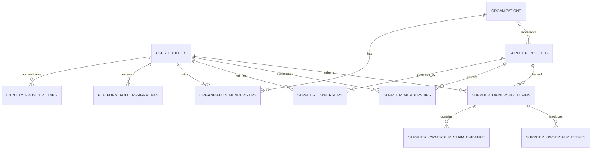
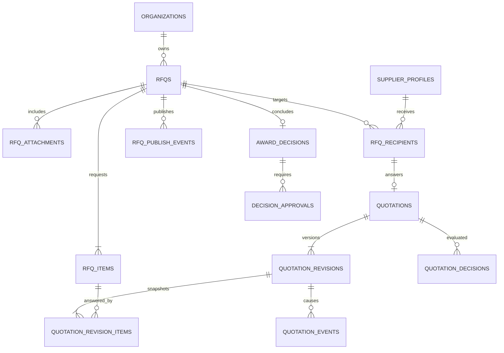
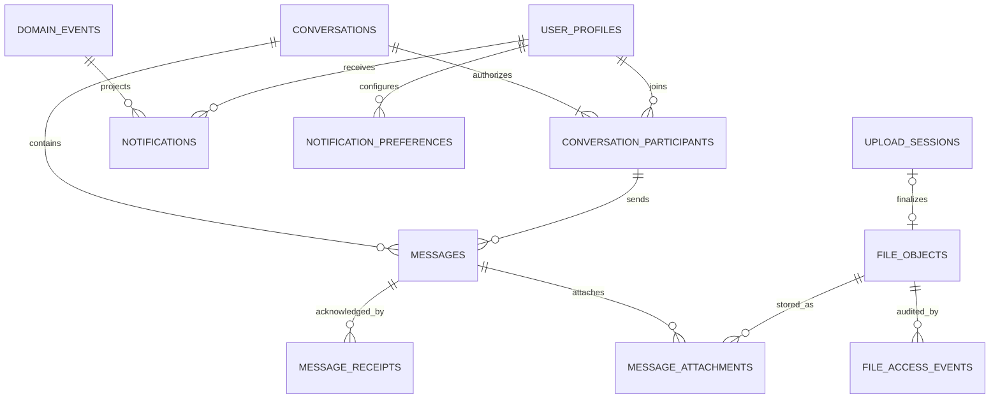
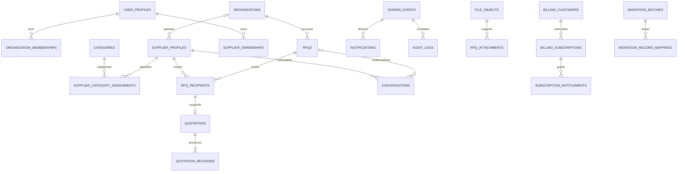

# Authoritative PostgreSQL schema design

Status: **Recommended design; not implemented**
Design base: `1a4e5a59a37b2f1eb05d5cf8fa555d8f7dfe84d6`
Evidence date: 3 August 2026
Primary task profile: Documentation

## A. Scope and status

This document is the authoritative logical design for a future Mujahiz IQ PostgreSQL schema. It is documentation only.

- No Mujahiz application SQL exists.
- No Mujahiz application table exists locally or in a verified hosted environment.
- No migration, seed, database function, trigger, grant, database role, or RLS policy is implemented.
- No hosted Supabase project was linked, authenticated, queried, or independently verified.
- The local Supabase runtime was not started for this design.
- Firebase Production remains operational, authoritative, and unchanged.
- Claim Supplier Profile exists on GitHub `main` but is not deployed, enabled, or populated in Firebase Production.
- Future procurement decisions, awards, multi-user Supplier memberships, file uploads, saved searches, and Stripe billing are designs, not implemented product behavior.

The design translates the repository behavior at the exact base above. It does not claim that current GitHub code, Rules, indexes, or callable Functions are deployed. Current bounded Firestore counts are time-bound and must be refreshed before any migration or consequential Production decision.

### Evidence reviewed

The design was derived from the migration documents `00_CURRENT_STATE_AND_INVENTORY.md` through `08_LOCAL_CLI_FOUNDATION.md`, plus the current implementation and focused tests, including:

- `src/services/workspace.ts`, `firestore.ts`, `registration.ts`, `supplierExcelImport.ts`, `supplierOwnership.ts`, `supplierWorkspace.ts`, `portalDashboard.ts`, `adminUsers.ts`, and `uploadService.ts`;
- `src/types/domain.ts` and `src/types/workspace.ts`;
- `src/utils/rfqLifecycle.ts`, Supplier normalization/import/search utilities, and the Supplier directory query/filter path;
- `functions/src/adminUsers.ts`, `callableAuth.ts`, `supplierDuplicate.ts`, `supplierOwnership.ts`, `supplierSubmissionApproval.ts`, and their normalization cores;
- `firestore.rbac.rules` and `firestore.indexes.json`; and
- focused RFQ, revision, conversation, ownership, duplicate, import, trial/access, notification, permission, read-budget, and Functions/Firestore Emulator tests.

### Evidence labels

- **Current:** proved by repository evidence at the design base or the bounded 3 August 2026 inventory.
- **Recommended:** the preferred schema decision, still requiring review before implementation.
- **Open:** an explicit approval or evidence gap blocks the final implementation choice.
- **Future:** intentionally supported by the model but not current behavior.

## B. Design decisions

| Topic | Recommended decision | Reason and boundary |
|---|---|---|
| Primary keys | Use database-generated UUID primary keys for new relational identities. | Business relationships use UUID FKs, never email or mutable display values. Deterministic legacy keys remain unique alternate keys, not primary keys. |
| UUID generation | Prefer database-generated UUIDv7 if the selected PostgreSQL environment supports it through a reviewed built-in or approved mechanism; UUIDv4 is the fallback. | UUIDv7 improves index locality. The exact mechanism is **Open** until the target PostgreSQL version and extensions are verified. Clients never choose authoritative IDs. |
| Firebase identity | Store each Firebase UID as `identity_provider_links.provider_subject` with provider `firebase`, and preserve `users/{uid}` as `user_profiles.legacy_firestore_id`. | The Firebase subject is bounded text, not a PostgreSQL UUID. The provider link is the initial RLS identity bridge and can coexist with a later Supabase Auth subject. |
| Firestore document IDs | Give every migrated root document a unique `legacy_firestore_id`; preserve collection and ID again in `migration_record_mappings`. | This supports idempotent re-import, exception resolution, rollback comparison, and deterministic event verification. |
| Timestamps | Use timezone-aware timestamps for all instants; preserve source `created_at` and `updated_at` separately from migration timestamps. | New trusted writes use database/server time. Ordering uses a stable tie-breaker such as UUID or preserved legacy ID, never physical row order. |
| Dates and durations | Use dates only for calendar concepts; use timestamps for deadlines and validity windows. | RFQ closing, access expiry, claim expiry, message creation, and billing periods are instants. Delivery days and granted days are positive integers. |
| Money | Use exact fixed-precision numeric amounts, conceptually `numeric(20,4)`, with an explicit ISO 4217 currency code. | Floating point is prohibited. Per-currency scale and rounding are validated by the trusted quotation command. Current `price` semantics remain an **Open** migration question. |
| Status fields | Use bounded text with check constraints for stable workflow states; use reference tables only for administrator-extensible vocabularies. | PostgreSQL enums are not recommended for frequently evolving workflows. A native enum is acceptable only after an ADR proves the value set is truly closed. |
| JSONB | Restrict JSONB to immutable source snapshots, external webhook payloads, migration evidence, schema-versioned settings, and bounded audit/event metadata. | Searchable relationships, authorization fields, money, status, recipients, participants, categories, contacts, and line items remain relational. |
| Soft deletion | Do not add `deleted_at` everywhere. Use state transitions for users, organizations, Suppliers, RFQs, quotations, claims, subscriptions, and files; hard delete only disposable/pre-publication or user-owned preference rows. | Procurement, ownership, financial, event, audit, and migration history is never cascade-deleted in normal operation. |
| Audit columns | Mutable business tables use `created_at`, `created_by_user_id`, `updated_at`, and `updated_by_user_id` where the actor is meaningful. | Append-only ledgers use only creation/actor fields. Migration provenance is separate from business authorship. |
| Trusted-server fields | Roles, account status, verification mirrors, ownership, `can_receive_rfqs`, canonical fingerprints, review decisions, revision numbers, current revision pointers, awards, entitlement state, file readiness/scan state, events, notifications, audits, and migration fields are trusted-only. | Browser input is never authoritative for identity, authorization, sequence, money totals, eligibility, deduplication, or history. |
| Immutable data | Quotation revisions/items, ownership events, RFQ publication records, access grants, billing events, domain events, audit logs, and migration mappings are append-only. | Corrections use compensating rows or a new revision/event, not in-place historical edits. |
| Reference numbers | Store a separate immutable human-readable reference allocated by a trusted transaction; do not expose UUID order as a business sequence. | Reference uniqueness is scoped by type and, where needed, organization plus year. Gaps are acceptable. |
| Email and identifiers | Store original display value plus a versioned normalized value. Enforce case-insensitive uniqueness only within the correct provider or invitation scope. | Email is PII and a delivery/login attribute, not a permanent relationship. No account merge is based on email alone. |
| Arabic and English | Store UTF-8 text. Use explicit `*_ar` and `*_en` columns for core bilingual names/snapshots; use translation tables for extensible content and taxonomy. | One language never silently overwrites or backfills the other. Search normalization retains the original text and normalization version. |
| Search normalization | Keep a versioned normalizer and derived search projection or generated vector; do not treat current `searchKeywords` arrays as authoritative. | Start with relational filters and PostgreSQL full-text/trigram evaluation in TEST. A separate search service is deferred until measured need. |
| Category hierarchy | Use one `categories` adjacency hierarchy with stable codes and translation rows; Supplier assignments point to any approved node and record whether it is primary. | Current category/subcategory strings require a reviewed mapping and exception queue before FKs can be enforced. |
| File metadata | Use immutable provider-neutral `file_objects`; domain attachment tables own the relationship. Persist provider/bucket/object key, safe original filename, detected MIME, size, SHA-256, classification, upload/scan state, retention, and owner. | Store stable file IDs, not permanent signed/public URLs. Replacements create a new object version. |
| Duplicate detection | Recompute versioned canonical fingerprints in a trusted path. Prefer a protected keyed digest for contact-derived fingerprints; retain legacy SHA-256 evidence only for migration comparison. | `supplier_duplicate_fingerprints` is server-only and unique by active fingerprint kind/value. Collisions and normalizer changes enter review; no automatic merge/delete. |
| Idempotency | Hash the client key, bind it to actor, operation scope, normalized payload hash, result reference, and expiry, then consume it in the same transaction as the command. | Raw keys are not stored. Replays with a different payload fail. Deterministic legacy IDs remain migration evidence. |
| Denormalization | Permit current-projection quotation items, Supplier rating summaries, conversation last-message pointer, notification bilingual snapshots, and immutable migration/audit payloads only when a trusted write maintains them. | Canonical normalized rows or immutable revisions remain authoritative. Derived values must be rebuildable and consistency-checked. |

### Recomputed rather than authoritative

The following current fields should not be canonical stored state: Supplier `completionScore`, user `qualityRatio`, badges, directory `searchKeywords`, review aggregates, dashboard counts, effective access status where grants/entitlements determine it, RFQ expiry labels, and quotation comparison totals that can be calculated from line items. A performance projection may cache a value only after query evidence, with a trusted refresh rule and reconciliation test.

### RLS design boundary

This document records sensitivity and expected access dimensions but does not design or implement policies. Final grants, exposed schemas, JWT mapping, helper functions, and RLS require a separate **Extra High security PR** and independent allow/deny review.

Expected dimensions are: unauthenticated public, authenticated user, organization member, Buyer organization, Supplier profile member, verified Supplier owner, RFQ creator, RFQ recipient, conversation participant, Admin, Owner, and trusted server only. Platform `owner`/`admin` application roles must never be confused with Supabase/PostgreSQL technical roles.

## C. Domain model

The recommended model contains **79 logical tables**. “Future” tables are designed for compatibility but are not proposed for the first SQL migration.

| Domain | Proposed tables | Count |
|---|---|---:|
| Identity and access | `user_profiles`, `identity_provider_links`, `platform_role_assignments`, `organizations`, `organization_memberships`, `account_invitations`, `access_credits`, `access_grants`, `contribution_logs` | 9 |
| Supplier directory and ownership | `supplier_profiles`, `supplier_locations`, `supplier_contacts`, `supplier_category_assignments`, `supplier_capabilities`, `supplier_payment_options`, `supplier_products`, `supplier_documents`, `supplier_ownerships`, `supplier_memberships`, `supplier_ownership_claims`, `supplier_ownership_claim_evidence`, `supplier_ownership_events`, `supplier_claim_rate_limits`, `supplier_submissions`, `supplier_import_batches`, `supplier_duplicate_fingerprints`, `supplier_feedback`, `supplier_reviews`, `supplier_review_tags`, `supplier_favorites` | 21 |
| RFQ and procurement | `rfqs`, `rfq_items`, `rfq_attachments`, `rfq_recipients`, `rfq_publish_events`, `rfq_status_history`, `quotations`, `quotation_items`, `quotation_revisions`, `quotation_revision_items`, `quotation_revision_attachments`, `quotation_events`, `quotation_decisions`, `quotation_comparison_notes`, `award_decisions`, `decision_approvals` | 16 |
| Messaging and notifications | `conversations`, `conversation_participants`, `messages`, `message_receipts`, `message_attachments`, `notifications`, `notification_preferences` | 7 |
| Content, search, and configuration | `categories`, `category_translations`, `administrative_areas`, `registration_sectors`, `content_pages`, `content_page_translations`, `material_terms`, `material_term_aliases`, `term_suggestions`, `term_suggestion_examples`, `platform_settings` | 11 |
| Files and storage metadata | `file_objects`, `upload_sessions`, `file_access_events` | 3 |
| Audit, security, and reliability | `audit_logs`, `idempotency_keys`, `domain_events`, `security_events`, `import_errors`, `migration_batches`, `migration_record_mappings`, `migration_validation_results` | 8 |
| Future billing | `subscription_entitlements`, `billing_customers`, `billing_subscriptions`, `billing_events` | 4 |

### Identity and access conclusions

- Firebase Auth remains the initial identity authority. One `user_profiles` row may have multiple provider links over time, but each provider/subject pair maps to exactly one user.
- A person may belong to multiple organizations. RFQs belong to a Buyer organization and record the creating user.
- Platform Owner/Admin are platform role assignments and need no organization membership. Buyer/Supplier are business context, not PostgreSQL roles.
- A separate `buyer_profiles` table is not justified by current fields. Buyer-specific organization data belongs to organizations/memberships; a later verified buyer qualification aggregate can add a table without splitting identities.
- Current `role=suspended` becomes account suspension state, not a role. Legacy contributor/viewer values are preserved during migration and resolved by the role ADR.
- Effective access is computed from immutable grants plus future subscription entitlements. Current user access fields are migration comparison values, not the long-term ledger.

### Supplier directory and ownership conclusions

- `supplier_profiles` is a listed business profile, not an Auth account. “Listed”, “claimed”, “verified owner”, “RFQ-ready”, and “paying” are independent states.
- `supplier_ownerships` records temporal verified ownership authority. `supplier_memberships` separately grants operational roles. Claim approval creates a primary ownership row and an operational membership atomically.
- One active primary owner is recommended initially. Multiple operational members are supported. Transfer closes the old ownership, creates the new ownership, adjusts memberships, writes events/audit/notifications, and never rewrites history.
- `can_receive_rfqs` is a trusted eligibility projection derived from listed status, ownership/membership, user/account status, verification, and access. It must be explainable and reconciled, not a browser-editable flag.
- Locations, contacts, categories, capabilities, payment options, review tags, and fingerprints become relational rows. Source snapshots remain only where approval/audit fidelity requires them.
- Supplier submission approval, canonical duplicate mutation, ownership decisions, transfers, suspensions, and import finalization are trusted commands.

### RFQ and procurement conclusions

- Current states are `draft`, `published`, `receiving`, `closed`, and `cancelled`. `awarded` is Future and may be either an RFQ state or a derived state from an active award; this is **Open**.
- Publication freezes the recipient set into `rfq_recipients` with eligibility and ownership snapshots. A later ownership change does not rewrite the historical invite.
- There is one canonical quotation per RFQ and Supplier profile, not per login. The submitting member is recorded on each revision.
- `quotation_revisions` and `quotation_revision_items` are authoritative immutable snapshots. `quotations.current_revision_id` and `quotation_items` are trusted current projections.
- Material-change detection compares normalized commercial content with the current revision. Identical resubmission returns the existing result and creates no revision, event, audit, or notification.
- Buyer-only decisions, notes, approvals, award evidence, value/savings measures, and competitor quotations are never visible to Supplier competitors.
- Multi-stage decision approval is Future and remains disabled until organization roles and thresholds are approved.

### Messaging and notifications conclusions

- A conversation links a Buyer organization, a Supplier profile, and optionally an RFQ. Membership is explicit and temporal; authorization rechecks current eligibility for writes while retained participants may read history under the final retention policy.
- Message body and sender identity are immutable. Edit/delete/tombstone behavior is **Open**; the recommended initial policy is no edits and no user deletion.
- Read receipts are normalized per message/participant and are self-write only.
- `domain_events` is the notification/outbox source. `notifications` enforces one row per event/recipient/channel and stores bounded bilingual delivery snapshots. A separate `notification_events` table would duplicate the event ledger and is not recommended.
- Notification preferences are Future; security, ownership, award, and required transactional notices may not be suppressible.

### Content, files, audit, and billing conclusions

- Categories use a hierarchy and translation rows. Material synonyms, brands, and standards become typed alias rows. Term suggestion examples carry their source instead of arrays in one document.
- Database-backed `feature_flags` are not recommended now; current deployment flags remain fail-closed build/runtime configuration. `saved_searches` are deferred until a product workflow exists.
- A generic polymorphic `file_links` table is not recommended because it weakens FK integrity. Typed domain attachment tables reference `file_objects`.
- Audit logs do not replace ownership, revision, status, or billing histories. Audit/event/idempotency/migration tables are internal and never browser-writable.
- Billing is Future. A customer may belong to one organization or one user, never both; the billing ownership decision remains Open. Stripe webhook events are append-only and idempotent.

## D. Table specification

All candidate indexes below are conceptual, not SQL. `legacy_firestore_id` is nullable for new records and unique within the relevant source collection when populated. “Trusted” means no unrestricted browser write path.

### D1. Identity and access

| Table | Domain and purpose / primary key | Required columns | Optional columns | Foreign keys | Unique and check constraints | Candidate indexes | Immutable and trusted-only fields | Sensitivity and deletion | Firestore source, transformation, open question |
|---|---|---|---|---|---|---|---|---|---|
| `user_profiles` | Identity; application person/profile. PK `id` UUID. | `legacy_firestore_id`, `full_name`, `account_status`, `preferred_locale`, `created_at`, `updated_at` | normalized/display email, phone, job title, onboarding account type, city, free-text legacy organization/sector, verification mirror, suspension reason | actor columns to `user_profiles` | unique legacy ID; valid locale/status; no email relationship | status and created cursor; normalized email for controlled support search | account status, verification mirror, counters/projections, audit actors trusted; identity/creation immutable | Critical PII; self plus scoped staff; suspend/anonymize, never cascade-delete history | `users` documents. Preserve UID document ID, move provider subject, roles, memberships, access ledgers; do not migrate badges/quality/dashboard counters as canonical. Open: legacy contributor/viewer disposition. |
| `identity_provider_links` | Identity; provider subject mapping. PK UUID. | `user_profile_id`, `provider_code`, `provider_subject`, `linked_at`, `link_status` | email-at-link snapshot, verified-at, unlinked-at, migration batch | user profile; migration batch | unique provider/subject; one active primary link per provider/user; subject bounded | provider plus subject; user plus status | provider subject, link/unlink actors and timestamps trusted; link record immutable except status | Critical identity data; self metadata and trusted server; retain through migration/rollback | Firebase UID from `users/{uid}` and Auth reconciliation. Open: Firebase coexistence duration; never link by email alone. |
| `platform_role_assignments` | Identity; temporal platform Owner/Admin or legacy access-level assignment. PK UUID. | `user_profile_id`, `role_code`, `valid_from`, `status`, `assigned_by_user_id`, `created_at` | `valid_until`, revoked actor/reason, legacy role | user and actor users | one active role/code/user; bounded roles; valid interval | active role/code; user history | all assignment/revocation fields trusted; history immutable | Privileged security data; Admin/Owner by policy; append/revoke, never hard delete | `users.role`. Recommended platform roles Owner/Admin; map contributor/viewer through approved ADR; `suspended` becomes account state. |
| `organizations` | Identity; Buyer or Supplier legal/business entity. PK UUID. | `organization_type`, `display_name`, `legal_name`, `status`, `created_at` | legacy ID, names ar/en, registration reference, normalized legal fingerprint, parent ID, archived-at | optional parent organization; actors | unique reviewed fingerprint only after reconciliation; valid type/status | type/status/name; parent | canonical fingerprint, verification/status changes trusted | Mixed public/private business data; archive/state transition; no cascade into procurement | No current organization collection. Seed Supplier organizations from reviewed Supplier profiles; buyer `users.organization` remains unmatched evidence until resolved. Open: legal verification fields. |
| `organization_memberships` | Identity; temporal user membership and organization role. PK UUID. | `organization_id`, `user_profile_id`, `membership_role`, `status`, `valid_from`, `created_at` | valid-until, invited-by, approved-by, title | organization, user, actor users | one active membership per user/org/role; valid interval | user/status; organization/role/status | role, status, approval/revocation trusted | Private tenant authorization; revoke/close, never erase used memberships | Derived only after organization matching; current Buyer user fields do not prove membership. Open: Buyer requester/approver role vocabulary. |
| `account_invitations` | Identity; one-time invitation to organization or Supplier membership. PK UUID. | invite scope, inviter, normalized invite email, token hash, intended role, status, expires-at, created-at | organization ID, Supplier profile ID, accepted user/time, revoked time | inviter/acceptor users; organization or Supplier | exactly one target scope; unique active token hash; expiry after creation | normalized email/status/expiry; target/status | token hash, intended role, target, acceptance trusted | PII/security; invitee and target admins; purge token material after retention, retain minimal acceptance audit | No Firestore source; Future multi-user workflow. Open: invitation expiry and support recovery. |
| `access_credits` | Access; earned/applied credit ledger. PK UUID. | legacy ID, user, source code, approved Supplier count, days value, status, created-at | applied-at, contribution ID, grant ID, previous/new expiry, created-by | user, contribution, grant, actor | non-negative counts, positive days when applied; deterministic source uniqueness | user/created cursor; status | source, values, application state trusted; corrections compensating only | Private financial-like access data; self/admin; immutable under normal operation | `accessCredits` 8. Normalize trial, contribution, manual grace variants; validate deterministic `trial-{uid}` and side-effect IDs. Open: pending credit expiry/revocation. |
| `access_grants` | Access; immutable access periods. PK UUID. | legacy ID, beneficiary user, grant type/source, days, valid-from, valid-until, granted-by, created-at | credit ID, approved Supplier count, audit ID, superseding grant | user, credit, actor, audit | positive interval/days; deterministic trial uniqueness; no overlap rule only if business approves | user/valid-until; source | every business field immutable trusted-only | Private entitlement history; self/admin read; never normal-delete | `accessGrants` 2. Convert previous/new expiry and approved submission references; source arrays resolved through contribution/submission joins or preserved snapshot. |
| `contribution_logs` | Access; immutable contribution/reward ledger. PK UUID. | legacy ID, user, contribution type, points, counts-for-access, occurred-at | Supplier submission/profile/review IDs, reversal-of, metadata snapshot | user and related Supplier records; reversal row | unique legacy ID and deterministic source event; points bounded | user/occurred cursor; type | eligibility, points, source relation trusted; reversal by compensating row | Private self/admin; append-only | `contributionLogs` 528. Map existing relationships and distinguish Supplier contribution from review/duplicate/profile events. Open: final product term ?contribution? versus ?referral?. |

### D2. Supplier directory and ownership

| Table | Domain and purpose / primary key | Required columns | Optional columns | Foreign keys | Unique and check constraints | Candidate indexes | Immutable and trusted-only fields | Sensitivity and deletion | Firestore source, transformation, open question |
|---|---|---|---|---|---|---|---|---|---|
| `supplier_profiles` | Supplier; canonical listed business profile. PK UUID. | legacy ID, organization, original/display name, business type, listing status, verification status, source type, confidence, created/updated actors/times | names ar/en, descriptions, map/external links, credit note, experience fields, eligibility projection | organization; actors | unique legacy ID; status/value checks; no contact uniqueness here | listing status/display name cursor; verification; organization | approval, verification, normalized identity, eligibility projection trusted | Public directory projection plus restricted source/quality fields; archive/state transition | `suppliers` 480. Split nested values and preserve original/source text. `accountOwnerId` moves to ownership. Open: public/buyer/owner field projection. |
| `supplier_locations` | Supplier; headquarters, branch, or service-area rows with explicit order. PK UUID. | Supplier, location kind, position, administrative area code, created-at | city, market area, address, map link, branch phone contact link, active dates | Supplier; administrative area; optional contact | unique Supplier/kind/position; position non-negative; bounded HTTPS map link | Supplier/kind/position; area/Supplier | verification and source trusted; identity/order stable after publication | Address/contact sensitivity varies; archive row, do not rewrite historical recipient snapshots | `governorate`, `governorates[]`, `branches[]`, `coverageAreas[]`, city/market/address. Open: Iraq address hierarchy and service-area vocabulary. |
| `supplier_contacts` | Supplier; normalized phone, email, website/social, or contact-person channel. PK UUID. | Supplier, contact type, display value, normalized value, visibility, position, created-at | location ID, contact name/role, verification status/time, valid dates | Supplier; location; verifier user | unique active Supplier/type/normalized value where appropriate; type-specific validation | Supplier/type/active; protected exact normalized lookup | normalized value, verification, visibility trusted for approved data | High PII for people/phones/email; public projection explicit; close/archive, not automatic erase from evidence | Supplier phones, email, websites, social links and contact-person fields. Open: contact-person separation and consent/retention. |
| `supplier_category_assignments` | Supplier; many-to-many taxonomy link. PK UUID. | Supplier, category, assignment type, primary flag, position, source | approved-by/time, confidence | Supplier, category, actor | unique Supplier/category/type; at most one primary per level if approved | category/Supplier; Supplier/position | approval/source/primary trusted; user proposal may be staged | Directory-visible; remove only via audited update; history may be evented | Explode `categories[]` and `subcategories[]`; unmapped strings go to migration exceptions. Open: mixed legacy labels/codes. |
| `supplier_capabilities` | Supplier; capability/specialty code or bounded custom term. PK UUID. | Supplier, capability type, display value, normalized value, position, status | category, source, verified-at/by | Supplier, category, actor | unique active Supplier/type/normalized value | capability/value/Supplier; Supplier/status | moderation/verification trusted | Public/buyer projection; archive rather than destructive delete after use | `capabilityTags[]`, `relatedMaterialService`, free-text sub-specialties not mapped as categories. Open: controlled-vocabulary boundary. |
| `supplier_payment_options` | Supplier; payment currency/method and credit-day options. PK UUID. | Supplier, option type, option code, position, status | credit days, credit start, note, valid dates | Supplier | type-specific check; credit days 1-365; unique active semantic option | Supplier/type/status | verified/active state trusted | Buyer-visible commercial profile; archive | `paymentOptions[]`, `acceptsCredit`, `creditDays[]`, `creditStart`, credit note. Open: whether options are indicative or contractual. |
| `supplier_products` | Supplier; Catalog Lite product/service. PK UUID. | legacy ID when migrated, Supplier, created-by member, type, name ar/en, category, status, created/updated times | descriptions ar/en, SKU/reference, primary file, moderation fields | Supplier, membership/user, category, file | unique legacy ID; type/status checks; ownership agreement | Supplier/status/updated cursor; category/status | Supplier identity, moderation/status/media readiness trusted | Active products buyer-readable; drafts Supplier-only; archive, no hard delete after quotation use | `supplierProducts` 0. Preserve bilingual fields and `mediaStatus`; full variants/pricing/CPQ deferred. |
| `supplier_documents` | Supplier; document/certificate business metadata. PK UUID. | legacy ID when migrated, Supplier, owner membership/user, name, document type, verification status, created/updated times | description, certificate number, issuer, issue/expiry dates, current file object | Supplier, member/user, file, verifier | unique legacy ID; expiry after issue; ownership agreement | Supplier/type/status; expiry | verification and file link trusted; identity immutable | Private by default; Supplier member/reviewer; archive or retention state | `supplierDocuments` 0; metadata-only/upload-pending values map without inventing file objects. Open: document types and legal retention. |
| `supplier_ownerships` | Supplier; temporal verified ownership authority, separate from access membership. PK UUID. | Supplier, owner user, ownership role, status, valid-from, established-by, source type, created-at | claim/submission/event, valid-until, revocation/transfer reason | Supplier, owner/actor users, claim, submission, event | one active primary owner per Supplier; current rule at most one active primary profile per owner; valid interval | Supplier/status; owner/status | every activation/closure field trusted; historical row immutable | Critical authorization; owner plus Admin/Owner; never hard delete | Reconcile `users.supplierProfileId` with `suppliers.accountOwnerId`; fail on mismatch. Open: future owner-to-many policy. |
| `supplier_memberships` | Supplier; operational access role independent of verified ownership. PK UUID. | Supplier, user, member role, status, valid-from, created-at | ownership, invitation, approved-by, valid-until, reason | Supplier, user, ownership, invitation, actor | one active membership per Supplier/user/role; valid interval | user/status; Supplier/role/status | activation, role, revocation trusted | Critical authorization; member/admin; close/revoke, never erase used membership | Current canonical owner creates one membership; additional members are Future. Open: role vocabulary and primary-owner operational rights. |
| `supplier_ownership_claims` | Supplier; immutable request plus controlled lifecycle. PK UUID. | legacy ID, claimant user, Supplier, status, reason, claimant snapshot, created/updated/expiry | evidence-summary compatibility, reviewer/time/notes, withdrawn fields, superseding claim, decision event | user, Supplier, reviewer, event, superseding claim | allowed transitions; one active claim per claimant; expiry; terminal immutability | claimant/created cursor; status/created; Supplier/status/created | decisions, reviewer, terminal times trusted; submitted snapshot/reason immutable | Critical PII; claimant, current verified owner history, Admin/Owner; never normal-delete | `supplierOwnershipClaims` 0, GitHub-only. Split evidence and retain bounded claimant snapshot JSONB for historical proof. Open: renewal/transfer semantics. |
| `supplier_ownership_claim_evidence` | Supplier; one evidence item per claim. PK UUID. | claim, evidence type, position, summary, created-at | external HTTPS link, file object, verification state/notes/reviewer | claim, file, reviewer | exactly one link/file where applicable; max-count policy; unique claim/position | claim/position; verification state | verification, scan, reviewer trusted; submitted evidence immutable after decision | Highly restricted claimant/reviewer; retention/legal hold, never public | Split current `evidenceType`, `evidenceSummary`, and up to 3 `referenceLinks`; no file is invented. Open: allowed evidence/files and retention. |

| `supplier_ownership_events` | Supplier; append-only ownership/claim event history. PK UUID. | legacy ID where present, event type, Supplier, actor, occurred-at | claim, submission, prior/new owner, reason, causation event | Supplier, users, claim, submission, domain event | unique legacy/deterministic event ID; type-specific required FKs | Supplier/occurred cursor; claim/event | all fields immutable trusted-only | Critical history; restricted; never normal-delete | `supplierOwnershipEvents` 0; deterministic approve/reject/withdraw/expire/supersede/submission IDs. Future transfer/revoke adds events. |
| `supplier_claim_rate_limits` | Supplier security; short-lived abuse-control bucket. PK UUID. | identity/user, scope, window start/end, request count, expires-at, updated-at | last request, blocked-until, hashed network/device signal if approved | user/identity | one active bucket per subject/scope/window; non-negative count | subject/scope/window; expiry | all fields trusted-only | Security metadata; hidden; retention TTL/hard delete after approved horizon | `supplierClaimSearchRateLimits` 0. Map per-UID fixed window only if present. Open: distributed limiter versus database row. |
| `supplier_submissions` | Supplier; proposed Supplier data and review lifecycle. PK UUID. | legacy ID, submitter, status, immutable Supplier payload snapshot, duplicate snapshot, source, counts-for-access, created-at | import batch/row, reviewer/times/notes, approved Supplier, idempotency key, completeness evidence, override reason | users, import batch, approved Supplier, idempotency | unique legacy ID; import batch/row and idempotency uniqueness; valid transitions | submitter/created cursor; status/created; import batch/row | review, counts, target, override trusted; submitted snapshot immutable per submission version | High restricted proposal/PII; submitter/reviewer; archive/retain after review | `supplierSubmissions` 540. Normalize approved target data; retain restricted immutable source snapshot and duplicate evidence. Open: corrected resubmission as version versus row update. |
| `supplier_import_batches` | Supplier; metadata-only import run. PK UUID. | legacy ID, importer, importer-role snapshot, safe filename, byte size, row counts, status, created/completed times | sheet name, normalizer/template version, idempotency key | user, idempotency | unique legacy/batch key; size at most 204800; rows at most 50; count reconciliation | importer/created cursor; status | completion counts and source metadata trusted after commit | Private importer/Admin; retain for audit, no raw workbook | `supplierImportBatches` 1. Preserve metadata only; raw workbook remains browser-local. Open: metadata retention. |
| `supplier_duplicate_fingerprints` | Supplier security; canonical exact duplicate guard for profile or pending submission. PK UUID. | fingerprint kind, protected digest, algorithm version, source type, created-at | Supplier profile, submission, superseded-at/by | Supplier or submission, actor | exactly one source; unique active kind/digest; digest format/version | exact kind/digest; Supplier; submission | every field trusted-only; supersede rather than rewrite | Server-only sensitive index; retain while source active plus review window | `supplierDuplicateIndex` 480, `supplierCanonicalUniqueness` 0, `supplierSubmissionDuplicateIndex` 0. Recompute and compare; one document may create several rows. Open: keyed digest/key rotation. |
| `supplier_feedback` | Supplier; correction/issue report and review. PK UUID. | legacy ID, Supplier, submitter, feedback type, message, status, created-at | suggested correction, name snapshot, reviewer/times/notes, resolution event | Supplier, users, event | unique legacy ID; bounded text/status transitions | submitter/created cursor; status/created; Supplier/status | review/resolution trusted; submitted content immutable | Private reporter/reviewer; retain/audit, optionally redact PII | `supplierFeedback` 0. Separate snapshot from live Supplier. Open: whether resolved feedback creates a Supplier change request. |
| `supplier_reviews` | Supplier; moderated multidimensional review. PK UUID. | legacy ID, Supplier, reviewer, status, overall and required rating dimensions, interaction type/year, comment, created-at | optional rating dimensions, related category, approved-at/by | Supplier, reviewer, category, approver | ratings in approved range; unique policy Open; valid moderation | Supplier/status/created; reviewer/created; status/created | moderation and approval trusted; submitted ratings/comment immutable | Approved projection buyer-visible; draft/rejected private; tombstone/moderate, no cascade | `reviews` 0. Move tag arrays; recompute Supplier aggregate. Open: one review per interaction/Supplier and public-comment policy. |
| `supplier_review_tags` | Supplier; positive/concern tag join. PK UUID. | review, tag type, normalized tag, position | category/reference code | review, optional category | unique review/type/tag; valid tag type | tag/Supplier via review; review/position | moderation state follows review | Same sensitivity/retention as review; delete only with unsubmitted review | Explode `positiveTags[]` and `concernTags[]`. Open: controlled vocabulary. |
| `supplier_favorites` | Supplier preference; user bookmark. PK UUID. | user, Supplier, created-at | none | user, Supplier | unique user/Supplier | user/created cursor | none beyond ownership; Supplier ID immutable | Self-only preference; hard delete allowed | `favorites` 0; ignore cached Supplier name/location/category snapshots and join current projection. |

### D3. RFQ and procurement

| Table | Domain and purpose / primary key | Required columns | Optional columns | Foreign keys | Unique and check constraints | Candidate indexes | Immutable and trusted-only fields | Sensitivity and deletion | Firestore source, transformation, open question |
|---|---|---|---|---|---|---|---|---|---|
| `rfqs` | Procurement; RFQ header and current lifecycle. PK UUID. | legacy ID, Buyer organization, created-by user, reference number, title, description, status, closing-at, delivery area, created/updated times | preferred-currency mode/code, payment/delivery terms, cancellation/closure actor/reason, current version | organization, user, category/area, actors | unique legacy ID and reference scope; legal transitions; closing after publish; published needs recipients | organization/status/created cursor; status/closing; reference | status transitions, reference, publication/closure actors trusted | Buyer organization private; recipients see published scope; draft hard delete only, otherwise state transition | `rfqs` 2 controlled TEST. Move single-item fields to item while preserving header snapshot during compatibility. Open: organization resolution and awarded-state semantics. |
| `rfq_items` | Procurement; requested line items with stable order. PK UUID. | RFQ, line number, title/description, quantity exact numeric, unit code, created-at | other unit, category, product reference, technical specifications snapshot | RFQ, category, product | unique RFQ/line number; positive quantity; type-specific unit rule | RFQ/line; category/RFQ | identity/order immutable after publication; edits through draft aggregate | Same as RFQ; cascade only for un-published draft, retain after publication | Create line 1 from current title/description/quantity/unit. Open: quantity scale and header-versus-item text boundary. |
| `rfq_attachments` | Procurement; ordered file or external-reference relation. PK UUID. | RFQ, attachment kind, position, created-by/time | file object, external HTTPS URL, label | RFQ, file, user | exactly one file/URL; unique RFQ/position; max-count policy | RFQ/position | relation immutable after publication except trusted invalidation | Buyer/eligible recipients; retention with RFQ; no permanent URL | Current `referenceLinks[]` and upload placeholder. Preserve links; create no file rows. Open: permitted purposes/count/retention. |
| `rfq_recipients` | Procurement; immutable invitation to Supplier profile. PK UUID. | RFQ, Supplier, selected-at/by, eligibility status and snapshot, invited owner/membership snapshot | notification event, viewed/responded times, revoked reason before publish only | RFQ, Supplier, user/membership, event | unique RFQ/Supplier; recipient eligible at publication | Supplier/status/RFQ; RFQ/position; invited owner | selection, eligibility snapshot, publish-time identity trusted | Buyer sees all; Supplier sees own row only; never silently remove after publish | Explode `rfqs.recipientIds[]`; validate listed status and current canonical owner/eligibility. Ownership changes do not rewrite snapshot. |
| `rfq_publish_events` | Procurement; immutable publication fact and recipient-set digest. PK UUID. | legacy ID, RFQ, actor, published-at, recipient count/digest | source payload snapshot, domain event | RFQ, actor, domain event | one canonical first publish per RFQ; unique legacy/deterministic ID | RFQ/published; actor/time | every field immutable trusted | Buyer/Admin and authorized recipients through RFQ; never normal-delete | `rfqPublishEvents` 2 controlled TEST. Explode recipient IDs through recipients and retain ordered digest/snapshot for validation. |
| `rfq_status_history` | Procurement; append-only lifecycle transitions. PK UUID. | RFQ, from/to status, actor, occurred-at | reason, publish event, domain event | RFQ, actor, events | one initial transition; valid from/to; deterministic command key | RFQ/occurred cursor; status/time | all fields immutable trusted | Buyer organization; restricted operations; never normal-delete | Synthesized from RFQ current timestamps and publish events only under approved rules; do not invent unknown legacy transitions. |
| `quotations` | Procurement; one canonical current quotation per RFQ/Supplier. PK UUID. | legacy ID, RFQ recipient, Supplier, status, current revision, first-submitted-at, created/updated times | submitted-by membership/user, withdrawn-at/reason | RFQ, recipient, Supplier, revision, member/user | unique RFQ/Supplier; current revision belongs to quotation; valid status | RFQ/status; Supplier/updated cursor; recipient | identity, first submit, current revision pointer trusted | Buyer sees own RFQ; Supplier sees own only; no competitor access; never hard delete | `rfqResponses` 2 controlled TEST. Deterministic legacy ID is alternate key; resolve Supplier/profile/user agreement. |
| `quotation_items` | Procurement; trusted current commercial projection for comparison. PK UUID. | quotation, RFQ item, current revision item, position, compliance status, exact unit/line amounts | offered quantity, alternate description, tax/freight allocation, delivery detail | quotation, RFQ item, revision item | unique quotation/RFQ item; non-negative amounts; currency agrees with revision | quotation/position; RFQ item/compliance | browser cannot write; projection atomically replaced by revision command | Same privacy as quotation; rebuildable projection, delete only when rebuilding | Current single `price` becomes one projection row only after semantics are approved. Open: price meaning, partial bids, alternates. |

| `quotation_revisions` | Procurement; immutable commercial revision header. PK UUID. | legacy ID, quotation, revision number, change type, currency, message, response status, submitted-by, created-at, normalized-content hash | prior revision, validity date, delivery days/terms, payment terms, subtotal/tax/freight/total snapshots, source snapshot | quotation, prior revision, user/membership | unique quotation/revision number; positive monotonic sequence; currency/amount consistency | quotation/revision desc; created cursor | all commercial/history fields immutable trusted-created | Same strict quotation privacy; never update/delete | `rfqResponseRevisions` 2 controlled TEST. Preserve V1/V2 and source hash; legacy V1 synthesis requires explicit reconciliation. |
| `quotation_revision_items` | Procurement; immutable line snapshot for a revision. PK UUID. | revision, RFQ item, line number, offered quantity, unit, exact unit/line amounts, currency, compliance, created-at | description/alternate, tax/freight, lead time, notes | revision, RFQ item | unique revision/RFQ item/line; non-negative exact amounts; computed total rule | revision/line; RFQ item | all fields immutable trusted-created | Same quotation privacy; never update/delete | Create line 1 from current response fields after price interpretation. Totals may be stored for snapshot integrity only and must be recomputed/validated in the command. |
| `quotation_revision_attachments` | Procurement; immutable ordered file/external-reference snapshot. PK UUID. | revision, attachment kind, position, created-at | file object, external HTTPS URL, label | revision, file | exactly one file/URL; unique revision/position; max-count | revision/position | immutable with revision; scan/readiness trusted | Buyer and submitting Supplier only; retain with revision | Current quotation `referenceLinks[]`; preserve ordered link snapshot, no invented object. |
| `quotation_events` | Procurement; append-only submitted/updated/withdrawn/decision event. PK UUID. | legacy ID where present, event type, quotation, revision, actor, occurred-at | prior revision, RFQ, domain event, reason | quotation, revision, users, RFQ, domain event | unique legacy/deterministic ID; event revision matches quotation | quotation/occurred cursor; RFQ/type/time | all fields immutable trusted | Buyer and own Supplier through aggregate; never normal-delete | `rfqResponseEvents` 3 controlled TEST. Preserve response ID for first event and `response_vN` for updates. |
| `quotation_decisions` | Procurement; Buyer-only per-quotation shortlist/reject/clarify decision history. PK UUID. | quotation, Buyer organization, decision type, actor, occurred-at | reason, supersedes decision, domain event | quotation, organization, user, prior decision/event | valid decision; one current decision per quotation/type through active marker | RFQ/current decision; quotation/time | decision actor/type/reason trusted; historical row immutable | Buyer organization and authorized staff only; Supplier projection separate if later approved | No Firestore source; Future. Open: reversible states, Supplier disclosure, legal wording. |
| `quotation_comparison_notes` | Procurement; Buyer-private structured note or score. PK UUID. | RFQ, Buyer organization, author, note type, body/score, created-at | quotation, RFQ item, updated-at, archived-at | RFQ, organization, user, quotation/item | target belongs to RFQ; bounded body/score | RFQ/created cursor; quotation/type | organization/target immutable; author may edit only under approved policy | Buyer-only, never Supplier/competitor; archive/retention policy | No Firestore source; Future comparison workflow. Open: collaborative edit history and scoring rubric. |
| `award_decisions` | Procurement; RFQ-level award or no-award record and value measurement. PK UUID. | RFQ, Buyer organization, decision status, actor, decided-at, currency | winning quotation/Supplier, awarded amount, baseline amount, savings amount/method, rationale, effective/voided fields | RFQ, organization, quotation, Supplier, actors | at most one active award per RFQ; winner belongs to RFQ; exact money/currency | organization/decided cursor; RFQ/status | every decision/value field trusted; corrections supersede/void | Buyer-only until approved Supplier notice; immutable history, no delete | No Firestore source; Future. Open: award state, value baseline, partial/multi-award, disclosure. |
| `decision_approvals` | Procurement; Future multi-stage approval record. PK UUID. | award decision, stage number, approver membership/user, status, acted-at | comments, threshold snapshot, delegated-by | award, organization membership/user | unique award/stage/approver; valid ordered transitions | award/stage; approver/status | threshold, actor, status trusted; acted row immutable | Buyer organization only; never delete | No Firestore source; Future and disabled until organization role/threshold ADR. |

### D4. Messaging and notifications

| Table | Domain and purpose / primary key | Required columns | Optional columns | Foreign keys | Unique and check constraints | Candidate indexes | Immutable and trusted-only fields | Sensitivity and deletion | Firestore source, transformation, open question |
|---|---|---|---|---|---|---|---|---|---|
| `conversations` | Messaging; Buyer-organization/Supplier context. PK UUID. | legacy ID, Buyer organization, Supplier, status, created-by/time, updated-at | RFQ, last message ID/time, archived-at/reason | organization, Supplier, RFQ, user, message | unique active context/party pair; RFQ belongs to Buyer and targeted Supplier | participant join drives access; organization/updated cursor; Supplier/updated | party/context identity trusted; last-message pointer trusted projection | Critical private context; participants only; archive, never normal-delete | `conversations` 0. Remove participant arrays/maps and message-body preview. Open: support/Admin access and duplicate context rules. |
| `conversation_participants` | Messaging; temporal participant membership. PK UUID. | conversation, user, participant role, status, joined-at | Supplier/org membership, left/revoked-at/by, display-label snapshot | conversation, user, memberships, actor | unique active conversation/user; participant belongs to a party | user/status/conversation; conversation/status | membership/role/revoke trusted; join identity immutable | Critical authorization; participant only; close membership, retain history | Explode `participantIds[]`; `participantLabels` retained only as bounded join-time snapshot. Current exact size is two. |
| `messages` | Messaging; immutable private body. PK UUID. | legacy ID, conversation, sender participant/user, body, created-at | reply-to, client idempotency, tombstone/moderation metadata | conversation, participant/user, prior message, idempotency | sender is active participant; bounded non-empty body; unique client key if used | conversation/created cursor and ID; sender/time | body/sender/time immutable; moderation/tombstone trusted | Highly sensitive participants only; no edit/delete initially; retention decision required | `messages` 0. Preserve body and sender; do not duplicate body in conversation/notification. Open: tombstone/export/legal policy. |
| `message_receipts` | Messaging; self-only delivered/read state. PK UUID. | message, participant/user, receipt type, occurred-at | device class, domain event | message, participant/user, event | unique message/user/type; receiver is participant | user/type/time; message/user | subject and prior receipt immutable; only caller's receipt command | Participant-private; retain with message or privacy policy | Explode `readBy[]`; sender's initial receipt is created atomically. Open: delivered versus seen and per-device need. |
| `message_attachments` | Messaging; ordered immutable file relation. PK UUID. | message, file object, position, created-at | caption | message, file | unique message/position/file; file ready and conversation-authorized | message/position | link/readiness trusted; immutable after send | Same message privacy; retention with message/file policy | No current objects; `attachmentStatus=upload_pending_launch` creates no row. Future only. |
| `notifications` | Notification; recipient inbox and delivery snapshot. PK UUID. | legacy ID, recipient user, notification type, title/body ar/en, read flag, created-at | actor, domain event, reference kind/ID, response/revision, link, read-at, expires-at | recipient/actor users, domain event; typed reference resolved by command | unique event/recipient/channel when event-backed; recipient immutable; bounded content | recipient/created cursor and ID; recipient/read/time; event/recipient | creation/routing/content/reference trusted; recipient may set read state only | Self-only inbox; retention/tombstone policy; protected ownership notices not browser-deletable | `notifications` 6. Validate deterministic RFQ/ownership/submission links; classify controlled TEST-linked rows per event. Open: retention and snapshot-vs-template rendering. |
| `notification_preferences` | Notification; Future user/channel preference. PK UUID. | user, notification class, channel, enabled, updated-at | quiet hours, locale, digest mode | user | unique user/class/channel; valid channel/timezone | user/channel | mandatory class and enforcement trusted; user edits own optional preferences | Private self; hard delete/reset allowed | No Firestore source; Future. Security/ownership/billing transactional notices may be mandatory. |

### D5. Content, search, and configuration

| Table | Domain and purpose / primary key | Required columns | Optional columns | Foreign keys | Unique and check constraints | Candidate indexes | Immutable and trusted-only fields | Sensitivity and deletion | Firestore source, transformation, open question |
|---|---|---|---|---|---|---|---|---|---|
| `categories` | Taxonomy; hierarchical Supplier/material category. PK UUID. | stable code, category type, status, sort order, created/updated times | parent category, legacy ID, valid dates | parent category; actors | unique code; no hierarchy cycle; non-negative order | parent/status/order; type/status/code | code, parent, approval/status trusted | Published active rows public/authenticated as approved; archive, no delete after reference | `categories` 0 plus reviewed constants/settings taxonomy. Open: current strings-to-node mapping and maximum depth. |
| `category_translations` | Taxonomy; localized category labels/descriptions. PK UUID. | category, locale, label, created/updated times | description, search aliases | category; actors | unique category/locale; locale supported | locale/normalized label; category | publication/moderation trusted | Published content public; version/archive with category | Current `labelAr`/`labelEn` fields and constants. Missing translation remains explicit, never copied silently. |
| `administrative_areas` | Reference; Iraq governorate/area hierarchy. PK UUID. | stable code, area type, name ar/en, status, sort order | parent area, external code | parent area | unique code; no cycle; non-negative order | parent/status/order; normalized names | code/hierarchy/status trusted | Public reference; archive | Governorate constants, Supplier/user/location fields. Open: governorate-only first phase versus fuller hierarchy. |
| `registration_sectors` | Reference; public onboarding sectors. PK UUID. | stable code, label ar/en, active flag, sort order, created/updated times | legacy value, description | actors | unique code; non-negative order | active/order | activation/order trusted Owner operation | Public active read; archive | `publicConfig/registration.sectors[]` 0 and repository defaults. Preserve order; no fallback is represented as database state. |
| `content_pages` | Content; page identity and publication state. PK UUID. | legacy ID, unique slug, status, sort order, created/updated actors/times | published-at, archived-at | users | unique slug; valid status/order | status/order; slug | slug/publication trusted Owner operation | Published public; drafts Owner; archive/version, no destructive delete after publication | `contentPages` 0. Move localized bodies/SEO to translations. Open: revision-history requirement. |
| `content_page_translations` | Content; localized title/body/SEO. PK UUID. | page, locale, title, body, created/updated times | SEO title/description | page; actors | unique page/locale | locale/title search; page | publication coupling trusted | Follows page visibility; preserve published history if CMS versions added | Split `titleAr/En`, `contentAr/En`, meta fields. Open: markdown/rich-text format and sanitization. |
| `material_terms` | Search; canonical bilingual material concept. PK UUID. | legacy ID, canonical ar/en, category, status, created/updated times | normalized keys, created/updated by | category, users | unique reviewed normalized concept/category; valid status | category/status; normalized ar/en | moderation/merge trusted | Authenticated search dictionary; archive/merge, no silent delete | `materialTerms` 1. Move subcategories/aliases; normalization version recorded. Open: duplicate-concept merge rules. |
| `material_term_aliases` | Search; typed synonym, brand, standard, or subcategory alias. PK UUID. | material term, alias type, locale/script, display value, normalized value, created-at | source, confidence | material term, actor | unique term/type/normalized; bounded type | normalized value/type; term/type | approval/merge trusted | Authenticated search data; archive/merge | Explode `synonyms[]`, `brands[]`, `standards[]`, `subcategories[]`. Also serves recommended search-synonym role. |
| `term_suggestions` | Search; moderated unknown normalized phrase. PK UUID. | legacy ID, display/normalized term, status, occurrence count, created/updated times | category suggestion, merged material term, review fields/notes | material term, category, reviewer | unique active normalized term; non-negative count; valid transitions | status/count desc; normalized term | count merge, moderation, material link trusted | Admin review; examples restricted; retain merge history | `termSuggestions` 11. Replace array unions with rows/examples and atomic count. Open: retention for ignored terms. |
| `term_suggestion_examples` | Search; bounded occurrence/source evidence. PK UUID. | suggestion, source type, query excerpt, seen-at | creating user, source record | suggestion, user | deterministic source occurrence where possible; bounded excerpt | suggestion/seen cursor; source/time | sanitized excerpt and source relation trusted after capture | Potential PII/query content; Admin only; retention/minimization required | Explode `examples[]` and `sources[]`; source is derived from example rows. |
| `platform_settings` | Configuration; schema-versioned typed/flexible setting. PK UUID. | setting key, scope, visibility, schema version, JSONB value, updated-at/by | effective dates, legacy ID | updater user | unique key/scope/current version; value validated by key schema | scope/key; visibility/key | protected settings Owner/Admin trusted; public projection controlled | Mixed public/protected; version/archive, no secret values | `settings` 1 and `publicConfig` where not normalized. Split platform, branding, admin operations. Never store credentials. Open: which keys become typed tables. |

### D6. Files and uploads

| Table | Domain and purpose / primary key | Required columns | Optional columns | Foreign keys | Unique and check constraints | Candidate indexes | Immutable and trusted-only fields | Sensitivity and deletion | Firestore source, transformation, open question |
|---|---|---|---|---|---|---|---|---|---|
| `file_objects` | Files; provider-neutral metadata for a stored object. PK UUID. | provider, bucket/container, opaque object key, owner user or organization, media type, byte size, state, created-at | checksum, original/safe filename, scan state/time, retention class, deleted-at | user or organization; actor | opaque object key unique within provider/container; non-negative size; one owner scope | owner/state/created cursor; checksum; retention/state | object key, size, checksum, scan and readiness trusted-only | Private by default; signed access only; lifecycle-delete only after relationship and retention checks | No current Storage objects. Existing HTTPS links stay links; upload placeholders create no object. Open: provider, limits, scanning, retention. |
| `upload_sessions` | Files; short-lived authorization and finalization state. PK UUID. | uploader, purpose, provider target, state, expires-at, created-at | organization/Supplier context, expected media/size/checksum, completed file, failure code | user, organization, Supplier, file object | one completion; expiry after creation; purpose-specific context | uploader/state/created; expires-at | target, constraints, completion and failure trusted-only | Sensitive pre-signed capability metadata; short TTL and hard delete after audit horizon | No Firestore source; Future. Client may request but cannot mark an object ready. |
| `file_access_events` | Files; append-only material access/security event. PK UUID. | file object, actor or service identity, action, occurred-at, outcome | purpose, related record kind/ID, network/security digest | file, user/identity | bounded action/outcome; deterministic request key when available | file/occurred cursor; actor/time; outcome/time | all fields trusted-only and immutable | Restricted security metadata; retention/legal policy; never public | No Firestore source; Future for sensitive evidence/documents. Open: event granularity and privacy-preserving network signals. |

### D7. Audit, security, reliability, and migration

| Table | Domain and purpose / primary key | Required columns | Optional columns | Foreign keys | Unique and check constraints | Candidate indexes | Immutable and trusted-only fields | Sensitivity and deletion | Firestore source, transformation, open question |
|---|---|---|---|---|---|---|---|---|---|
| `audit_logs` | Audit; immutable actor/action/resource record. PK UUID. | legacy ID where present, action, resource type/key, occurred-at, outcome, actor type | actor user, role snapshot, resource UUID, reason, correlation/request ID, safe before/after summary, metadata JSONB | actor user where applicable | unique legacy/deterministic ID; bounded action/resource/outcome; JSONB schema by action | occurred cursor; actor/time; resource/time; action/time; correlation | all fields trusted-only and immutable | Highly restricted; redact secrets/PII; retention/legal hold, never browser-delete | `auditLogs` 623. Resolve typed resources where possible; preserve unresolved legacy key and safe snapshots. Mixed TEST status classified per related record. |
| `idempotency_keys` | Reliability; command replay guard with scoped result reference. PK UUID. | scope, subject identity, key digest, request digest, state, created/expires times | result resource type/UUID, completed-at, error class | identity/user; typed result resolved by command | unique scope/subject/key digest; same key requires same request digest | subject/scope/key; expires/state | all fields trusted-only; completion immutable | Restricted operational metadata; TTL after domain retention needs | Derived from current deterministic IDs/request IDs; no literal Firestore collection. Open: retention by command class. |
| `domain_events` | Reliability; transactional outbox and canonical domain fact. PK UUID. | aggregate type/UUID, event type, sequence, occurred-at, payload schema version, minimal payload JSONB, delivery state | actor, causation/correlation IDs, available/processed times | actor user | unique aggregate/sequence and causation key; bounded schema/event type | delivery state/available; aggregate/sequence; correlation | event identity/payload immutable trusted-only; delivery state worker-only | Restricted; payload minimized; retain per audit/event policy | Unifies trusted fan-out behind current deterministic notifications/events. It does not replace domain-specific immutable histories. |
| `security_events` | Security; authentication/authorization/abuse outcome. PK UUID. | event type, subject type/key digest, outcome, occurred-at | user, role snapshot, resource, policy code, correlation, safe metadata JSONB | user | bounded event/outcome; metadata schema; no raw credentials/tokens | user/time; type/outcome/time; correlation | all fields trusted-only immutable | Most restricted operational class; explicit retention and access review | Derived only from trusted enforcement; not a dump of Auth tokens or complete requests. Open: Firebase/Auth provider event feed. |
| `import_errors` | Migration/import; row- or record-level validation failure. PK UUID. | process type, batch, source record key, error code, safe message, severity, created-at | field path, normalized value excerpt, resolution/status, resolved-by/time | Supplier import or migration batch; actor | unique batch/source/error code/field when deterministic; bounded excerpts | batch/severity/status; code/status | original result immutable; resolution trusted | Restricted; minimize Supplier/contact data; retention with batch | Supplier import failures plus future migration exceptions. Never store raw workbook rows or full Production documents by default. |
| `migration_batches` | Migration; controlled snapshot/cutover unit. PK UUID. | environment, source system, source snapshot marker, schema version, status, started-by/time | completed-at, code SHA, validation summary, rollback marker, notes | actor user/identity | unique environment/source marker/schema version; valid transitions | environment/status/started; source marker | environment, source marker, code SHA, status trusted-only | Production-controlled metadata; no data movement without explicit approval | No current row. Required before any future write migration; this design does not create one. |
| `migration_record_mappings` | Migration; legacy-to-UUID traceability. PK UUID. | batch, source collection/type, legacy ID, target table, target UUID, disposition, created-at | source fingerprint, classification, reason, superseded mapping | migration batch | unique batch/source type/legacy ID/target table; target uniqueness where one-to-one | source type/legacy ID; target table/UUID; batch/disposition | all mapping facts trusted-only; changes supersede | Restricted; legacy identifiers may be sensitive; retain through rollback/audit horizon | Every migrated Firestore document receives a mapping even when target UUID also stores legacy ID. Supports controlled TEST classification and reconciliation. |
| `migration_validation_results` | Migration; immutable check outcome and aggregate reconciliation. PK UUID. | batch, check code, scope, status, expected/actual counts, executed-at | source/target query version, safe sample keys, notes, evidence digest | migration batch | unique batch/check code/scope; non-negative counts; bounded samples | batch/status; check/status | execution/result fields trusted-only immutable | Restricted; samples must be minimized and never contain full Production records | Future migration verification only. This documentation records expected transformations, not results. |

### D8. Future billing and entitlement compatibility

| Table | Domain and purpose / primary key | Required columns | Optional columns | Foreign keys | Unique and check constraints | Candidate indexes | Immutable and trusted-only fields | Sensitivity and deletion | Firestore source, transformation, open question |
|---|---|---|---|---|---|---|---|---|---|
| `subscription_entitlements` | Billing/access; provider-neutral effective entitlement grant. PK UUID. | subject type/UUID, entitlement code, status, valid-from, source type, created-at | valid-until, billing subscription, access grant, limits JSONB, revoked reason/time | organization or user; subscription; access grant | one active entitlement per subject/code/source; valid interval; schema-validated limits | subject/status/code; expiry | source, interval, status trusted-only | Sensitive commercial/access data; archive/revoke, never client-delete | Future bridge from `accessGrants` to subscriptions. Open: organization versus user billing owner. |
| `billing_customers` | Billing; internal subject to external-customer mapping. PK UUID. | provider, external customer ID, subject type/UUID, status, created-at | billing email reference, metadata JSONB | organization or user | unique provider/external ID; one active mapping per provider/subject | subject/status; provider/external ID | external mapping/status trusted webhook/admin only | Highly restricted commercial/PII; retain per finance/legal policy | No Firestore source; Future. Never store payment credentials. |
| `billing_subscriptions` | Billing; current provider subscription projection. PK UUID. | billing customer, provider, external subscription ID, plan code, status, current-period start/end, updated-at | cancel/end/trial dates, provider version, entitlement policy version | billing customer | unique provider/external subscription; valid periods/status | customer/status; status/period end | all provider state trusted webhook/reconciliation only | Highly restricted commercial data; state transition/retention, not browser-delete | No Firestore source; Future. Entitlements are derived transactionally, not user-authored. |
| `billing_events` | Billing; immutable verified webhook/reconciliation ledger. PK UUID. | provider, external event ID, event type, received-at, verification status, processing state | billing customer/subscription, occurred-at, payload digest, minimal normalized payload JSONB, processed-at/error | customer, subscription | unique provider/external event ID; schema version; bounded normalized payload | processing state/received; customer/time; event type/time | every field trusted-only; normalized event immutable | Most restricted; no raw secrets/payment data; legal/operational retention | No Firestore source; Future. Open: provider and raw-event retention outside the operational database. |

## E. Relationship and integrity rules

1. A `user_profile` has one or more provider links and zero or more temporal platform-role assignments. Authentication identity is not an authorization role.
2. Users and organizations are many-to-many through memberships. A Buyer RFQ belongs to an organization even while the current single-user UI supplies its creator.
3. A Supplier is a business profile, optionally linked to an organization. Verified authority is temporal in `supplier_ownerships`; operational access is temporal in `supplier_memberships`. Neither is inferred from profile text.
4. A Supplier has many locations, contacts, taxonomy assignments, capabilities, payment options, products, documents, submissions, claims, reviews, feedback records, and favorites. Public visibility is defined per child row, not inherited blindly.
5. An RFQ has one or more ordered items and zero or more attachments while draft. Publication atomically fixes its initial recipient set and first publish event. Each recipient points to a Supplier, not merely a user UID.
6. A recipient may have at most one canonical quotation. A quotation has monotonically numbered immutable revisions; each revision has immutable item and attachment snapshots. The current quotation/item rows are trusted projections, not competing history.
7. Buyer decisions and notes reference only quotations/items belonging to that Buyer organization's RFQ. An active award may identify only an eligible quotation in that RFQ.
8. A conversation has a Buyer organization, a Supplier, optional RFQ, and temporal participant rows. Messages belong to one conversation and one active sender participant; receipts belong to a message and participant.
9. A domain event is written in the same trusted transaction as its aggregate change. Notifications are recipient projections from that event. Audit rows remain a separate security record.
10. File objects are never authorized by object key alone. Every usable file has a typed relation (`rfq_attachments`, `quotation_revision_attachments`, `message_attachments`, claim evidence, product/document link) whose parent authorization controls access.
11. Billing subscriptions belong to an internal billing customer; entitlements apply to either an organization or user according to the billing ADR. Existing access credits/grants remain independently traceable.

Foreign-key deletion defaults to `RESTRICT`. Cascading hard delete is acceptable only for an unpublished draft aggregate and disposable self-owned preferences. Published procurement, quotations, ownership, messages, audits, events, migration mappings, and billing ledgers require archive, revoke, tombstone, or superseding records.

## F. Deletion, retention, and minimization matrix

Exact time periods require Owner/legal approval. ?Retain? below defines behavior, not an approved duration.

| Data class | Normal lifecycle | Hard delete allowed | Retention/minimization requirement |
|---|---|---|---|
| User profile and provider links | suspend/deactivate; unlink provider only through trusted identity flow | Only approved privacy workflow after dependency review | Keep minimum identity mapping needed for ownership, procurement, and audit; pseudonymize where lawful. |
| Roles, organization/Supplier memberships, ownerships | close/revoke with valid-until and actor/reason | No after use | Retain authorization history; never infer past access from current role. |
| Supplier profile and public children | archive/unlist/version | Draft/unreferenced child only | Preserve source/provenance and procurement references; separate public projection from contacts and quality evidence. |
| Claims, evidence, ownership events | terminal state; evidence lifecycle/legal hold | Only approved evidence-retention process | Highly restricted; links/files and claimant snapshots minimized; event history retained. |
| Submissions, import batches, fingerprints | archive/supersede/TTL where stated | Raw transient import material and expired limiter buckets | Keep safe batch metadata, decisions, and mappings; no raw workbook; rotate/protect fingerprint digest scheme. |
| RFQs, recipients, publish history | draft delete before publication; otherwise close/cancel/archive | Unpublished draft aggregate only | Preserve published recipient set and commercial context. |
| Quotations, revisions, events, decisions | withdraw/supersede/void | No after first submission | Revisions/events immutable; private competitor separation remains after closure. |
| Conversations/messages/receipts | archive conversation; possible message tombstone | Only empty draft/support-approved privacy workflow | Message edit/delete and retention remain ADRs; attachments follow stricter parent/file rule. |
| Notifications/preferences | expire/archive; preference reset | Preferences and expired low-risk notifications per policy | Security/ownership notices may need longer retention; body contains no unnecessary private payload. |
| Audit, security, domain, idempotency events | append, process, expire only by class policy | Only scheduled approved retention after legal/security horizon | Minimize JSONB, hash request keys, never store tokens, secrets, or full source documents. |
| File objects and access events | quarantine/archive/lifecycle delete | Only when no live relation, hold, or retention duty | Opaque keys, signed access, scan state, and purpose-specific limits. |
| Billing ledgers | status transition/correction event | No normal hard delete | Retain per finance/legal policy; store no payment credentials or raw secret webhook material. |
| Migration evidence/mappings | complete/supersede | Only after rollback/audit horizon and approval | Counts and safe sample keys only; Production record extracts are not documentation artifacts. |

Any Production purge, backfill, migration, or classification remains a separately approved operation with a dry run and rollback plan.

## G. Trusted operation matrix

| Operation | Required owner | Atomic responsibilities | Direct client boundary |
|---|---|---|---|
| Assign/revoke platform role | PostgreSQL function/RPC or Edge Function/server | authorize actor, close prior assignment, add audit/security event | Client may request; cannot write roles. |
| Invite/change organization membership | RPC/server | validate inviter and role, create/close membership, notify/audit | No direct role mutation. |
| Approve/reject/withdraw/expire/transfer Supplier ownership | RPC/server | re-read identity and current owner, enforce active claimant/profile uniqueness, write ownership/member/event/notification/audit | Claimant may submit/withdraw own pending claim; terminal state trusted. |
| Create/update duplicate fingerprint guard | RPC/server | normalize with version, protect digest, reserve/release atomically with profile/submission | Client never reads or writes digests. |
| Approve/reject Supplier submission/import rows | controlled service process or RPC/server | validate payload and duplicate state, write Supplier graph, counters/access, events, notification, audit | Browser may submit bounded proposal/import batch only. |
| Publish RFQ and generate recipients | RPC/server | lock draft, validate items/eligibility/ownership, create recipients/publish/status/domain events and notifications | Buyer supplies selection; cannot create arbitrary recipient visibility. |
| Submit/update quotation | RPC/server | authorize invited Supplier, compare normalized material content, insert next immutable revision/items/event, replace current projection, notify/audit | Direct client cannot write revision number, Supplier, totals, event, or current pointer. |
| Record Buyer decision/award | RPC/server | validate Buyer organization and candidate, enforce approval/value rules, write immutable decision/event/notice | No direct award/status mutation. |
| Issue/revoke access credit or grant | RPC/server | enforce source uniqueness/eligibility, write ledger and audit | Client reads own effective access only. |
| Material-term suggestion upsert | RPC/server | normalize/version, merge count, add bounded occurrence | Client submits a bounded raw term, not counters/status. |
| Send message / record receipt | restricted RPC or narrowly scoped transaction | verify active participant; create immutable message/receipt/event; self-only receipt monotonicity | Implementation choice finalized with RLS PR; no cross-participant mutation. |
| Notification fan-out | transactional outbox worker/server | idempotent event-recipient delivery and safe content rendering | Recipient may only mark own row read. |
| Billing webhook and entitlements | Edge Function/server | authenticate provider, deduplicate event, update subscription, recompute entitlements, audit | No client billing-state writes. |
| Migration/backfill/reconciliation | controlled service process | environment gate, batch/mapping/idempotency, validation results, stop/rollback markers | Never a browser operation; explicit Production approval required. |

The RLS design will separately express visibility. RLS is not a substitute for these multi-row invariants or trusted computation.

## H. Query and index matrix

Candidate indexes must be confirmed with representative data and `EXPLAIN`; they are not an instruction to create indexes now.

| Query path | Filter and order contract | Candidate index/strategy | Cardinality and pagination | Privacy/performance note |
|---|---|---|---|---|
| Supplier directory browse/search | listed/verified status; optional category, area, capability; normalized query; order rank then UUID | partial status indexes; category/area joins; generated search document with GIN; evaluate `pg_trgm` for names | Hundreds now, designed for large growth; keyset cursor | Server-side projection replaces loading 100 Suppliers and client filtering. Only public columns. |
| Supplier exact duplicate check | fingerprint kind + protected digest | unique active btree | one row; no pagination | Trusted-only constant-shape lookup; never expose match details. |
| Supplier claim search | eligible listed profile + bounded normalized term | public-search index plus exclusion of active owner/claim through joins | cap results; keyset | Rate limited; omit contact/duplicate signals. |
| Ownership review queue | claim status; created/expiry order; optional Supplier/claimant | status/created and expiry indexes | potentially high; keyset | Reviewer-only; claimant snapshots excluded from list projection. |
| Buyer RFQ list | Buyer organization + status; created desc + UUID | organization/status/created | high per organization; keyset | Current UID query becomes organization-scoped. |
| Supplier invited RFQs | recipient Supplier + eligibility/status; RFQ closing/created | recipient Supplier/status/RFQ plus RFQ status/closing | high; keyset | Replaces owner-UID arrays; invitation row is authorization anchor. |
| Buyer RFQ quotation comparison | RFQ + quotation status; item line; Supplier | quotations RFQ/status plus projection items quotation/position | recipients ? lines; bounded page/export | One relational query avoids per-RFQ response fetches and blocks competitor access. |
| Supplier quotation history | Supplier + status; updated desc + UUID | Supplier/status/updated | high; keyset | Returns own current projection; revisions fetched only on demand. |
| Notifications inbox | recipient + read state; created desc + UUID | recipient/read/created and recipient/created | high; keyset | Avoid offset drift; recipient-only. |
| Conversation list | active participant user; conversation updated desc | participant user/status/conversation and conversation updated | high; keyset | No body preview needed for authorization; optional trusted last-message summary. |
| Message history | conversation; created desc + UUID | conversation/created/UUID | very high; keyset | Participant check first; bounded page; no global message search initially. |
| Audit/resource investigation | time range + actor/action/resource/correlation | separate actor/time, resource/time, action/time, correlation indexes | very high; mandatory bounded time/keyset | Restricted columns; JSONB indexing only for proven keys. |
| Material dictionary lookup | normalized alias/canonical + locale/category/status | alias normalized btree; optional trigram/FTS for fuzzy | moderate; capped ranked page | Review fuzzy-extension need; do not rely on Supplier `searchKeywords[]`. |
| Term suggestion queue | status; occurrence desc; updated + UUID | status/count/updated | moderate; keyset | Admin-only examples loaded separately. |

## I. Firestore-to-PostgreSQL migration mapping

Counts are the verified 3 August 2026 baseline. This is a design mapping, not authorization to read or write Production.

| Firestore collection (count) | PostgreSQL destination/transformation | Legacy ID and relationship validation | Classification, risk, or open item |
|---|---|---|---|
| `users` (4) | `user_profiles`, provider links, roles, memberships; move trial/access fields to ledgers | preserve document UID/provider subject; validate Auth identity before write | Production identity/role data; Firebase Auth duration and organization resolution open. |
| `accessCredits` (8) | `access_credits` | preserve ID/source key; validate user and source submission | Protected access ledger; reconcile credits independently of profile counters. |
| `accessGrants` (2) | `access_grants` | preserve ID; validate user, period, source | Protected; may later feed subscription entitlements. |
| `contributionLogs` (528) | `contribution_logs` | preserve ID; validate actor/submission/import row and idempotency | High-volume ledger; inconsistent source relations become import errors. |
| `suppliers` (480) | Supplier profile plus normalized locations, contacts, categories, capabilities, payment options, ownership | preserve Supplier document ID as legacy alternate key; reconcile owner UID both directions | Production Supplier/contact data protected; recompute derived quality/search fields. |
| `supplierDuplicateIndex` (480) | one or more `supplier_duplicate_fingerprints` | preserve source mapping, recompute versioned protected digest, validate Supplier | Critical server-only data; never copy weak/raw fingerprint as public identifier. |
| `supplierSubmissions` (540) | submission snapshot plus approved normalized Supplier graph | preserve submission ID; link submitter, reviewer, import batch/row, approved Supplier | Production proposal/PII; counts do not imply approval correctness. |
| `supplierImportBatches` (1) | `supplier_import_batches` and validation/errors | preserve batch ID; validate importer and row-count reconciliation | Metadata only; do not move raw workbook. |
| `supplierOwnershipClaims` (0) | claims plus evidence rows | preserve deterministic ID; validate claimant/Supplier/expiry | GitHub-only, not deployed; empty is not proof of final shape. |
| `supplierOwnershipEvents` (0) | immutable ownership events | preserve deterministic ID; validate event-specific references | GitHub-only; deploy/runtime status must be reverified later. |
| `supplierOwnershipClaimRequests` (0) | `idempotency_keys` and claim mapping | preserve request digest/key only; validate claimant scope | Consolidate replay guard; retention open. |
| `supplierClaimantLocks` (0) | active-claim constraint plus optional short-lived lock state | preserve mapping if records later exist; validate claim/expiry | Prefer database constraint; avoid permanent lock table unless concurrency evidence requires it. |
| `supplierClaimSearchRateLimits` (0) | `supplier_claim_rate_limits` | map UID/window ID; validate expiry | TTL security data; hard delete after approved horizon. |
| `supplierCanonicalUniqueness` (0) | duplicate fingerprints/unique constraint | map protected key and Supplier | Consolidate three guard collections into typed/versioned rows. |
| `supplierSubmissionDuplicateIndex` (0) | duplicate fingerprints linked to submission | map protected key and submission | Same consolidation; active uniqueness semantics must cover approve transition. |
| `rfqs` (2) | RFQ header, line 1, links, recipients, status reconstruction | preserve RFQ ID; resolve Buyer organization/category/area and recipient Suppliers | Controlled TEST. Do not invent status history not evidenced. |
| `rfqPublishEvents` (2) | immutable publish event; recipients are separate rows | preserve ID; verify RFQ, actor, recipient digest/count | Controlled TEST; publication atomicity is a cutover gate. |
| `rfqResponses` (2) | canonical quotations and current item projections | preserve response ID; resolve RFQ + Supplier owner/profile | Controlled TEST; price/currency interpretation is open. |
| `rfqResponseRevisions` (2) | immutable revision headers/items/link snapshots | preserve Vn ID; validate sequence/content against response | Controlled TEST; reconcile any missing V1 explicitly. |
| `rfqResponseEvents` (3) | immutable quotation events | preserve deterministic IDs; validate response/revision/actor | Controlled TEST; no duplicate notification fan-out. |
| `notifications` (6) | notification projections linked to domain event where provable | preserve ID; validate recipient/reference and deterministic cause | Mixed TEST-linked status; classify row-by-row, not whole collection. |
| `auditLogs` (623) | immutable audit rows with typed target when resolvable | preserve ID; validate actor/resource without loading full payload into metadata | Mixed sensitive history; minimize and classify row-by-row. |
| `materialTerms` (1) | term plus alias rows | preserve ID; resolve category; recompute normalized values/version | Production-like dictionary; merge/normalization ADR. |
| `termSuggestions` (11) | suggestion plus bounded example rows | preserve ID; recompute count from rows then reconcile legacy count | Query excerpts may contain PII; retention/minimization required. |
| `settings` (1) | validated `platform_settings` rows or typed reference rows | preserve key/ID and schema version | Split visibility; never migrate secrets. |
| `categories` (0) | categories/translations | preserve ID/code if created; map reviewed constants separately | Taxonomy hierarchy remains open. |
| `publicConfig` (0) | registration sectors or public settings | preserve key/version | Repository defaults are not silently claimed as migrated data. |
| `contentPages` (0) | pages/translations | preserve ID/slug | No rows; publication/version model open. |
| `supplierProducts` (0) | products and typed file link | preserve ID; validate owner membership/Supplier | Catalog Lite only; no invented media. |
| `supplierDocuments` (0) | documents and current file link | preserve ID; validate owner/verification | Private by default; legal retention open. |
| `reviews` (0) | reviews plus tag joins | preserve ID; validate reviewer/Supplier/category | Moderation/uniqueness policy open. |
| `supplierFeedback` (0) | feedback/review lifecycle | preserve ID; validate reporter/Supplier | Private reporter content. |
| `favorites` (0) | unique user/Supplier bookmark | deterministic legacy key may be retained; drop cached Supplier snapshots | Self-owned preference; safe hard delete. |
| `conversations` (0) | conversation plus participant rows | preserve ID; validate exact current parties/RFQ | Private; party identity replaces participant arrays/maps. |
| `messages` (0) | immutable messages plus receipt rows | preserve ID; validate sender participant and read users | Highly sensitive; retention/edit ADR. |

## J. Entity-relationship views

These views show authorization and lifecycle anchors; the detailed table catalog remains authoritative.

### J1. Identity, organizations, and Supplier ownership

### J2. RFQ and quotation lifecycle

### J3. Messaging, notifications, and files

### J4. Full-domain control flow

## K. Open decisions and ADR candidates

The stable identifier is expanded in `10_SCHEMA_DECISION_REGISTER.md`. ?Before? is the latest safe resolution point.

| ID | Decision required | Recommended direction | Material alternative | Benefit and risk | Owner/approver | Before |
|---|---|---|---|---|---|---|
| DB-001 | UUID generation | UUIDv7 when the chosen PostgreSQL/Supabase mechanism is supported; otherwise UUIDv4 | UUIDv4 everywhere | Better locality versus extension/version dependency | Technical owner | First migration SQL PR |
| DB-002 | Status representation | text plus checks and transition logic | PostgreSQL enums or lookup tables | Easier staged change versus weaker type centralization | Technical owner | First migration SQL PR |
| DB-003 | Soft deletion | State/archive fields only where business history requires them | universal `deleted_at` | Explicit lifecycle versus generic-query simplicity | Technical + product owner | Per-domain SQL PR |
| ID-001 | Authentication authority duration | Keep Firebase Auth initially behind provider-link mapping | Move immediately to Supabase Auth | Lower cutover risk versus dual-system duration | Owner/security | Identity migration phase |
| ID-003 | Platform roles | Temporal role-assignment rows; one effective platform role initially | role on user profile or many simultaneous roles | Auditable changes versus join complexity | Owner/security | RLS design |
| ORG-001 | Buyer organization model | Introduce organizations/memberships and migrate current creators into organizations | Continue user-owned RFQs | Enables team/billing/approval scale versus added onboarding | Product owner | RFQ migration |
| SUP-001 | Multi-user Supplier access | Separate verified ownership from memberships; add roles incrementally | owner UID directly on profile | Supports delegation versus broader authorization surface | Product + security | Supplier RLS design |
| SUP-002 | Taxonomy hierarchy | Stable codes, parent links, translations, alias mapping | flat labels or dedicated levels | Controlled bilingual filtering versus governance cost | Product/data owner | Supplier transformation |
| SUP-003 | Iraq address model | Governorate reference plus typed locations/service areas initially | free text only or full national hierarchy | Queryable coverage versus incomplete locality standards | Product/data owner | Supplier transformation |
| SUP-005 | Catalog depth | Catalog Lite now; defer variants/pricing/inventory | full product catalog | Keeps procurement scope bounded versus later migration | Product owner | Product SQL PR |
| RFQ-001 | Quotation history | Immutable normalized revision/items with trusted current projection | mutable response or JSONB snapshots only | Auditability/comparison versus more tables | Product + technical owner | RFQ SQL PR |
| RFQ-003 | Currency and price semantics | ISO currency per revision and exact numeric amounts after business definition | free text/float or RFQ-only currency | Correct comparisons versus decision required for legacy `price` | Finance/product owner | RFQ data transform |
| RFQ-004 | Award/value measurement | Immutable award/no-award record with approved baseline method | derive from status/current quote | Measurable value versus governance/legal semantics | Product/finance owner | Award feature phase |
| MSG-001 | Message mutation/retention | Immutable at launch; later tombstone through trusted moderation | user edit/delete | Strong evidence/privacy versus correction needs | Product/legal/security | Messaging SQL PR |
| MSG-002 | Notification retention/rendering | Store safe delivery snapshot linked to event and expire by class | render entirely from live entities | Stable inbox versus duplicated content | Product/security | Notification SQL PR |
| SEARCH-001 | Search implementation | PostgreSQL FTS first; evaluate `pg_trgm` with measured need | external search service | Fewer systems versus Arabic/English ranking limits | Technical/data owner | Directory query migration |
| FILE-001 | Object storage provider | Provider-neutral metadata; Supabase Storage is candidate | retain Firebase Storage or other object store | Portability versus operational integration | Technical/security | Any upload enablement |
| BILL-001 | Billing subject | Prefer organization entitlement with explicit user fallback | user-only billing | Team-scale commercial model versus migration complexity | Business/product owner | Billing design phase |
| AUD-001 | Audit/security retention | Class-based policy with minimization and legal hold | one universal duration | Lower exposure/cost versus policy complexity | Owner/legal/security | Audit migration |
| RES-001 | Data residency | Choose region/provider only after legal and latency review | default nearest hosted region | Compliance/performance versus provider availability | Owner/legal/security | Hosted environment creation |
| MIG-002 | Hosted environment strategy | Separate local/dev/staging/Production projects with explicit gates | one shared project | Safer verification versus cost/administration | Owner/technical lead | Any hosted Supabase project |

## L. Design completion boundary

This document is complete when reviewers can trace every current collection and critical invariant to a relational destination, constraint, trusted-operation owner, query path, retention class, and explicit open decision. It intentionally stops before SQL syntax, migrations, RLS policies, generated types, hosted Supabase configuration, data movement, or runtime changes.
