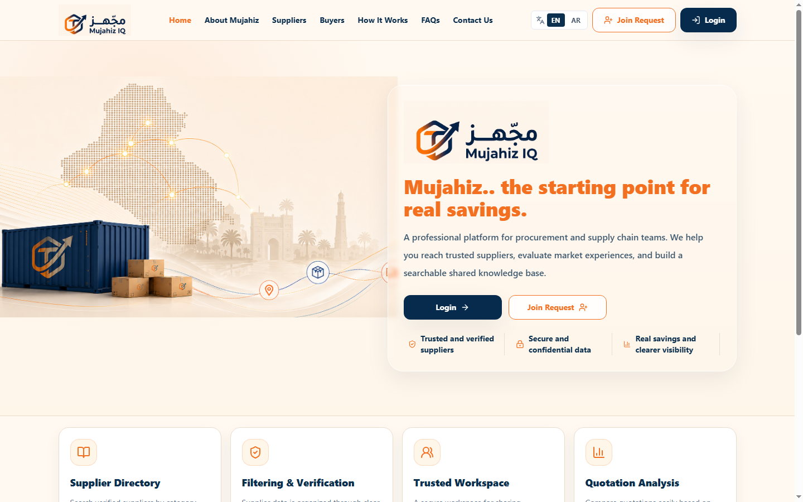
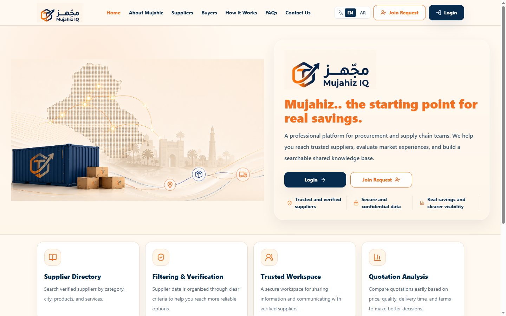
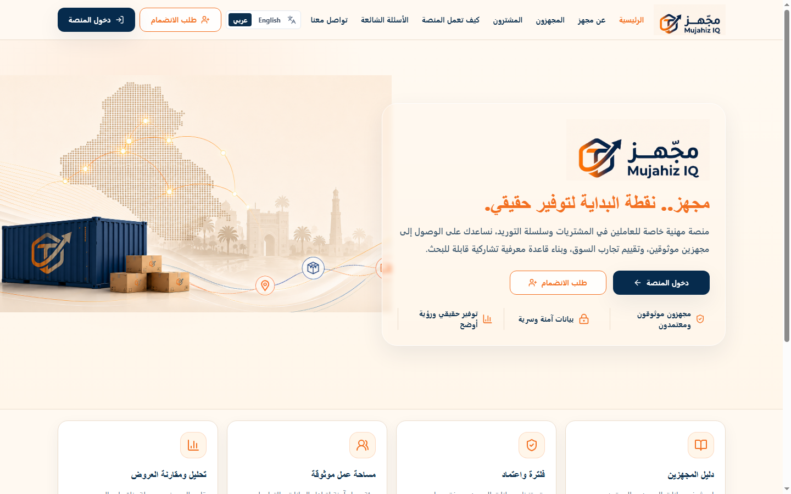
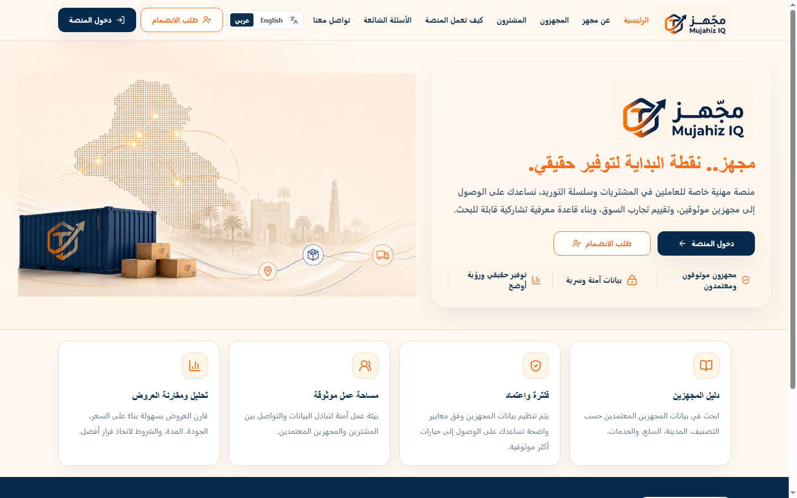

# Homepage Hero Visual Validation

Representative screenshots for the responsive homepage Hero correction.

## English desktop

| Before | After |
| --- | --- |
|  |  |

## Arabic desktop

| Before | After |
| --- | --- |
|  |  |

## Mobile after

| English | Arabic |
| --- | --- |
|  |  |

## Validation coverage

Both English and Arabic were captured at:

- 1024x768
- 1280x720
- 1366x768
- 1440x900
- 1536x864
- 1920x1080
- 2560x1440
- 768x1024
- 390x844

Continuous resize validation sampled another 78 states from 390px through
2560px. The measured desktop column gap stayed between 20.47px and 32px.
No sample produced horizontal overflow, overlap, column detachment, or image
aspect-ratio distortion.
